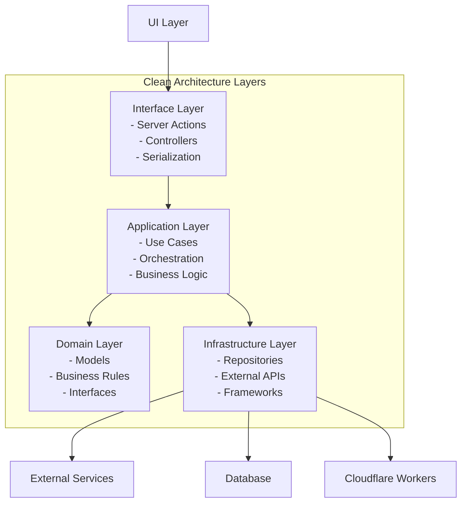

# Architecture Guide: Effect-TS Clean Architecture

## Overview

This application follows a **Clean Architecture** pattern implemented with **Effect-TS**, creating a highly scalable, maintainable, and type-safe system. The architecture emphasizes separation of concerns, dependency inversion, and functional programming principles.

## Architecture Philosophy

### Core Principles

1. **Dependency Inversion**: High-level modules should not depend on low-level modules. Both should depend on abstractions.
2. **Separation of Concerns**: Each layer has a single responsibility and clear boundaries.
3. **Type Safety**: Leverage TypeScript and Effect-TS to eliminate runtime errors through compile-time guarantees.
4. **Functional Programming**: Use immutable data structures, pure functions, and effect systems.
5. **Testability**: Every component can be tested in isolation through dependency injection.

### Why Effect-TS?

Effect-TS provides:

- **Structured Error Handling**: Errors are part of the type system
- **Dependency Injection**: Type-safe context management
- **Composability**: Effects can be easily combined and reused
- **Resource Management**: Automatic cleanup of resources
- **Observability**: Built-in tracing and metrics

## Layer Architecture



### 1. Domain Layer (`src/domain/`)

**Purpose**: Contains the core business entities, rules, and contracts.

**Responsibilities**:

- Define business entities and value objects
- Establish contracts (interfaces) for repositories and use cases
- Define domain-specific errors
- Implement business rules and validation logic

**Key Files**:

- `models.ts`: Entity definitions, schemas, error types
- `service.ts`: Abstract repository and use case interfaces

**Example Structure**:

```typescript
// src/domain/tenant/invitations/models.ts
export type Invitation = {
  readonly id: InvitationId;
  readonly email: Email;
  readonly status: InvitationStatus;
  // ... other properties
};

export class InvitationNotFound extends Data.TaggedError("InvitationNotFound")<{
  message: string;
}> {}

// src/domain/tenant/invitations/service.ts
export abstract class InvitationRepo extends Context.Tag("InvitationRepo")<
  InvitationRepo,
  {
    readonly findAll: () => Effect.Effect<Invitation[], OrgDbError>;
    readonly create: (
      data: NewInvitation
    ) => Effect.Effect<Invitation, OrgDbError>;
  }
>() {}
```

### 2. Application Layer (`src/application/`)

**Purpose**: Orchestrates business logic and coordinates between domain and infrastructure.

**Responsibilities**:

- Implement use cases (business workflows)
- Coordinate multiple domain services
- Transform data between layers
- Handle complex business logic

**Key Patterns**:

- Use `Effect.gen` for readable async flows
- Compose multiple repository calls
- Transform domain errors to application errors
- Add observability with `Effect.withSpan`

**Example**:

```typescript
// src/application/tenant/invitations/service.ts
export const InvitationUseCaseLive = (doId: DurableObjectId) =>
  Layer.effect(
    InvitationUseCase,
    Effect.gen(function* () {
      const invitationRepo = yield* InvitationRepo;
      const memberRepo = yield* MemberRepo;
      const emailService = yield* EmailService;

      return {
        create: (input: NewInvitation) =>
          Effect.gen(function* () {
            // 1. Check if user already exists
            const existingMember = yield* memberRepo.findByEmail(input.email);
            if (Option.isSome(existingMember)) {
              yield* Effect.fail(
                new UserAlreadyMember({
                  /* ... */
                })
              );
            }

            // 2. Create invitation
            const invitation = yield* invitationRepo.create(input);

            // 3. Send email
            yield* emailService.sendInvitation(invitation);

            return invitation;
          }).pipe(Effect.withSpan("InvitationUseCase.create")),

        list: () =>
          invitationRepo
            .findAll()
            .pipe(Effect.withSpan("InvitationUseCase.list")),
      };
    })
  );
```

### 3. Infrastructure Layer (`src/infrastructure/`)

**Purpose**: Implements the contracts defined in the domain layer using external frameworks and services.

**Responsibilities**:

- Database access (repositories)
- External API calls
- File system operations
- Cloudflare Workers integration
- HTTP API endpoints

**Key Components**:

#### Persistence (`src/infrastructure/persistence/`)

```typescript
// src/infrastructure/persistence/tenant/sqlite/InvitationRepoLive.ts
export const InvitationRepoLive = Layer.effect(
  InvitationRepo,
  Effect.gen(function* () {
    const drizzleClient = yield* DrizzleDOClient;

    return {
      findAll: () =>
        Effect.gen(function* () {
          const result = yield* Effect.tryPromise({
            try: () => drizzleClient.db.select().from(schema.invitation),
            catch: (error) => new OrgDbError({ cause: error }),
          });

          return result.map(mapDbInvitationToDomain);
        }),

      create: (data: NewInvitation) =>
        Effect.gen(function* () {
          const result = yield* Effect.tryPromise({
            try: () =>
              drizzleClient.db
                .insert(schema.invitation)
                .values({
                  id: crypto.randomUUID(),
                  email: data.inviteeEmail,
                  // ... other fields
                })
                .returning(),
            catch: (error) => new OrgDbError({ cause: error }),
          });

          return mapDbInvitationToDomain(result[0]);
        }),
    };
  })
);
```

#### Cloudflare Integration (`src/infrastructure/cloudflare/`)

```typescript
// src/infrastructure/cloudflare/durable-objects/InvitationDO.ts
export const InvitationDOServiceLive = Layer.effect(
  InvitationDOService,
  Effect.gen(function* () {
    const invitationDONamespace = yield* InvitationDONamespace;

    return {
      list: (organizationSlug: string) =>
        Effect.gen(function* () {
          const doId = invitationDONamespace.idFromName(organizationSlug);
          const stub = invitationDONamespace.get(doId);

          const response = yield* Effect.tryPromise({
            try: async () => {
              const res = await stub.fetch("http://internal/invitations", {
                method: "GET",
              });

              if (!res.ok) throw new Error(`HTTP ${res.status}`);
              return res.json() as Promise<Invitation[]>;
            },
            catch: (error) =>
              new DOInteractionError({
                /* ... */
              }),
          });

          return response;
        }),
    };
  })
);
```

#### HTTP API (`src/infrastructure/cloudflare/durable-objects/organization/api/handlers.ts`)

```typescript
// Define endpoints
const getInvitations = HttpApiEndpoint.get("getInvitations", "/invitations")
  .addSuccess(Schema.Array(InvitationSchema))
  .addError(HttpApiError.NotFound);

// Add to API group
const organizationsGroup =
  HttpApiGroup.make("organizations").add(getInvitations);

// Implement handlers
const organizationsGroupLive = HttpApiBuilder.group(
  api,
  "organizations",
  (handlers) =>
    Effect.gen(function* () {
      const invitationService = yield* InvitationUseCase;

      return handlers.handle("getInvitations", () => {
        return invitationService.list().pipe(
          Effect.mapError(
            (error) =>
              new HttpApiError.HttpApiDecodeError({
                message: error.message,
                issues: [],
              })
          )
        );
      });
    })
);
```

### 4. Configuration Layer (`src/config/layers.ts`)

**Purpose**: Wires all dependencies together using Effect layers.

**Key Patterns**:

- Layer composition for dependency injection
- Environment-specific configurations
- Resource management

```typescript
// Layer composition for Durable Objects
export function InvitationDOLive(doEnv: { ORG_DO: typeof env.ORG_DO }) {
  const doNamespaceLayer = Layer.succeed(InvitationDONamespace, doEnv.ORG_DO);
  return Layer.provide(InvitationDOServiceLive, doNamespaceLayer);
}

// Layer composition for tenant-specific services
export const InvitationLayerLive = (doId: DurableObjectId) => {
  const InvitationRepoLayer = Layer.provide(
    InvitationRepoLive,
    DrizzleDOClientLive
  );
  const InvitationUseCaseLayer = Layer.provide(
    InvitationUseCaseLive(doId),
    InvitationRepoLayer
  );
  return InvitationUseCaseLayer;
};
```

### 5. Application/UI Layer (`src/app/`)

**Purpose**: Handles user interactions and external requests.

**Responsibilities**:

- Server actions for form handling
- Data serialization for client components
- Request/response transformation
- Error handling and user feedback

```typescript
// src/app/actions/invitations/list.ts
"use server";

export async function getPendingInvitations(
  organizationSlug: string
): Promise<{ pendingInvitations: SerializableInvitation[] }> {
  const program = pipe(
    Effect.gen(function* (_) {
      const invitationProgram = InvitationDOService.pipe(
        Effect.flatMap((service) => service.list(organizationSlug))
      );

      const fullLayer = InvitationDOLive({ ORG_DO: env.ORG_DO });

      const invitations = yield* _(
        Effect.tryPromise({
          try: () =>
            Effect.runPromise(
              invitationProgram.pipe(Effect.provide(fullLayer))
            ),
          catch: (error) =>
            new InvitationListError("Failed to fetch invitations"),
        })
      );

      return {
        pendingInvitations: invitations
          .filter((inv) => inv.status === "pending")
          .map(convertToSerializable),
      };
    }),
    Effect.catchAll((error) => {
      console.error("Error in getPendingInvitations:", error);
      return Effect.succeed({ pendingInvitations: [] });
    })
  );

  return Effect.runPromise(program);
}
```

## Adding a New Feature: Step-by-Step Guide

Let's walk through adding a new feature: "Archive Invitation"

### Step 1: Domain Layer Updates

**Update Models (`src/domain/tenant/invitations/models.ts`)**:

```typescript
// Add new status
export const InvitationStatusLiterals = {
  pending: S.Literal("pending"),
  accepted: S.Literal("accepted"),
  expired: S.Literal("expired"),
  revoked: S.Literal("revoked"),
  archived: S.Literal("archived"), // ← New status
} as const;

// Add new error
export class InvitationAlreadyArchived extends Data.TaggedError(
  "InvitationAlreadyArchived"
)<{ message: string }> {}
```

**Update Service Interfaces (`src/domain/tenant/invitations/service.ts`)**:

```typescript
export abstract class InvitationRepo extends Context.Tag("InvitationRepo")<
  InvitationRepo,
  {
    // ... existing methods
    readonly archive: (
      invitationId: InvitationId
    ) => Effect.Effect<Invitation, OrgDbError>;
  }
>() {}

export class InvitationUseCase extends Context.Tag("InvitationUseCase")<
  InvitationUseCase,
  {
    // ... existing methods
    readonly archive: (
      invitationId: InvitationId
    ) => Effect.Effect<Invitation, InvitationError | OrgDbError>;
  }
>() {}
```

### Step 2: Infrastructure - Repository Implementation

**Update Repository (`src/infrastructure/persistence/tenant/sqlite/InvitationRepoLive.ts`)**:

```typescript
export const InvitationRepoLive = Layer.effect(
  InvitationRepo,
  Effect.gen(function* () {
    const drizzleClient = yield* DrizzleDOClient;

    return {
      // ... existing methods
      archive: (invitationId: InvitationId) =>
        Effect.gen(function* () {
          const result = yield* Effect.tryPromise({
            try: () =>
              drizzleClient.db
                .update(schema.invitation)
                .set({ status: "archived" })
                .where(eq(schema.invitation.id, invitationId))
                .returning(),
            catch: (error) => new OrgDbError({ cause: error }),
          });

          if (!result[0]) {
            yield* Effect.fail(
              new OrgDbError({
                cause: new Error("Invitation not found"),
              })
            );
          }

          return mapDbInvitationToDomain({
            ...result[0],
            expiresAt: Number(result[0].expiresAt),
            createdAt: Number(result[0].createdAt),
          });
        }),
    };
  })
);
```

### Step 3: Application - Use Case Implementation

**Update Use Case (`src/application/tenant/invitations/service.ts`)**:

```typescript
export const InvitationUseCaseLive = (doId: DurableObjectId) =>
  Layer.effect(
    InvitationUseCase,
    Effect.gen(function* () {
      const invitationRepo = yield* InvitationRepo;

      return {
        // ... existing methods
        archive: (invitationId: InvitationId) =>
          Effect.gen(function* () {
            // 1. Get current invitation
            const invitationOpt = yield* invitationRepo.getInvitation(
              invitationId
            );

            if (Option.isNone(invitationOpt)) {
              yield* Effect.fail(
                new InvitationNotFound({
                  message: "Invitation not found",
                })
              );
            }

            const invitation = invitationOpt.value;

            // 2. Business rule: can only archive pending invitations
            if (invitation.status !== "pending") {
              yield* Effect.fail(
                new InvitationAlreadyArchived({
                  message: `Cannot archive invitation with status: ${invitation.status}`,
                })
              );
            }

            // 3. Archive the invitation
            const archivedInvitation = yield* invitationRepo.archive(
              invitationId
            );

            return archivedInvitation;
          }).pipe(Effect.withSpan("InvitationUseCase.archive")),
      };
    })
  );
```

### Step 4: Infrastructure - Durable Object Service

**Update DO Service (`src/infrastructure/cloudflare/durable-objects/InvitationDO.ts`)**:

```typescript
export const InvitationDOServiceLive = Layer.effect(
  InvitationDOService,
  Effect.gen(function* () {
    const invitationDONamespace = yield* InvitationDONamespace;

    return {
      // ... existing methods
      archive: (invitationId: string, organizationSlug: string) => {
        return Effect.gen(function* () {
          const doId = invitationDONamespace.idFromName(organizationSlug);
          const stub = invitationDONamespace.get(doId);

          const response = yield* Effect.tryPromise({
            try: async () => {
              const response = await stub.fetch(
                `http://internal/invitations/${invitationId}/archive`,
                {
                  method: "POST",
                  headers: Headers.unsafeFromRecord({
                    "Content-Type": "application/json",
                  }),
                }
              );

              if (!response.ok) {
                throw new OrgDbError({
                  cause: new Error(
                    `Server responded with status ${response.status}`
                  ),
                });
              }

              return (await response.json()) as Invitation;
            },
            catch: (error) => new OrgDbError({ cause: error }),
          });

          return response;
        });
      },
    };
  })
);
```

### Step 5: Infrastructure - HTTP API Handler

**Update API Handlers (`src/infrastructure/cloudflare/durable-objects/organization/api/handlers.ts`)**:

```typescript
// 1. Define endpoint
const archiveInvitation = HttpApiEndpoint.post(
  "archiveInvitation",
  "/invitations/:invitationId/archive"
)
  .setPath(Schema.Struct({ invitationId: Schema.String }))
  .addSuccess(InvitationSchema)
  .addError(HttpApiError.NotFound)
  .addError(HttpApiError.BadRequest);

// 2. Add to group
const organizationsGroup = HttpApiGroup.make("organizations")
  .add(archiveInvitation)
  // ... other endpoints

  // 3. Add handler
  .handle("archiveInvitation", ({ path: { invitationId } }) => {
    return Effect.gen(function* () {
      const invitationService = yield* InvitationUseCase;
      return yield* invitationService
        .archive(invitationId as InvitationId)
        .pipe(
          Effect.mapError((error) => {
            if (error._tag === "InvitationNotFound") {
              return new HttpApiError.NotFound({ message: error.message });
            }
            if (error._tag === "InvitationAlreadyArchived") {
              return new HttpApiError.BadRequest({ message: error.message });
            }
            return new HttpApiError.HttpApiDecodeError({
              message: error.message || String(error),
              issues: [],
            });
          })
        );
    });
  });
```

### Step 6: Application Layer - Server Action

**Create Server Action (`src/app/actions/invitations/archive.ts`)**:

```typescript
"use server";

import { env } from "cloudflare:workers";
import { Effect, pipe } from "effect";
import { InvitationDOService } from "@/application/tenant/invitations/service";
import { InvitationDOLive } from "@/config/layers";
import type { InvitationId } from "@/domain/tenant/invitations/models";

export class ArchiveInvitationError extends Error {
  readonly _tag = "ArchiveInvitationError";
  constructor(message: string, public code = "ARCHIVE_FAILED") {
    super(message);
  }
}

export async function archiveInvitation(
  invitationId: string,
  organizationSlug: string
): Promise<{ success: boolean; error?: string }> {
  const program = pipe(
    Effect.gen(function* (_) {
      const invitationProgram = InvitationDOService.pipe(
        Effect.flatMap((service) =>
          service.archive(invitationId, organizationSlug)
        )
      );

      const fullLayer = InvitationDOLive({ ORG_DO: env.ORG_DO });

      yield* _(
        Effect.tryPromise({
          try: () =>
            Effect.runPromise(
              invitationProgram.pipe(Effect.provide(fullLayer))
            ),
          catch: (error) => {
            console.error("Error archiving invitation:", error);
            return new ArchiveInvitationError("Failed to archive invitation");
          },
        })
      );

      return { success: true };
    }),
    Effect.catchAll((error) => {
      console.error("Error in archiveInvitation:", error);
      return Effect.succeed({
        success: false,
        error: error instanceof Error ? error.message : "Unknown error",
      });
    })
  );

  return Effect.runPromise(program);
}
```

### Step 7: UI Integration

**Update Component (`src/app/components/organizations/slug/members/PendingInvitationsList.tsx`)**:

```typescript
"use client";

import { archiveInvitation } from "@/app/actions/invitations/archive";

export function PendingInvitationsList({ invitations, organizationSlug }) {
  const handleArchive = async (invitationId: string) => {
    const result = await archiveInvitation(invitationId, organizationSlug);
    if (result.success) {
      // Handle success (refresh data, show toast, etc.)
    } else {
      // Handle error
      console.error(result.error);
    }
  };

  return (
    <EntityList title="Pending Invitations">
      {invitations.map((invitation) => (
        <EntityList.Item
          key={invitation.id}
          title={invitation.email}
          actions={[
            <Button onClick={() => handleArchive(invitation.id)}>
              Archive
            </Button>,
          ]}
        />
      ))}
    </EntityList>
  );
}
```

## Error Handling Strategy

### Error Types Hierarchy

```typescript
// Domain Errors (Business Rules)
export class InvitationNotFound extends Data.TaggedError("InvitationNotFound")<{
  message: string;
}> {}

export class InvitationAlreadyArchived extends Data.TaggedError(
  "InvitationAlreadyArchived"
)<{
  message: string;
}> {}

// Infrastructure Errors (Technical)
export class OrgDbError extends Data.TaggedError("OrgDbError")<{
  cause: unknown;
}> {}

export class DOInteractionError extends Data.TaggedError("DOInteractionError")<{
  message: string;
  status?: number;
}> {}

// Application Errors (Use Case Level)
export class ArchiveInvitationError extends Error {
  readonly _tag = "ArchiveInvitationError";
}
```

### Error Mapping Strategy

```typescript
// Map domain errors to HTTP errors
Effect.mapError((error) => {
  switch (error._tag) {
    case "InvitationNotFound":
      return new HttpApiError.NotFound({ message: error.message });
    case "InvitationAlreadyArchived":
      return new HttpApiError.BadRequest({ message: error.message });
    case "OrgDbError":
      return new HttpApiError.InternalServerError({
        message: "Database error",
      });
    default:
      return new HttpApiError.InternalServerError({ message: "Unknown error" });
  }
});
```

## Testing Strategy

### Unit Testing with Effect

```typescript
// Test repository with mock layer
import { Effect, Layer } from "effect";
import { InvitationRepo } from "@/domain/tenant/invitations/service";

const MockInvitationRepo = Layer.succeed(InvitationRepo, {
  findAll: () => Effect.succeed([mockInvitation]),
  archive: (id) => Effect.succeed(mockArchivedInvitation),
});

test("should archive invitation", async () => {
  const program = Effect.gen(function* () {
    const repo = yield* InvitationRepo;
    const result = yield* repo.archive("inv-123" as InvitationId);
    expect(result.status).toBe("archived");
  });

  await Effect.runPromise(program.pipe(Effect.provide(MockInvitationRepo)));
});
```

### Integration Testing

```typescript
// Test with real database layer
const TestLayer = Layer.mergeAll(
  DrizzleDOClientLive,
  InvitationRepoLive,
  TestDatabaseLayer
);

test("should create and archive invitation", async () => {
  const program = Effect.gen(function* () {
    const repo = yield* InvitationRepo;

    // Create invitation
    const invitation = yield* repo.create(mockNewInvitation);

    // Archive it
    const archived = yield* repo.archive(invitation.id);

    expect(archived.status).toBe("archived");
  });

  await Effect.runPromise(program.pipe(Effect.provide(TestLayer)));
});
```

## Performance Considerations

### Layer Composition Costs

- **Heavy Operations**: Layer creation, Durable Object instantiation
- **Light Operations**: Effect composition, function calls
- **Optimization**: Cache layers at appropriate boundaries

### Batching Strategies

```typescript
// Batch multiple operations
const batchArchiveInvitations = (invitationIds: InvitationId[]) =>
  Effect.gen(function* () {
    const repo = yield* InvitationRepo;

    // Batch database operations
    const results = yield* Effect.all(
      invitationIds.map((id) => repo.archive(id)),
      { concurrency: 5 } // Limit concurrency
    );

    return results;
  });
```

### Caching

```typescript
// Cache expensive operations
const getCachedInvitations = Effect.gen(function* () {
  const cached = yield* Effect.promise(() => cache.get("invitations"));

  if (cached) {
    return cached;
  }

  const fresh = yield* invitationRepo.findAll();
  yield* Effect.promise(() => cache.set("invitations", fresh, { ttl: 300 }));

  return fresh;
});
```

## My Thoughts on This Architecture

### Strengths

1. **Type Safety**: The Effect-TS system provides compile-time guarantees about error handling and dependencies.

2. **Separation of Concerns**: Each layer has a clear responsibility, making the codebase easy to navigate and maintain.

3. **Testability**: Dependency injection through Effect layers makes unit testing straightforward.

4. **Composability**: Effects can be easily combined, reused, and transformed.

5. **Error Handling**: Errors are part of the type system, preventing silent failures.

6. **Observability**: Built-in tracing and metrics support.

### Weaknesses

1. **Learning Curve**: Effect-TS has a steep learning curve for developers unfamiliar with functional programming.

2. **Boilerplate**: Simple CRUD operations require touching many files and layers.

3. **Complexity**: The abstraction layers can make debugging more difficult.

4. **Performance Overhead**: Layer composition and Effect creation have runtime costs.

5. **Ecosystem Maturity**: Effect-TS is relatively new, with a smaller ecosystem compared to traditional approaches.

### When to Use This Architecture

**Ideal For**:

- Large, complex applications with many developers
- Systems requiring high reliability and error handling
- Applications with complex business logic
- Long-term projects where maintainability is crucial
- Teams comfortable with functional programming

**Not Ideal For**:

- Simple CRUD applications
- Rapid prototyping
- Small teams without FP experience
- Applications with simple, linear workflows

### Recommendations

1. **Start Simple**: Begin with a smaller subset of the architecture and expand as needed.

2. **Team Training**: Invest in Effect-TS and functional programming training for your team.

3. **Gradual Adoption**: Consider migrating existing code incrementally rather than rewriting everything.

4. **Documentation**: Maintain excellent documentation due to the complexity.

5. **Code Generation**: Consider creating code generators for common patterns to reduce boilerplate.

The architecture represents a sophisticated approach to building maintainable, scalable applications. While it requires significant upfront investment in learning and setup, it pays dividends in long-term maintainability, reliability, and developer productivity for complex applications.
