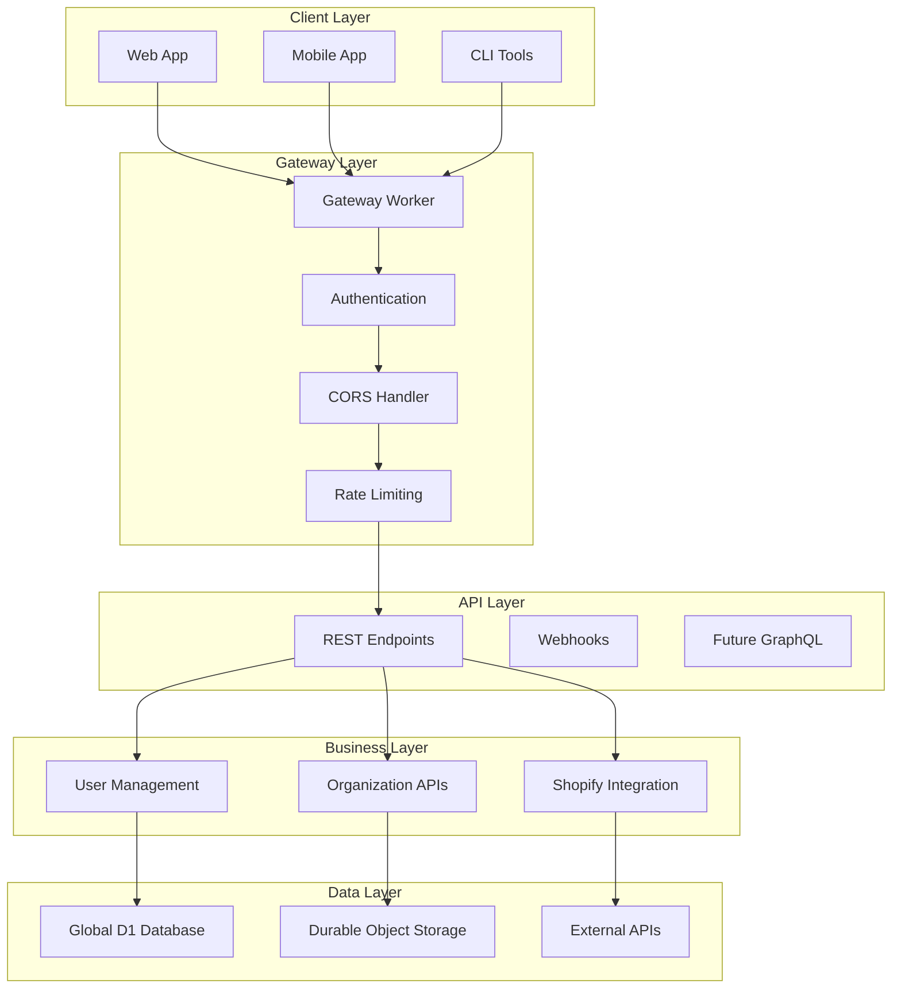
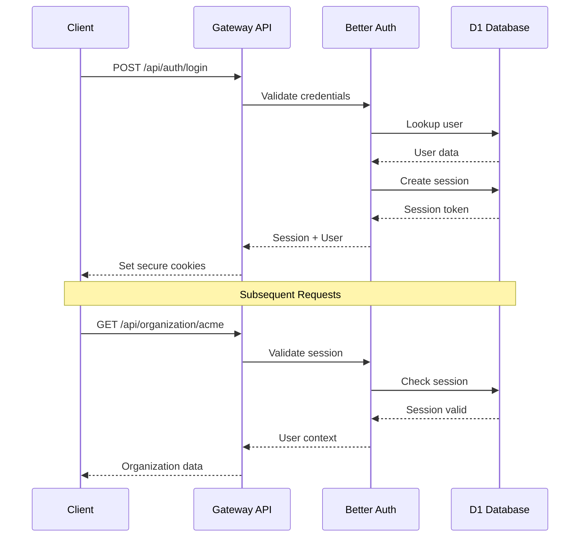
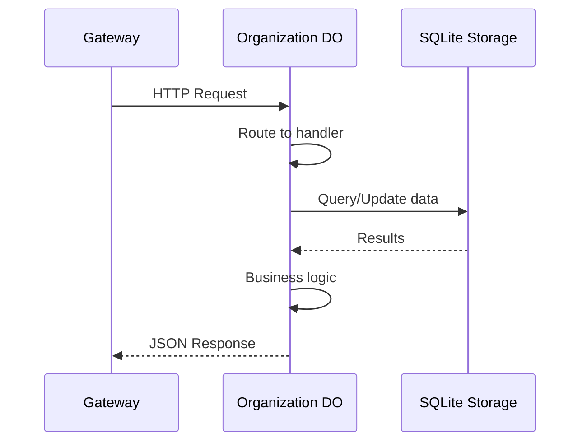

# API Documentation

## Table of Contents

1. [Overview](#overview)
2. [Authentication](#authentication)
3. [Core APIs](#core-apis)
4. [Organization Management](#organization-management)
5. [Member & Invitation APIs](#member--invitation-apis)
6. [Shopify Integration](#shopify-integration)
7. [Durable Object APIs](#durable-object-apis)
8. [Error Handling](#error-handling)
9. [Rate Limiting](#rate-limiting)
10. [SDK Examples](#sdk-examples)

## Overview

Nimblers provides a comprehensive REST API built on **Cloudflare Workers** with **Effect-TS** for type safety and error handling. The API follows RESTful conventions with JSON request/response format and supports multi-tenant operations.

### API Base URLs

| Environment     | Base URL                          | Purpose             |
| --------------- | --------------------------------- | ------------------- |
| **Production**  | `https://nimblers.co/api`         | Live production API |
| **Staging**     | `https://staging.nimblers.co/api` | Testing environment |
| **Development** | `http://localhost:5173/api`       | Local development   |

### API Architecture



### Request/Response Format

All API endpoints use JSON format with consistent error handling:

```typescript
// Success Response Format
{
  "success": true,
  "data": {
    // Response data
  },
  "meta": {
    "timestamp": "2025-01-21T10:30:00Z",
    "requestId": "req_abc123",
    "version": "v1"
  }
}

// Error Response Format
{
  "success": false,
  "error": {
    "code": "VALIDATION_ERROR",
    "message": "Invalid email format",
    "details": {
      "field": "email",
      "expected": "valid email address"
    }
  },
  "meta": {
    "timestamp": "2025-01-21T10:30:00Z",
    "requestId": "req_abc123"
  }
}
```

## Authentication

The API uses **session-based authentication** with Better Auth, providing secure and scalable user management.

### Authentication Flow



### Authentication Endpoints

#### Login

```http
POST /api/auth/login
Content-Type: application/json

{
  "email": "user@example.com",
  "password": "securepassword"
}
```

**Response:**

```json
{
  "success": true,
  "data": {
    "user": {
      "id": "user_abc123",
      "email": "user@example.com",
      "name": "John Doe"
    },
    "session": {
      "id": "sess_xyz789",
      "expiresAt": "2025-01-28T10:30:00Z"
    }
  }
}
```

#### Register

```http
POST /api/auth/register
Content-Type: application/json

{
  "name": "John Doe",
  "email": "user@example.com",
  "password": "securepassword"
}
```

#### Logout

```http
POST /api/auth/logout
```

### Session Management

#### Get Current User

```http
GET /api/auth/me
Authorization: Bearer <session_token>
```

**Response:**

```json
{
  "success": true,
  "data": {
    "user": {
      "id": "user_abc123",
      "email": "user@example.com",
      "name": "John Doe",
      "role": "admin"
    },
    "organizations": [
      {
        "id": "org_123",
        "slug": "acme-corp",
        "name": "Acme Corporation",
        "role": "owner"
      }
    ]
  }
}
```

## Core APIs

### Health Check

Monitor API availability and performance.

```http
GET /api/health
```

**Response:**

```json
{
  "success": true,
  "data": {
    "status": "healthy",
    "timestamp": "2025-01-21T10:30:00Z",
    "version": "1.0.0",
    "services": {
      "database": "healthy",
      "durable_objects": "healthy",
      "external_apis": "healthy"
    },
    "performance": {
      "responseTime": "45ms",
      "uptime": "99.99%"
    }
  }
}
```

### Version Information

```http
GET /api/version
```

**Response:**

```json
{
  "success": true,
  "data": {
    "version": "1.0.0",
    "buildDate": "2025-01-21T08:00:00Z",
    "gitCommit": "abc123def456",
    "environment": "production"
  }
}
```

## Organization Management

Organizations are the primary tenant boundary in Nimblers, with dedicated Durable Object instances.

### List Organizations

```http
GET /api/organizations
Authorization: Bearer <session_token>
```

**Response:**

```json
{
  "success": true,
  "data": {
    "organizations": [
      {
        "id": "org_abc123",
        "slug": "acme-corp",
        "name": "Acme Corporation",
        "role": "owner",
        "memberCount": 12,
        "connectedStores": 3,
        "createdAt": "2024-12-01T09:00:00Z"
      }
    ]
  }
}
```

### Get Organization

```http
GET /api/organizations/{slug}
Authorization: Bearer <session_token>
```

**Path Parameters:**

- `slug` (string): Organization slug identifier

**Response:**

```json
{
  "success": true,
  "data": {
    "organization": {
      "id": "org_abc123",
      "slug": "acme-corp",
      "name": "Acme Corporation",
      "description": "E-commerce solutions company",
      "logo": "https://cdn.nimblers.co/logos/acme-corp.png",
      "createdAt": "2024-12-01T09:00:00Z",
      "members": [
        {
          "id": "member_xyz789",
          "userId": "user_abc123",
          "name": "John Doe",
          "email": "john@acme.com",
          "role": "owner",
          "joinedAt": "2024-12-01T09:00:00Z"
        }
      ],
      "connectedStores": [
        {
          "id": "store_def456",
          "type": "shopify",
          "shopDomain": "acme-store.myshopify.com",
          "status": "active",
          "connectedAt": "2024-12-05T14:30:00Z"
        }
      ]
    }
  }
}
```

### Create Organization

```http
POST /api/organizations
Authorization: Bearer <session_token>
Content-Type: application/json

{
  "name": "Acme Corporation",
  "slug": "acme-corp",
  "description": "E-commerce solutions company"
}
```

**Response:**

```json
{
  "success": true,
  "data": {
    "organization": {
      "id": "org_abc123",
      "slug": "acme-corp",
      "name": "Acme Corporation",
      "description": "E-commerce solutions company",
      "createdAt": "2025-01-21T10:30:00Z"
    }
  }
}
```

### Update Organization

```http
PUT /api/organizations/{slug}
Authorization: Bearer <session_token>
Content-Type: application/json

{
  "name": "Acme Corporation Ltd",
  "description": "Updated description"
}
```

### Delete Organization

```http
DELETE /api/organizations/{slug}
Authorization: Bearer <session_token>
```

**Response:**

```json
{
  "success": true,
  "data": {
    "message": "Organization deleted successfully",
    "deletedAt": "2025-01-21T10:30:00Z"
  }
}
```

## Member & Invitation APIs

### Organization Members

#### List Members

```http
GET /api/organizations/{slug}/members
Authorization: Bearer <session_token>
```

**Query Parameters:**

- `role` (optional): Filter by role (owner, admin, member)
- `limit` (optional): Number of results (default: 50, max: 100)
- `offset` (optional): Pagination offset

**Response:**

```json
{
  "success": true,
  "data": {
    "members": [
      {
        "id": "member_abc123",
        "userId": "user_xyz789",
        "name": "Jane Smith",
        "email": "jane@acme.com",
        "role": "admin",
        "joinedAt": "2024-12-02T10:15:00Z"
      }
    ],
    "pagination": {
      "total": 12,
      "limit": 50,
      "offset": 0,
      "hasMore": false
    }
  }
}
```

#### Update Member Role

```http
PUT /api/organizations/{slug}/members/{memberId}
Authorization: Bearer <session_token>
Content-Type: application/json

{
  "role": "admin"
}
```

#### Remove Member

```http
DELETE /api/organizations/{slug}/members/{memberId}
Authorization: Bearer <session_token>
```

### Invitations

#### List Invitations

```http
GET /api/organizations/{slug}/invitations
Authorization: Bearer <session_token>
```

**Query Parameters:**

- `status` (optional): Filter by status (pending, accepted, expired, revoked)

**Response:**

```json
{
  "success": true,
  "data": {
    "invitations": [
      {
        "id": "inv_abc123",
        "email": "newuser@example.com",
        "role": "member",
        "status": "pending",
        "invitedBy": {
          "id": "user_xyz789",
          "name": "John Doe"
        },
        "expiresAt": "2025-01-28T10:30:00Z",
        "createdAt": "2025-01-21T10:30:00Z"
      }
    ]
  }
}
```

#### Create Invitation

```http
POST /api/organizations/{slug}/invitations
Authorization: Bearer <session_token>
Content-Type: application/json

{
  "email": "newuser@example.com",
  "role": "member"
}
```

**Response:**

```json
{
  "success": true,
  "data": {
    "invitation": {
      "id": "inv_abc123",
      "email": "newuser@example.com",
      "role": "member",
      "status": "pending",
      "expiresAt": "2025-01-28T10:30:00Z",
      "createdAt": "2025-01-21T10:30:00Z"
    }
  }
}
```

#### Accept Invitation

```http
POST /api/invitations/accept
Content-Type: application/json

{
  "token": "inv_token_abc123xyz789"
}
```

**Response:**

```json
{
  "success": true,
  "data": {
    "organization": {
      "slug": "acme-corp",
      "name": "Acme Corporation"
    },
    "member": {
      "id": "member_new123",
      "role": "member",
      "joinedAt": "2025-01-21T10:30:00Z"
    }
  }
}
```

#### Revoke Invitation

```http
DELETE /api/organizations/{slug}/invitations/{invitationId}
Authorization: Bearer <session_token>
```

## Shopify Integration

### OAuth Flow

#### Initiate Shopify Connection

```http
POST /api/organizations/{slug}/shopify/connect
Authorization: Bearer <session_token>
Content-Type: application/json

{
  "shopDomain": "example-store.myshopify.com"
}
```

**Response:**

```json
{
  "success": true,
  "data": {
    "authUrl": "https://example-store.myshopify.com/admin/oauth/authorize?client_id=abc123&scope=read_products&redirect_uri=...",
    "state": "oauth_state_xyz789"
  }
}
```

#### OAuth Callback (Internal)

```http
GET /api/shopify/callback?code={auth_code}&state={oauth_state}&shop={shop_domain}
```

This endpoint is called by Shopify after user authorization.

### Store Management

#### List Connected Stores

```http
GET /api/organizations/{slug}/stores
Authorization: Bearer <session_token>
```

**Response:**

```json
{
  "success": true,
  "data": {
    "stores": [
      {
        "id": "store_abc123",
        "type": "shopify",
        "shopDomain": "example-store.myshopify.com",
        "shopName": "Example Store",
        "status": "active",
        "permissions": ["read_products", "write_products"],
        "connectedAt": "2024-12-05T14:30:00Z",
        "lastSyncAt": "2025-01-21T09:00:00Z",
        "metadata": {
          "plan": "basic",
          "country": "US",
          "currency": "USD"
        }
      }
    ]
  }
}
```

#### Disconnect Store

```http
DELETE /api/organizations/{slug}/stores/{storeId}
Authorization: Bearer <session_token>
```

#### Get Store Details

```http
GET /api/organizations/{slug}/stores/{storeId}
Authorization: Bearer <session_token>
```

### Webhook Endpoints

#### Privacy Compliance Webhooks

These endpoints handle GDPR/CCPA compliance requirements from Shopify.

```http
POST /api/shopify/webhooks/customers/data_request
Content-Type: application/json
X-Shopify-Hmac-Sha256: <webhook_signature>

{
  "shop_id": 12345,
  "shop_domain": "example-store.myshopify.com",
  "customer": {
    "id": 67890,
    "email": "customer@example.com"
  }
}
```

```http
POST /api/shopify/webhooks/customers/redact
Content-Type: application/json
X-Shopify-Hmac-Sha256: <webhook_signature>

{
  "shop_id": 12345,
  "shop_domain": "example-store.myshopify.com",
  "customer": {
    "id": 67890,
    "email": "customer@example.com"
  }
}
```

```http
POST /api/shopify/webhooks/shop/redact
Content-Type: application/json
X-Shopify-Hmac-Sha256: <webhook_signature>

{
  "shop_id": 12345,
  "shop_domain": "example-store.myshopify.com"
}
```

## Durable Object APIs

Each organization runs in its own Durable Object instance, providing strong consistency and isolation.

### Internal Durable Object Interface

These endpoints are called internally by the Gateway Worker to communicate with organization-specific Durable Objects.

#### Organization Initialization

```http
POST http://internal/initialize
Content-Type: application/json

{
  "organization": {
    "id": "org_abc123",
    "slug": "acme-corp",
    "name": "Acme Corporation"
  },
  "creator": {
    "id": "user_xyz789",
    "name": "John Doe",
    "email": "john@acme.com"
  }
}
```

#### Member Operations

```http
GET http://internal/members
```

```http
POST http://internal/members
Content-Type: application/json

{
  "userId": "user_abc123",
  "role": "member"
}
```

#### Invitation Operations

```http
GET http://internal/invitations
```

```http
POST http://internal/invitations
Content-Type: application/json

{
  "email": "user@example.com",
  "inviterId": "user_xyz789",
  "role": "member"
}
```

#### Store Operations

```http
GET http://internal/stores
```

```http
POST http://internal/stores
Content-Type: application/json

{
  "type": "shopify",
  "shopDomain": "example-store.myshopify.com",
  "accessToken": "encrypted_token",
  "scope": "read_products,write_products"
}
```

### Durable Object State Management

Each Durable Object maintains its own SQLite database with automatic schema management:



## Error Handling

The API uses structured error responses with specific error codes for different scenarios.

### Error Response Structure

```json
{
  "success": false,
  "error": {
    "code": "VALIDATION_ERROR",
    "message": "Validation failed",
    "details": {
      "field": "email",
      "reason": "Invalid email format",
      "expected": "valid@example.com"
    }
  },
  "meta": {
    "timestamp": "2025-01-21T10:30:00Z",
    "requestId": "req_abc123",
    "path": "/api/organizations",
    "method": "POST"
  }
}
```

### Common Error Codes

| Code                      | HTTP Status | Description              | Resolution       |
| ------------------------- | ----------- | ------------------------ | ---------------- |
| `AUTHENTICATION_REQUIRED` | 401         | No valid session         | Login required   |
| `AUTHORIZATION_DENIED`    | 403         | Insufficient permissions | Contact admin    |
| `RESOURCE_NOT_FOUND`      | 404         | Resource doesn't exist   | Check identifier |
| `VALIDATION_ERROR`        | 400         | Input validation failed  | Fix request data |
| `CONFLICT_ERROR`          | 409         | Resource conflict        | Resolve conflict |
| `RATE_LIMIT_EXCEEDED`     | 429         | Too many requests        | Wait and retry   |
| `INTERNAL_ERROR`          | 500         | Server error             | Contact support  |
| `SERVICE_UNAVAILABLE`     | 503         | Service temporarily down | Retry later      |

### Business Logic Errors

| Code                       | Description                   | Context               |
| -------------------------- | ----------------------------- | --------------------- |
| `ORGANIZATION_SLUG_TAKEN`  | Slug already exists           | Organization creation |
| `USER_ALREADY_MEMBER`      | User is already a member      | Invitation creation   |
| `INVITATION_EXPIRED`       | Invitation has expired        | Invitation acceptance |
| `SHOP_ALREADY_CONNECTED`   | Shop connected to another org | Shopify connection    |
| `INSUFFICIENT_PERMISSIONS` | User role lacks permissions   | Member management     |
| `MAX_INVITATIONS_REACHED`  | Too many pending invitations  | Invitation limits     |

### Error Handling Patterns

#### Retry Logic

```typescript
// Client-side retry with exponential backoff
async function apiCallWithRetry(
  request: () => Promise<Response>,
  maxRetries = 3
) {
  for (let attempt = 1; attempt <= maxRetries; attempt++) {
    try {
      const response = await request();

      if (response.ok) {
        return response;
      }

      // Don't retry client errors
      if (response.status >= 400 && response.status < 500) {
        throw new Error(`Client error: ${response.status}`);
      }

      // Retry server errors
      if (attempt < maxRetries) {
        const delay = Math.pow(2, attempt) * 1000; // Exponential backoff
        await new Promise((resolve) => setTimeout(resolve, delay));
      }
    } catch (error) {
      if (attempt === maxRetries) {
        throw error;
      }
    }
  }
}
```

## Rate Limiting

The API implements rate limiting to ensure fair usage and prevent abuse.

### Rate Limit Headers

All responses include rate limit information:

```http
HTTP/1.1 200 OK
X-RateLimit-Limit: 1000
X-RateLimit-Remaining: 999
X-RateLimit-Reset: 1642781400
X-RateLimit-Policy: 1000;w=3600
```

### Rate Limit Tiers

| Tier              | Requests/Hour | Burst Limit | Endpoints             |
| ----------------- | ------------- | ----------- | --------------------- |
| **Public**        | 100           | 10/min      | Health, version       |
| **Authenticated** | 1000          | 50/min      | Most endpoints        |
| **Organization**  | 5000          | 100/min     | Organization-specific |
| **Webhooks**      | 10000         | 500/min     | Shopify webhooks      |

### Rate Limit Response

When rate limit is exceeded:

```json
{
  "success": false,
  "error": {
    "code": "RATE_LIMIT_EXCEEDED",
    "message": "Rate limit exceeded",
    "details": {
      "limit": 1000,
      "resetAt": "2025-01-21T11:00:00Z",
      "retryAfter": 1800
    }
  }
}
```

## SDK Examples

### JavaScript/TypeScript SDK

```typescript
// Nimblers API SDK
class NimblersAPI {
  private baseUrl: string;
  private sessionToken?: string;

  constructor(baseUrl: string) {
    this.baseUrl = baseUrl;
  }

  async login(email: string, password: string) {
    const response = await fetch(`${this.baseUrl}/auth/login`, {
      method: "POST",
      headers: { "Content-Type": "application/json" },
      body: JSON.stringify({ email, password }),
    });

    const data = await response.json();
    if (data.success) {
      this.sessionToken = data.data.session.id;
    }
    return data;
  }

  async getOrganizations() {
    return this.request("/organizations");
  }

  async createInvitation(orgSlug: string, email: string, role: string) {
    return this.request(`/organizations/${orgSlug}/invitations`, {
      method: "POST",
      body: { email, role },
    });
  }

  private async request(endpoint: string, options: RequestInit = {}) {
    const url = `${this.baseUrl}${endpoint}`;
    const headers = {
      "Content-Type": "application/json",
      ...(this.sessionToken && {
        Authorization: `Bearer ${this.sessionToken}`,
      }),
      ...(options.headers || {}),
    };

    const response = await fetch(url, {
      ...options,
      headers,
      body: options.body ? JSON.stringify(options.body) : undefined,
    });

    return response.json();
  }
}

// Usage example
const api = new NimblersAPI("https://nimblers.co/api");

// Login and get organizations
await api.login("user@example.com", "password");
const orgs = await api.getOrganizations();

// Create invitation
await api.createInvitation("acme-corp", "newuser@example.com", "member");
```

### cURL Examples

#### Authentication

```bash
# Login
curl -X POST https://nimblers.co/api/auth/login \
  -H "Content-Type: application/json" \
  -d '{"email":"user@example.com","password":"password"}'

# Get current user
curl https://nimblers.co/api/auth/me \
  -H "Authorization: Bearer session_token"
```

#### Organization Management

```bash
# List organizations
curl https://nimblers.co/api/organizations \
  -H "Authorization: Bearer session_token"

# Create organization
curl -X POST https://nimblers.co/api/organizations \
  -H "Authorization: Bearer session_token" \
  -H "Content-Type: application/json" \
  -d '{"name":"Acme Corp","slug":"acme-corp"}'

# Get organization details
curl https://nimblers.co/api/organizations/acme-corp \
  -H "Authorization: Bearer session_token"
```

#### Invitation Management

```bash
# Create invitation
curl -X POST https://nimblers.co/api/organizations/acme-corp/invitations \
  -H "Authorization: Bearer session_token" \
  -H "Content-Type: application/json" \
  -d '{"email":"user@example.com","role":"member"}'

# Accept invitation
curl -X POST https://nimblers.co/api/invitations/accept \
  -H "Content-Type: application/json" \
  -d '{"token":"invitation_token"}'
```

### Python SDK Example

```python
import requests
from typing import Optional, Dict, Any

class NimblersAPI:
    def __init__(self, base_url: str):
        self.base_url = base_url
        self.session_token: Optional[str] = None

    def login(self, email: str, password: str) -> Dict[str, Any]:
        response = requests.post(
            f"{self.base_url}/auth/login",
            json={"email": email, "password": password}
        )
        data = response.json()

        if data.get("success"):
            self.session_token = data["data"]["session"]["id"]

        return data

    def get_organizations(self) -> Dict[str, Any]:
        return self._request("/organizations")

    def create_invitation(self, org_slug: str, email: str, role: str) -> Dict[str, Any]:
        return self._request(
            f"/organizations/{org_slug}/invitations",
            method="POST",
            json={"email": email, "role": role}
        )

    def _request(self, endpoint: str, method: str = "GET", **kwargs) -> Dict[str, Any]:
        headers = {"Content-Type": "application/json"}
        if self.session_token:
            headers["Authorization"] = f"Bearer {self.session_token}"

        response = requests.request(
            method,
            f"{self.base_url}{endpoint}",
            headers=headers,
            **kwargs
        )
        return response.json()

# Usage
api = NimblersAPI("https://nimblers.co/api")
api.login("user@example.com", "password")
organizations = api.get_organizations()
```

---

**Next**: [Development Guide](../development/README.md)
