# Architecture Overview

## Table of Contents

1. [System Architecture](#system-architecture)
2. [Clean Architecture Layers](#clean-architecture-layers)
3. [Multi-Tenant Design](#multi-tenant-design)
4. [Cloudflare Workers Platform](#cloudflare-workers-platform)
5. [Data Flow Architecture](#data-flow-architecture)
6. [Security Architecture](#security-architecture)
7. [Performance Architecture](#performance-architecture)

## System Architecture

Nimblers is built on a **serverless-first** architecture using Cloudflare Workers with Effect-TS Clean Architecture patterns. The system provides multi-tenant SaaS capabilities with strong isolation and scalability.

### High-Level System Overview

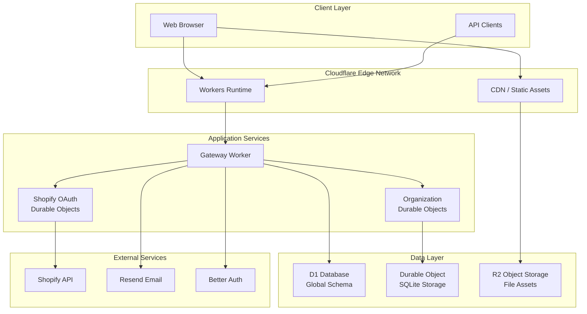

### Core Components

| Component              | Purpose                                               | Technology               | Scalability        |
| ---------------------- | ----------------------------------------------------- | ------------------------ | ------------------ |
| **Gateway Worker**     | Request routing, authentication, global operations    | Cloudflare Workers       | Auto-scaling       |
| **Organization DO**    | Tenant-specific business logic and data               | Durable Objects + SQLite | Per-tenant scaling |
| **Shopify OAuth DO**   | OAuth flow management and token storage               | Durable Objects + SQLite | Per-store scaling  |
| **D1 Global Database** | User accounts, sessions, global organization registry | Cloudflare D1            | Managed scaling    |
| **R2 Storage**         | Static assets, uploaded files                         | Cloudflare R2            | Global CDN         |

## Clean Architecture Layers

The project strictly follows Clean Architecture principles with Effect-TS for maximum maintainability and testability.

### Architecture Layer Diagram

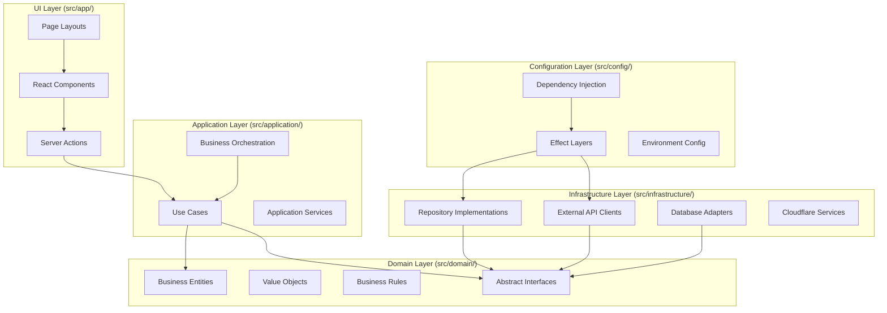

### Layer Responsibilities

#### 1. Domain Layer (`src/domain/`)

**Core Business Logic & Contracts**

- **Entities**: Pure business objects (User, Organization, Invitation)
- **Value Objects**: Immutable data types (Email, OrganizationSlug)
- **Business Rules**: Domain-specific validation and logic
- **Interfaces**: Abstract contracts for repositories and services
- **Errors**: Domain-specific error types

**Key Principles:**

- No external dependencies
- Pure functions only
- Immutable data structures
- Framework-agnostic

#### 2. Application Layer (`src/application/`)

**Business Use Case Orchestration**

- **Use Cases**: Complex business workflows
- **Application Services**: Coordinate multiple domain services
- **Business Logic**: Rules that span multiple entities
- **Data Transformation**: Convert between domain and infrastructure models

**Effect-TS Patterns:**

```typescript
export const CreateOrganizationUseCase = Effect.gen(function* () {
  const orgRepo = yield* OrganizationRepo;
  const userRepo = yield* UserRepo;
  const emailService = yield* EmailService;

  // Orchestrate multiple domain services
  // Handle complex business workflows
  // Transform data between layers
});
```

#### 3. Infrastructure Layer (`src/infrastructure/`)

**External System Integration**

- **Repositories**: Database access implementations
- **API Clients**: External service integrations
- **Adapters**: Framework-specific implementations
- **Durable Objects**: Cloudflare Workers-specific services

**Integration Points:**

- Cloudflare D1 Database
- Durable Object Storage
- Shopify API
- Resend Email Service
- Better Auth

#### 4. Configuration Layer (`src/config/`)

**Dependency Injection & Wiring**

- **Effect Layers**: Dependency composition
- **Environment Configuration**: Runtime settings
- **Service Wiring**: Connect interfaces to implementations

#### 5. UI Layer (`src/app/`)

**User Interface & Actions**

- **Server Actions**: Backend integration points
- **React Components**: UI presentation
- **Page Layouts**: Route-level organization

## Multi-Tenant Design

Nimblers implements a **hybrid multi-tenancy** model with both shared and isolated resources.

### Tenant Isolation Model

```mermaid
graph TB
    subgraph "Global Shared Layer"
        USERS[User Accounts]
        AUTH[Authentication]
        ORG_REGISTRY[Organization Registry]
        GLOBAL_CONFIG[Global Configuration]
    end

    subgraph "Tenant A"
        ORG_A[Organization DO A]
        MEMBERS_A[Members A]
        INVITES_A[Invitations A]
        STORES_A[Connected Stores A]
        DATA_A[SQLite Storage A]
    end

    subgraph "Tenant B"
        ORG_B[Organization DO B]
        MEMBERS_B[Members B]
        INVITES_B[Invitations B]
        STORES_B[Connected Stores B]
        DATA_B[SQLite Storage B]
    end

    subgraph "Tenant C"
        ORG_C[Organization DO C]
        MEMBERS_C[Members C]
        INVITES_C[Invitations C]
        STORES_C[Connected Stores C]
        DATA_C[SQLite Storage C]
    end

    USERS --> ORG_A
    USERS --> ORG_B
    USERS --> ORG_C

    ORG_REGISTRY --> ORG_A
    ORG_REGISTRY --> ORG_B
    ORG_REGISTRY --> ORG_C
```

### Isolation Boundaries

| Resource                  | Scope      | Technology              | Isolation Level |
| ------------------------- | ---------- | ----------------------- | --------------- |
| **User Accounts**         | Global     | D1 Database             | Shared          |
| **Authentication**        | Global     | Better Auth + D1        | Shared          |
| **Organization Registry** | Global     | D1 Database             | Shared          |
| **Organization Data**     | Per-Tenant | Durable Object SQLite   | Isolated        |
| **Members & Roles**       | Per-Tenant | Durable Object SQLite   | Isolated        |
| **Invitations**           | Per-Tenant | Durable Object SQLite   | Isolated        |
| **Connected Stores**      | Per-Tenant | Durable Object SQLite   | Isolated        |
| **Business Logic**        | Per-Tenant | Durable Object Instance | Isolated        |

### Tenant Addressing

Each organization is addressed by a unique slug and maps to a dedicated Durable Object:

```typescript
// Organization slug -> Durable Object ID
const doId = env.ORG_DO.idFromName(organizationSlug);
const orgDO = env.ORG_DO.get(doId);
```

## Cloudflare Workers Platform

### Platform Components

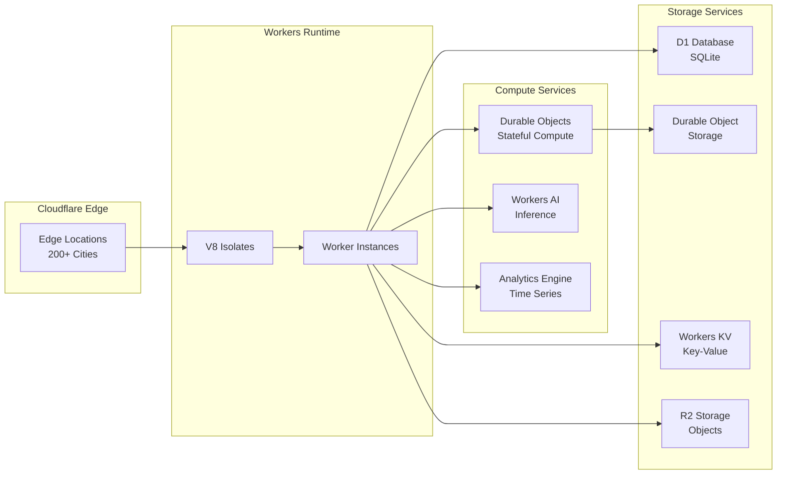

### Performance Characteristics

| Metric                  | Value        | Notes                        |
| ----------------------- | ------------ | ---------------------------- |
| **Cold Start**          | < 5ms        | V8 Isolates (not containers) |
| **Memory Limit**        | 128MB        | Per isolate                  |
| **CPU Time**            | 50ms/request | Standard plan                |
| **Duration Limit**      | 15 minutes   | Durable Objects              |
| **Request Size**        | 100MB        | Max request/response         |
| **Concurrent Requests** | 1000+        | Per Worker                   |

### Durable Objects Architecture

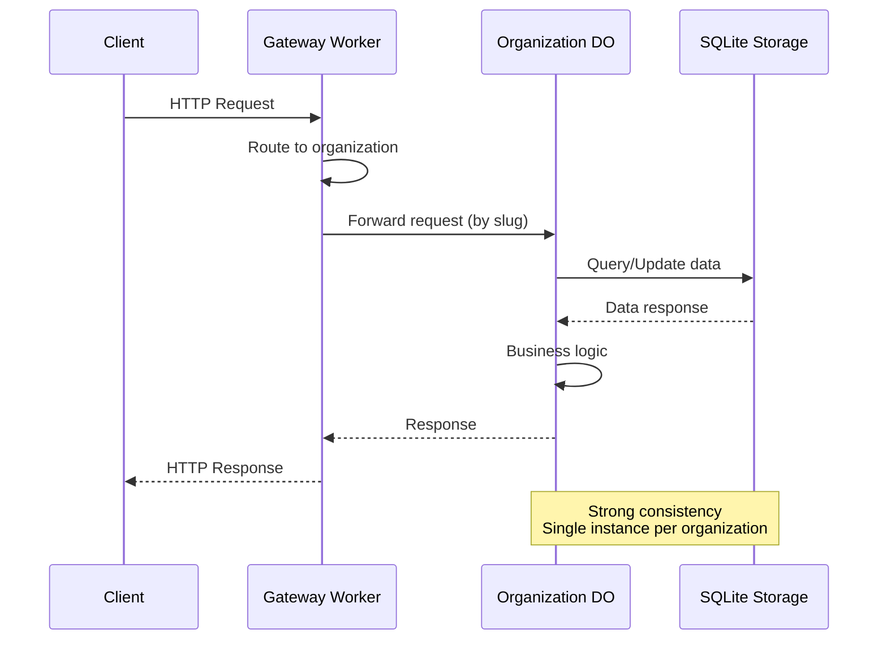

## Data Flow Architecture

### Request Processing Flow

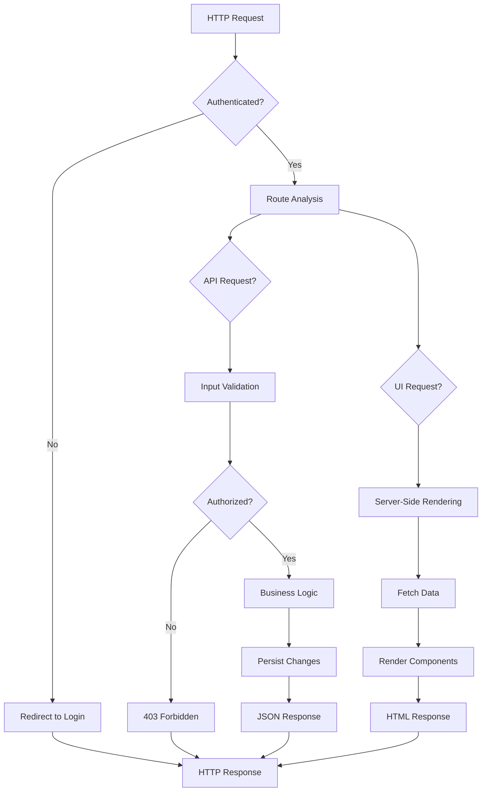

### Data Persistence Flow

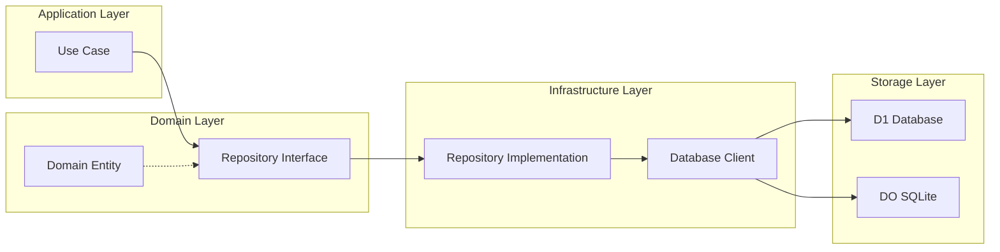

## Security Architecture

### Authentication & Authorization Flow

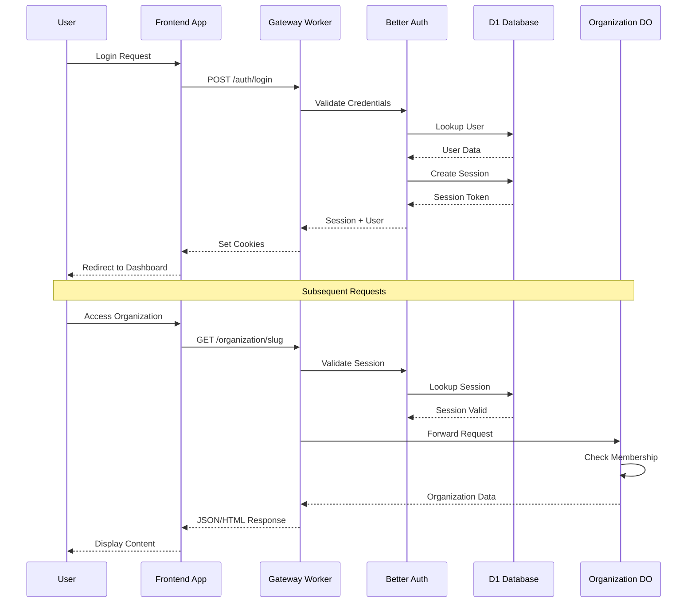

### Security Layers

| Layer                | Protection         | Implementation          |
| -------------------- | ------------------ | ----------------------- |
| **Transport**        | HTTPS/TLS          | Cloudflare SSL          |
| **Authentication**   | Session-based      | Better Auth             |
| **Authorization**    | Role-based         | Organization membership |
| **Input Validation** | Schema validation  | Effect Schema           |
| **CORS**             | Origin validation  | Custom middleware       |
| **Rate Limiting**    | Request throttling | Cloudflare rules        |
| **Data Encryption**  | At rest & transit  | Cloudflare encryption   |

### Privacy & Compliance

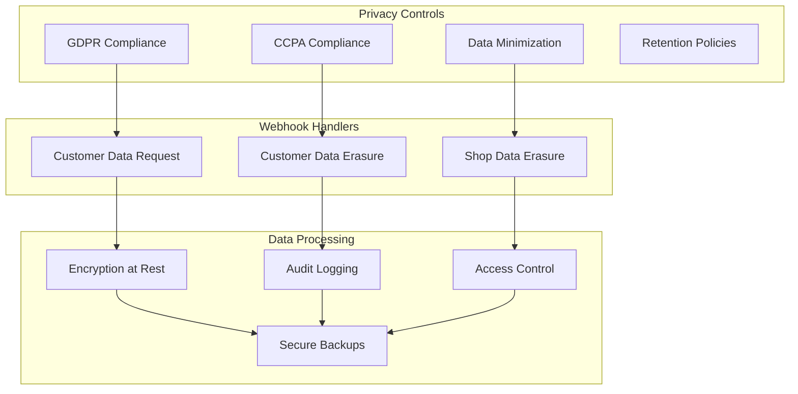

## Performance Architecture

### Caching Strategy

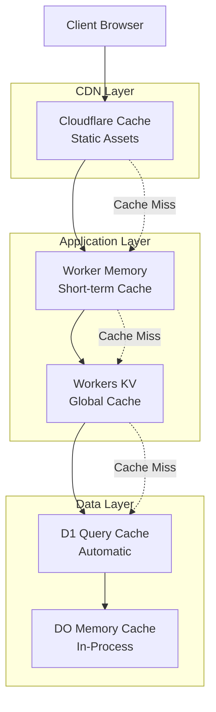

### Scalability Patterns

| Component            | Scaling Method          | Triggers                |
| -------------------- | ----------------------- | ----------------------- |
| **Gateway Worker**   | Horizontal auto-scaling | Request volume          |
| **Organization DOs** | Per-tenant scaling      | Organization activity   |
| **D1 Database**      | Automatic sharding      | Query volume            |
| **Static Assets**    | Global CDN              | Geographic distribution |
| **API Endpoints**    | Load balancing          | Response time           |

### Performance Monitoring

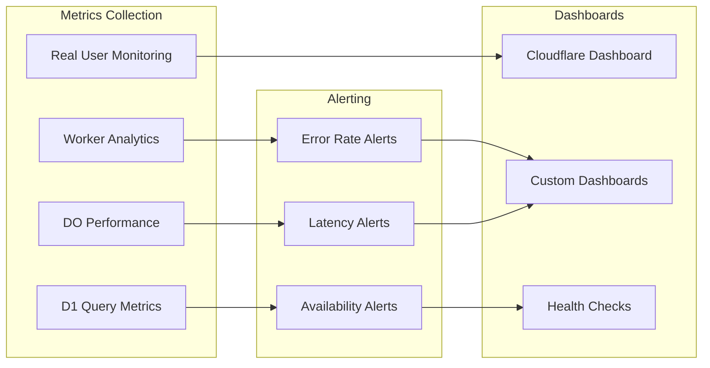

## Architecture Benefits

### Scalability Benefits

1. **Per-Tenant Scaling**: Each organization scales independently
2. **Global Distribution**: Cloudflare's edge network reduces latency
3. **Serverless Architecture**: No server management overhead
4. **Resource Efficiency**: Pay only for actual usage

### Maintainability Benefits

1. **Clean Architecture**: Clear separation of concerns
2. **Type Safety**: Compile-time error detection with TypeScript + Effect-TS
3. **Dependency Injection**: Easy testing and modular development
4. **Functional Programming**: Predictable, composable code

### Reliability Benefits

1. **Strong Consistency**: Durable Objects provide ACID guarantees
2. **Automatic Failover**: Cloudflare handles infrastructure failures
3. **Error Handling**: Structured error types prevent silent failures
4. **Observability**: Built-in tracing and monitoring

---

**Next**: [Data Models & Schemas](../data-models/README.md)
