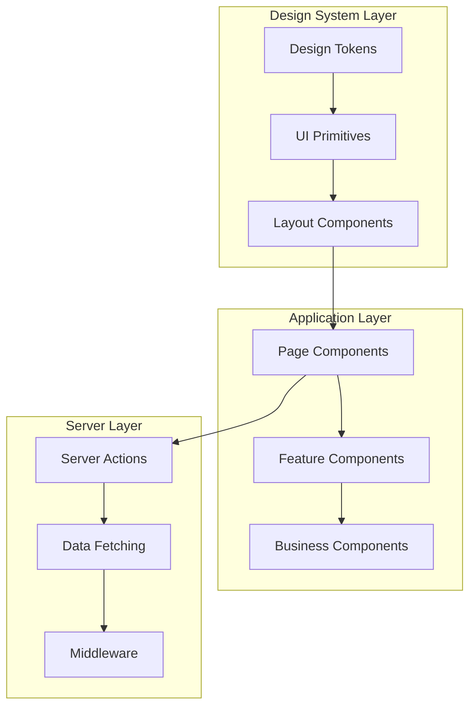

# Component Documentation

## Table of Contents

1. [Overview](#overview)
2. [Design System](#design-system)
3. [Layout Components](#layout-components)
4. [UI Components](#ui-components)
5. [Page Components](#page-components)
6. [Business Components](#business-components)
7. [Email Templates](#email-templates)
8. [Component Patterns](#component-patterns)
9. [Testing Components](#testing-components)

## Overview

Nimblers uses a **component-driven architecture** with React 19 Server Components, a custom design system built with Panda CSS, and React Aria Components for accessibility. The component hierarchy follows Clean Architecture principles with clear separation between UI presentation and business logic.

### Component Architecture



### Component Categories

| Category          | Purpose                | Examples                          | State Management |
| ----------------- | ---------------------- | --------------------------------- | ---------------- |
| **Design System** | Reusable UI primitives | Button, Card, Input               | Stateless        |
| **Layout**        | Page structure         | VStack, HStack, Grid              | Stateless        |
| **Pages**         | Route-level components | LoginLayout, OrganizationPage     | Server state     |
| **Features**      | Business functionality | InvitationForm, MemberList        | Mixed            |
| **Business**      | Domain-specific UI     | OrganizationCard, StoreConnection | Server state     |

## Design System

The design system provides a consistent, accessible foundation built with **Panda CSS** and **React Aria Components**.

### Design Tokens

```typescript
// panda.config.ts - Design token examples
export default defineConfig({
  theme: {
    tokens: {
      colors: {
        primary: { value: "#0066FF" },
        secondary: { value: "#6B7280" },
        success: { value: "#10B981" },
        warning: { value: "#F59E0B" },
        error: { value: "#EF4444" },
      },
      spacing: {
        xs: { value: "0.25rem" },
        sm: { value: "0.5rem" },
        md: { value: "1rem" },
        lg: { value: "1.5rem" },
        xl: { value: "2rem" },
      },
      radii: {
        sm: { value: "0.25rem" },
        md: { value: "0.375rem" },
        lg: { value: "0.5rem" },
      },
    },
  },
});
```

### Core Design Principles

1. **Accessibility First**: ARIA compliance through React Aria Components
2. **Type Safety**: Full TypeScript support with strict types
3. **Consistency**: Shared design tokens and patterns
4. **Performance**: Zero-runtime CSS with Panda CSS
5. **Developer Experience**: Clear APIs and excellent defaults

## Layout Components

Layout components provide structure and spacing using Panda CSS patterns.

### VStack (Vertical Stack)

```typescript
// src/app/design-system/Layout.tsx
import { VStack } from "styled-system/jsx";

// Usage example
export function UserProfile({ user }: { user: User }) {
  return (
    <VStack gap="6" align="start">
      <Heading size="xl">{user.name}</Heading>
      <Text color="gray.600">{user.email}</Text>
      <Button>Edit Profile</Button>
    </VStack>
  );
}
```

### HStack (Horizontal Stack)

```typescript
// Horizontal layout with consistent spacing
export function ActionBar({ onSave, onCancel }: ActionBarProps) {
  return (
    <HStack gap="4" justify="end">
      <Button variant="outline" onClick={onCancel}>
        Cancel
      </Button>
      <Button variant="solid" onClick={onSave}>
        Save Changes
      </Button>
    </HStack>
  );
}
```

### Responsive Grid

```typescript
import { Grid } from "styled-system/jsx";

export function DashboardGrid({ children }: { children: React.ReactNode }) {
  return (
    <Grid columns={{ base: 1, md: 2, lg: 3 }} gap="6" width="full">
      {children}
    </Grid>
  );
}
```

## UI Components

### Button Component

**Purpose**: Primary interaction element with multiple variants and states.

```typescript
// src/app/design-system/Button.tsx
import { Button as AriaButton } from "react-aria-components";
import { cva } from "styled-system/css";

const buttonVariants = cva({
  base: {
    display: "inline-flex",
    alignItems: "center",
    justifyContent: "center",
    borderRadius: "md",
    fontWeight: "medium",
    transition: "all 0.2s",
    cursor: "pointer",
    _disabled: {
      opacity: 0.5,
      cursor: "not-allowed",
    },
  },
  variants: {
    variant: {
      solid: {
        bg: "primary",
        color: "white",
        _hover: { bg: "primary.600" },
      },
      outline: {
        borderWidth: "1px",
        borderColor: "primary",
        color: "primary",
        _hover: { bg: "primary.50" },
      },
      ghost: {
        color: "primary",
        _hover: { bg: "primary.50" },
      },
    },
    size: {
      sm: { px: "3", py: "1.5", fontSize: "sm" },
      md: { px: "4", py: "2", fontSize: "md" },
      lg: { px: "6", py: "3", fontSize: "lg" },
    },
  },
  defaultVariants: {
    variant: "solid",
    size: "md",
  },
});

export interface ButtonProps {
  variant?: "solid" | "outline" | "ghost";
  size?: "sm" | "md" | "lg";
  children: React.ReactNode;
  disabled?: boolean;
  onClick?: () => void;
}

export function Button({
  variant,
  size,
  children,
  disabled,
  onClick,
  ...props
}: ButtonProps) {
  return (
    <AriaButton
      className={buttonVariants({ variant, size })}
      isDisabled={disabled}
      onPress={onClick}
      {...props}
    >
      {children}
    </AriaButton>
  );
}
```

### Card Component

**Purpose**: Content container with consistent styling and elevation.

```typescript
// src/app/design-system/Card.tsx
import { css } from "styled-system/css";
import { VStack } from "styled-system/jsx";

const cardStyles = cva({
  base: {
    bg: "white",
    borderRadius: "lg",
    borderWidth: "1px",
    borderColor: "gray.200",
    p: "6",
    shadow: "sm",
    _hover: {
      shadow: "md",
      borderColor: "gray.300",
    },
  },
  variants: {
    variant: {
      default: {},
      elevated: {
        shadow: "lg",
        borderWidth: "0",
      },
      bordered: {
        borderWidth: "2px",
        borderColor: "primary",
      },
    },
  },
});

export interface CardProps {
  variant?: "default" | "elevated" | "bordered";
  children: React.ReactNode;
  className?: string;
}

export function Card({ variant = "default", children, className }: CardProps) {
  return <div className={cardStyles({ variant, className })}>{children}</div>;
}

// Card composition components
export function CardHeader({ children }: { children: React.ReactNode }) {
  return (
    <VStack gap="2" mb="4">
      {children}
    </VStack>
  );
}

export function CardContent({ children }: { children: React.ReactNode }) {
  return <VStack gap="4">{children}</VStack>;
}
```

### Input Component

**Purpose**: Form input with validation states and accessibility features.

```typescript
// src/app/design-system/Input.tsx
import { TextField, Label, Input as AriaInput } from "react-aria-components";
import { cva } from "styled-system/css";

const inputStyles = cva({
  base: {
    width: "full",
    px: "3",
    py: "2",
    borderRadius: "md",
    borderWidth: "1px",
    borderColor: "gray.300",
    fontSize: "md",
    transition: "all 0.2s",
    _focus: {
      outline: "none",
      borderColor: "primary",
      ring: "2px",
      ringColor: "primary.100",
    },
    _invalid: {
      borderColor: "error",
      _focus: {
        borderColor: "error",
        ringColor: "error.100",
      },
    },
  },
});

export interface InputProps {
  label?: string;
  placeholder?: string;
  value?: string;
  onChange?: (value: string) => void;
  error?: string;
  required?: boolean;
  type?: "text" | "email" | "password" | "url";
}

export function Input({
  label,
  placeholder,
  value,
  onChange,
  error,
  required,
  type = "text",
}: InputProps) {
  return (
    <TextField
      isRequired={required}
      isInvalid={!!error}
      value={value}
      onChange={onChange}
    >
      {label && (
        <Label
          className={css({
            fontSize: "sm",
            fontWeight: "medium",
            mb: "1",
          })}
        >
          {label}
        </Label>
      )}
      <AriaInput
        type={type}
        placeholder={placeholder}
        className={inputStyles()}
      />
      {error && (
        <div
          className={css({
            color: "error",
            fontSize: "sm",
            mt: "1",
          })}
        >
          {error}
        </div>
      )}
    </TextField>
  );
}
```

### Dialog Component

**Purpose**: Modal dialogs with overlay and focus management.

```typescript
// src/app/design-system/Dialog.tsx
import {
  Dialog as AriaDialog,
  DialogTrigger,
  Modal,
  ModalOverlay,
} from "react-aria-components";
import { css } from "styled-system/css";

const overlayStyles = css({
  position: "fixed",
  inset: "0",
  bg: "black/50",
  display: "flex",
  alignItems: "center",
  justifyContent: "center",
  p: "4",
});

const dialogStyles = css({
  bg: "white",
  borderRadius: "lg",
  shadow: "xl",
  maxWidth: "md",
  width: "full",
  maxHeight: "90vh",
  overflow: "auto",
  outline: "none",
});

export interface DialogProps {
  trigger: React.ReactNode;
  title?: string;
  children: React.ReactNode;
  onClose?: () => void;
}

export function Dialog({ trigger, title, children, onClose }: DialogProps) {
  return (
    <DialogTrigger>
      {trigger}
      <ModalOverlay className={overlayStyles}>
        <Modal className={dialogStyles}>
          <AriaDialog>
            {({ close }) => (
              <VStack gap="6" p="6">
                {title && (
                  <HStack justify="between" align="center">
                    <Heading size="lg">{title}</Heading>
                    <Button
                      variant="ghost"
                      size="sm"
                      onClick={() => {
                        close();
                        onClose?.();
                      }}
                    >
                      ✕
                    </Button>
                  </HStack>
                )}
                {children}
              </VStack>
            )}
          </AriaDialog>
        </Modal>
      </ModalOverlay>
    </DialogTrigger>
  );
}
```

## Page Components

Page components are server components that handle routing, data fetching, and layout composition.

### Organization Layout

```typescript
// src/app/pages/organization/slug/Layout.tsx
import type { RequestInfo } from "rwsdk/worker";
import { getOrganization } from "@/app/actions/organization/get";
import { getOrganizationMembers } from "@/app/actions/organization/getMembers";
import { OrganizationHeader } from "./components/OrganizationHeader";
import { MembersList } from "./components/MembersList";
import { ConnectedStoresList } from "./components/ConnectedStoresList";

export async function Layout({ params, ctx }: RequestInfo) {
  // Server-side data fetching
  const [organization, members] = await Promise.all([
    getOrganization(params.orgSlug),
    getOrganizationMembers(params.orgSlug),
  ]);

  if (!organization) {
    return (
      <Card>
        <Text>Organization not found</Text>
      </Card>
    );
  }

  return (
    <VStack gap="8" maxWidth="4xl" mx="auto" p="6">
      <OrganizationHeader organization={organization} />

      <Grid columns={{ md: 2 }} gap="6">
        <Card>
          <CardHeader>
            <Heading size="md">Team Members</Heading>
          </CardHeader>
          <CardContent>
            <MembersList
              members={members}
              organizationSlug={organization.slug}
            />
          </CardContent>
        </Card>

        <Card>
          <CardHeader>
            <Heading size="md">Connected Stores</Heading>
          </CardHeader>
          <CardContent>
            <ConnectedStoresList organizationSlug={organization.slug} />
          </CardContent>
        </Card>
      </Grid>
    </VStack>
  );
}
```

### Login Layout

```typescript
// src/app/pages/login/Layout.tsx
import { LoginForm } from "./components/LoginForm";
import { SocialLogin } from "./components/SocialLogin";

export function Layout() {
  return (
    <VStack gap="8" maxWidth="md" mx="auto" p="6">
      <VStack gap="2" textAlign="center">
        <Heading size="xl">Welcome back</Heading>
        <Text color="gray.600">Sign in to your account to continue</Text>
      </VStack>

      <Card variant="elevated">
        <CardContent>
          <VStack gap="6">
            <LoginForm />
            <SocialLogin />
          </VStack>
        </CardContent>
      </Card>

      <Text textAlign="center" fontSize="sm" color="gray.600">
        Don't have an account?{" "}
        <Link href="/signup" color="primary">
          Sign up
        </Link>
      </Text>
    </VStack>
  );
}
```

## Business Components

Business components encapsulate domain-specific functionality and integrate with server actions.

### Invitation Form

```typescript
// src/app/components/InvitationForm.tsx
"use client";

import { useState } from "react";
import { createInvitation } from "@/app/actions/invitations/create";

interface InvitationFormProps {
  organizationSlug: string;
  onSuccess?: () => void;
}

export function InvitationForm({
  organizationSlug,
  onSuccess,
}: InvitationFormProps) {
  const [email, setEmail] = useState("");
  const [role, setRole] = useState("member");
  const [isLoading, setIsLoading] = useState(false);
  const [error, setError] = useState<string | null>(null);

  const handleSubmit = async (e: React.FormEvent) => {
    e.preventDefault();
    setIsLoading(true);
    setError(null);

    try {
      const result = await createInvitation({
        organizationSlug,
        inviteeEmail: email,
        role,
      });

      if (result.success) {
        setEmail("");
        setRole("member");
        onSuccess?.();
      } else {
        setError(result.error || "Failed to send invitation");
      }
    } catch (err) {
      setError("An unexpected error occurred");
    } finally {
      setIsLoading(false);
    }
  };

  return (
    <Card>
      <CardHeader>
        <Heading size="md">Invite Team Member</Heading>
        <Text color="gray.600">
          Send an invitation to join your organization
        </Text>
      </CardHeader>

      <CardContent>
        <form onSubmit={handleSubmit}>
          <VStack gap="4">
            <Input
              label="Email Address"
              type="email"
              value={email}
              onChange={setEmail}
              placeholder="colleague@company.com"
              required
            />

            <Select
              label="Role"
              value={role}
              onChange={setRole}
              options={[
                { value: "member", label: "Member" },
                { value: "admin", label: "Admin" },
                { value: "owner", label: "Owner" },
              ]}
            />

            {error && <Banner variant="error">{error}</Banner>}

            <Button
              type="submit"
              disabled={isLoading || !email.trim()}
              size="lg"
              width="full"
            >
              {isLoading ? "Sending..." : "Send Invitation"}
            </Button>
          </VStack>
        </form>
      </CardContent>
    </Card>
  );
}
```

### Member List

```typescript
// src/app/components/MembersList.tsx
import { removeMember } from "@/app/actions/members/remove";
import { updateMemberRole } from "@/app/actions/members/updateRole";

interface Member {
  id: string;
  userId: string;
  email: string;
  name: string;
  role: string;
  joinedAt: string;
}

interface MembersListProps {
  members: Member[];
  organizationSlug: string;
  currentUserRole?: string;
}

export function MembersList({
  members,
  organizationSlug,
  currentUserRole,
}: MembersListProps) {
  const canManageMembers =
    currentUserRole === "owner" || currentUserRole === "admin";

  return (
    <VStack gap="3">
      {members.map((member) => (
        <Card key={member.id} variant="bordered">
          <HStack justify="between" align="center">
            <HStack gap="3" align="center">
              <Avatar
                name={member.name}
                src={`/api/avatar/${member.userId}`}
                size="sm"
              />
              <VStack gap="1" align="start">
                <Text fontWeight="medium">{member.name}</Text>
                <Text fontSize="sm" color="gray.600">
                  {member.email}
                </Text>
              </VStack>
            </HStack>

            <HStack gap="2" align="center">
              <Pill variant="outline">{member.role}</Pill>

              {canManageMembers && (
                <Dialog
                  trigger={
                    <Button variant="ghost" size="sm">
                      ⋯
                    </Button>
                  }
                  title="Manage Member"
                >
                  <VStack gap="4">
                    <Select
                      label="Role"
                      value={member.role}
                      onChange={(newRole) =>
                        updateMemberRole(member.id, newRole)
                      }
                      options={[
                        { value: "member", label: "Member" },
                        { value: "admin", label: "Admin" },
                        { value: "owner", label: "Owner" },
                      ]}
                    />

                    <Button
                      variant="outline"
                      onClick={() => removeMember(member.id)}
                    >
                      Remove from Organization
                    </Button>
                  </VStack>
                </Dialog>
              )}
            </HStack>
          </HStack>
        </Card>
      ))}

      {members.length === 0 && (
        <Card>
          <Text textAlign="center" color="gray.600">
            No members yet. Invite your team to get started.
          </Text>
        </Card>
      )}
    </VStack>
  );
}
```

## Email Templates

Email templates use React Email components for consistent, responsive email design.

### Invitation Email Template

```typescript
// src/app/email-templates/InvitationEmail.tsx
import {
  Html,
  Head,
  Body,
  Container,
  Heading,
  Text,
  Button,
  Section,
  Hr,
} from "@react-email/components";

interface InvitationEmailProps {
  inviterName: string;
  organizationName: string;
  acceptUrl: string;
  role: string;
}

export function InvitationEmail({
  inviterName,
  organizationName,
  acceptUrl,
  role,
}: InvitationEmailProps) {
  return (
    <Html>
      <Head />
      <Body style={main}>
        <Container style={container}>
          <Heading style={h1}>
            You're invited to join {organizationName}
          </Heading>

          <Text style={text}>
            <strong>{inviterName}</strong> has invited you to join{" "}
            <strong>{organizationName}</strong> as a <strong>{role}</strong>.
          </Text>

          <Text style={text}>
            Click the button below to accept the invitation and get started:
          </Text>

          <Section style={buttonContainer}>
            <Button style={button} href={acceptUrl}>
              Accept Invitation
            </Button>
          </Section>

          <Hr style={hr} />

          <Text style={footer}>
            This invitation will expire in 7 days. If you don't want to receive
            these emails, you can safely ignore this message.
          </Text>
        </Container>
      </Body>
    </Html>
  );
}

// Email styles
const main = {
  backgroundColor: "#f6f9fc",
  fontFamily: '-apple-system,BlinkMacSystemFont,"Segoe UI",Roboto,sans-serif',
};

const container = {
  backgroundColor: "#ffffff",
  margin: "0 auto",
  padding: "20px 0 48px",
  marginBottom: "64px",
};

const h1 = {
  color: "#333",
  fontSize: "24px",
  fontWeight: "bold",
  margin: "40px 0",
  padding: "0",
};

const text = {
  color: "#333",
  fontSize: "16px",
  lineHeight: "26px",
};

const button = {
  backgroundColor: "#007ee6",
  borderRadius: "4px",
  color: "#fff",
  fontSize: "16px",
  textDecoration: "none",
  textAlign: "center" as const,
  display: "block",
  padding: "12px",
};

const buttonContainer = {
  padding: "27px 0 27px",
};

const hr = {
  borderColor: "#dfe1e4",
  margin: "42px 0 26px",
};

const footer = {
  color: "#8898aa",
  fontSize: "12px",
  lineHeight: "16px",
};
```

## Component Patterns

### Server Action Integration

```typescript
// Pattern: Component with server action
"use client";

export function ActionButton({ organizationId }: { organizationId: string }) {
  const [isPending, startTransition] = useTransition();

  const handleAction = () => {
    startTransition(async () => {
      await deleteOrganization(organizationId);
    });
  };

  return (
    <Button onClick={handleAction} disabled={isPending}>
      {isPending ? "Deleting..." : "Delete Organization"}
    </Button>
  );
}
```

### Error Boundary Pattern

```typescript
// Error boundary for component isolation
"use client";

import { ErrorBoundary } from "react-error-boundary";

function ErrorFallback({ error, resetErrorBoundary }: any) {
  return (
    <Card variant="bordered">
      <VStack gap="4" textAlign="center">
        <Text color="error">Something went wrong:</Text>
        <Text fontSize="sm" color="gray.600">
          {error.message}
        </Text>
        <Button onClick={resetErrorBoundary}>Try again</Button>
      </VStack>
    </Card>
  );
}

export function SafeComponent({ children }: { children: React.ReactNode }) {
  return (
    <ErrorBoundary FallbackComponent={ErrorFallback}>{children}</ErrorBoundary>
  );
}
```

### Loading States Pattern

```typescript
// Suspense boundary with loading fallback
import { Suspense } from "react";

function LoadingSkeleton() {
  return (
    <VStack gap="4">
      {Array.from({ length: 3 }).map((_, i) => (
        <Card key={i}>
          <div
            className={css({
              height: "20px",
              bg: "gray.200",
              borderRadius: "md",
              animation: "pulse 2s infinite",
            })}
          />
        </Card>
      ))}
    </VStack>
  );
}

export function AsyncDataComponent() {
  return (
    <Suspense fallback={<LoadingSkeleton />}>
      <DataComponent />
    </Suspense>
  );
}
```

## Testing Components

### Component Testing Strategy

```typescript
// Example component test with React Testing Library
import { render, screen, fireEvent } from "@testing-library/react";
import { Button } from "@/app/design-system/Button";

describe("Button Component", () => {
  it("renders with correct text", () => {
    render(<Button>Click me</Button>);
    expect(screen.getByRole("button")).toHaveTextContent("Click me");
  });

  it("calls onClick when clicked", () => {
    const handleClick = jest.fn();
    render(<Button onClick={handleClick}>Click me</Button>);

    fireEvent.click(screen.getByRole("button"));
    expect(handleClick).toHaveBeenCalledTimes(1);
  });

  it("is disabled when disabled prop is true", () => {
    render(<Button disabled>Click me</Button>);
    expect(screen.getByRole("button")).toBeDisabled();
  });
});
```

### Visual Testing with Storybook

```typescript
// src/app/design-system/Button.stories.tsx
import type { Meta, StoryObj } from "@storybook/react";
import { Button } from "./Button";

const meta: Meta<typeof Button> = {
  title: "Design System/Button",
  component: Button,
  parameters: {
    layout: "centered",
  },
  tags: ["autodocs"],
};

export default meta;
type Story = StoryObj<typeof meta>;

export const Primary: Story = {
  args: {
    variant: "solid",
    children: "Button",
  },
};

export const Secondary: Story = {
  args: {
    variant: "outline",
    children: "Button",
  },
};

export const Disabled: Story = {
  args: {
    disabled: true,
    children: "Button",
  },
};
```

## Component Best Practices

### Performance Optimization

1. **Server Components by Default**: Use server components for data fetching and static content
2. **Client Components Sparingly**: Only use "use client" when interactivity is needed
3. **Code Splitting**: Lazy load heavy components with React.lazy()
4. **Memoization**: Use React.memo() for expensive pure components

### Accessibility

1. **Semantic HTML**: Use proper HTML elements and roles
2. **ARIA Labels**: Provide descriptive labels for screen readers
3. **Keyboard Navigation**: Ensure all interactive elements are keyboard accessible
4. **Color Contrast**: Maintain WCAG AA contrast ratios

### Type Safety

1. **Strict Interfaces**: Define clear TypeScript interfaces for all props
2. **Generic Components**: Use generics for flexible, reusable components
3. **Branded Types**: Use branded types for IDs and domain-specific values
4. **Schema Validation**: Validate props with Effect Schema when needed

---

**Next**: [API Documentation](../api/README.md)
