# Data Models & Schemas

## Table of Contents

1. [Database Architecture](#database-architecture)
2. [Global Schema (D1)](#global-schema-d1)
3. [Tenant Schema (Durable Objects)](#tenant-schema-durable-objects)
4. [Shopify Schema](#shopify-schema)
5. [Domain Models](#domain-models)
6. [Data Validation](#data-validation)
7. [Migration Patterns](#migration-patterns)

## Database Architecture

Nimblers uses a **hybrid database architecture** combining global shared data with tenant-isolated storage for optimal performance and security.

### Database Distribution Strategy

```mermaid
graph TB
    subgraph "Global D1 Database"
        USERS[👤 Users]
        SESSIONS[🔑 Sessions]
        ACCOUNTS[📧 Accounts]
        ORG_REGISTRY[🏢 Organization Registry]
        SHOP_CONNECTIONS[🏪 Shop Connections]
        VERIFICATIONS[✅ Verifications]
    end

    subgraph "Tenant A - Durable Object SQLite"
        ORG_A[🏢 Organization A]
        MEMBERS_A[👥 Members A]
        INVITES_A[📧 Invitations A]
        STORES_A[🏪 Connected Stores A]
    end

    subgraph "Tenant B - Durable Object SQLite"
        ORG_B[🏢 Organization B]
        MEMBERS_B[👥 Members B]
        INVITES_B[📧 Invitations B]
        STORES_B[🏪 Connected Stores B]
    end

    subgraph "Shopify OAuth - Durable Object SQLite"
        OAUTH_STATES[🔐 OAuth States]
        ACCESS_TOKENS[🎫 Access Tokens]
        SHOP_INFO[ℹ️ Shop Information]
    end

    USERS -.->|References| MEMBERS_A
    USERS -.->|References| MEMBERS_B
    ORG_REGISTRY -.->|Maps to| ORG_A
    ORG_REGISTRY -.->|Maps to| ORG_B
    SHOP_CONNECTIONS -.->|Global Constraint| STORES_A
    SHOP_CONNECTIONS -.->|Global Constraint| STORES_B
```



### Schema Separation Benefits

| Schema                   | Purpose                          | Benefits                                       | Trade-offs                      |
| ------------------------ | -------------------------------- | ---------------------------------------------- | ------------------------------- |
| **Global D1**            | User identity, cross-tenant data | Consistent user experience, global constraints | Single point of failure         |
| **Tenant SQLite**        | Organization-specific data       | Perfect isolation, independent scaling         | Cross-tenant queries impossible |
| **Shopify OAuth SQLite** | OAuth state management           | Strong consistency for auth flows              | Additional complexity           |

## Global Schema (D1)

The global D1 database manages shared resources and cross-tenant relationships.

### Schema Overview


### Table Definitions

#### Users Table

**Purpose**: Central user identity and authentication

```sql
CREATE TABLE user (
    id TEXT PRIMARY KEY NOT NULL,           -- UUID
    name TEXT,                              -- Display name
    email TEXT NOT NULL UNIQUE,             -- Email address
    emailVerified INTEGER DEFAULT 0 NOT NULL, -- Boolean flag
    image TEXT,                             -- Profile image URL
    role TEXT DEFAULT 'admin',              -- Global role
    createdAt TEXT NOT NULL,                -- ISO timestamp
    updatedAt TEXT NOT NULL                 -- ISO timestamp
);
```

**Key Features:**

- UUID-based primary keys for global uniqueness
- Email uniqueness constraint
- Global role system (admin, user)
- ISO timestamp storage for consistency

#### Sessions Table

**Purpose**: User session management with Better Auth

```sql
CREATE TABLE session (
    id TEXT PRIMARY KEY,                    -- Session ID
    userId TEXT NOT NULL REFERENCES user(id) ON DELETE CASCADE,
    token TEXT NOT NULL UNIQUE,             -- Session token
    expiresAt TEXT NOT NULL,                -- ISO timestamp
    ipAddress TEXT,                         -- Client IP
    userAgent TEXT,                         -- Browser info
    activeOrganizationId TEXT,              -- Current org context
    createdAt TEXT NOT NULL,
    updatedAt TEXT NOT NULL
);
```

**Key Features:**

- Automatic cleanup on user deletion
- IP and User Agent tracking for security
- Active organization context for multi-tenancy

#### Organization Registry

**Purpose**: Global organization directory and routing

```sql
CREATE TABLE organization (
    id TEXT PRIMARY KEY NOT NULL,          -- Matches Durable Object ID
    slug TEXT NOT NULL UNIQUE,             -- URL-friendly identifier
    status TEXT DEFAULT 'active' NOT NULL, -- active, archived
    createdAt TEXT NOT NULL,
    updatedAt TEXT NOT NULL
);
```

**Key Features:**

- Slug-based routing to Durable Objects
- Global organization status tracking
- Unique slug constraint across platform

#### Shop Connection Registry

**Purpose**: Global shop ownership tracking and constraint enforcement

```sql
CREATE TABLE shop_connection (
    shopDomain TEXT PRIMARY KEY NOT NULL,   -- e.g., "store.myshopify.com"
    organizationSlug TEXT NOT NULL REFERENCES organization(id) ON DELETE CASCADE,
    type TEXT NOT NULL DEFAULT 'shopify',   -- shopify, woocommerce
    status TEXT NOT NULL DEFAULT 'active',  -- active, disconnected
    connectedAt TEXT NOT NULL,              -- ISO timestamp
    createdAt TEXT NOT NULL,
    updatedAt TEXT NOT NULL
);
```

**Key Features:**

- **Global uniqueness**: Prevents shops from connecting to multiple organizations
- **Referential integrity**: Ensures organization exists
- **Audit trail**: Tracks connection history

## Tenant Schema (Durable Objects)

Each organization gets its own isolated SQLite database within a Durable Object.

### Tenant Schema Overview


### Table Definitions

#### Organization Table

**Purpose**: Organization details and metadata

```sql
CREATE TABLE organization (
    id TEXT PRIMARY KEY,                    -- Matches global registry
    name TEXT NOT NULL,                     -- Display name
    slug TEXT NOT NULL UNIQUE,             -- URL identifier
    logo TEXT,                              -- Logo URL
    metadata TEXT,                          -- JSON metadata
    createdAt TEXT NOT NULL                 -- ISO timestamp
);
```

#### Members Table

**Purpose**: Organization membership and roles

```sql
CREATE TABLE member (
    id TEXT PRIMARY KEY,                    -- UUID
    userId TEXT NOT NULL,                   -- References global user
    role TEXT NOT NULL,                     -- owner, admin, member
    createdAt TEXT NOT NULL
);
```

**Role Hierarchy:**

- **owner**: Full control, can delete organization
- **admin**: Manage members, settings, integrations
- **member**: Read-only access to organization data

#### Invitations Table

**Purpose**: Pending member invitations

```sql
CREATE TABLE invitation (
    id TEXT PRIMARY KEY,                    -- UUID
    email TEXT NOT NULL,                    -- Invitee email
    inviterId TEXT NOT NULL,                -- References global user
    role TEXT NOT NULL,                     -- Proposed role
    status TEXT NOT NULL DEFAULT 'pending', -- pending, accepted, expired, revoked
    expiresAt TEXT NOT NULL,                -- ISO timestamp
    createdAt TEXT NOT NULL
);
```

**Status Flow:**


#### Connected Stores Table

**Purpose**: Track connected e-commerce stores

```sql
CREATE TABLE connected_store (
    id TEXT PRIMARY KEY,                    -- UUID
    organizationId TEXT NOT NULL REFERENCES organization(id) ON DELETE CASCADE,
    type TEXT NOT NULL,                     -- shopify, woocommerce
    shopDomain TEXT NOT NULL,               -- Store domain
    scope TEXT,                             -- OAuth scopes
    status TEXT NOT NULL DEFAULT 'active', -- active, disconnected, error
    connectedAt TEXT NOT NULL,              -- Connection timestamp
    lastSyncAt TEXT,                        -- Last data sync
    metadata TEXT,                          -- JSON store data
    createdAt TEXT NOT NULL,
    UNIQUE(organizationId, shopDomain)      -- Prevent duplicate connections
);
```

## Shopify Schema

Specialized schema for Shopify OAuth flows and store management.

### OAuth State Management


## Domain Models

Effect-TS domain models provide type safety and business rule enforcement.

### Core Domain Types

#### User Domain

```typescript
// Branded types for type safety
export type UserId = string & { readonly _tag: "UserId" };
export type Email = string & { readonly _tag: "Email" };

// User entity schema
export const UserSchema = S.Struct({
  id: S.String.pipe(S.brand("UserId")),
  name: S.optional(S.String),
  email: S.String.pipe(S.brand("Email")),
  emailVerified: S.Boolean,
  image: S.optional(S.String),
  role: S.Literal("admin", "user"),
  createdAt: S.Date,
  updatedAt: S.Date,
});

export type User = S.Schema.Type<typeof UserSchema>;
```

#### Organization Domain

```typescript
export type OrganizationId = string & { readonly _tag: "OrganizationId" };
export type OrganizationSlug = string & { readonly _tag: "OrganizationSlug" };

export const OrganizationSchema = S.Struct({
  id: S.String.pipe(S.brand("OrganizationId")),
  slug: S.String.pipe(S.brand("OrganizationSlug")),
  name: S.String,
  status: S.Literal("active", "archived"),
  createdAt: S.Date,
  updatedAt: S.Date,
});

export type Organization = S.Schema.Type<typeof OrganizationSchema>;
```

#### Invitation Domain

```typescript
export type InvitationId = string & { readonly _tag: "InvitationId" };
export type InvitationStatus = "pending" | "accepted" | "expired" | "revoked";

export const InvitationSchema = S.Struct({
  id: S.UUID.pipe(S.brand("InvitationId")),
  email: S.String.pipe(S.brand("Email")),
  inviterId: S.String.pipe(S.brand("UserId")),
  role: S.String,
  status: S.Literal("pending", "accepted", "expired", "revoked"),
  expiresAt: S.Number, // Unix timestamp
  createdAt: S.Number,
});

export type Invitation = S.Schema.Type<typeof InvitationSchema>;
```

## Data Validation

The project uses Effect Schema for comprehensive data validation at all boundaries.

### Validation Patterns

#### Input Validation

```typescript
// Create invitation input schema
export const CreateInvitationInputSchema = S.Struct({
  organizationId: S.String.pipe(S.brand("OrganizationId")),
  inviterId: S.String.pipe(S.brand("UserId")),
  inviteeEmail: S.String.pipe(S.brand("Email")),
  role: S.Literal("owner", "admin", "member"),
});

// Automatic validation in use case
export const createInvitation = (input: unknown) =>
  Effect.gen(function* () {
    // Validate and parse input
    const validInput = yield* S.decodeUnknown(CreateInvitationInputSchema)(
      input
    );

    // Business logic with validated data
    const invitation = yield* invitationRepo.create(validInput);

    return invitation;
  });
```

#### Database Output Validation

```typescript
// Ensure database output matches domain model
export const getInvitation = (id: InvitationId) =>
  Effect.gen(function* () {
    const rawData = yield* Effect.tryPromise({
      try: () => db.select().from(invitation).where(eq(invitation.id, id)),
      catch: (error) => new DbError({ cause: error }),
    });

    // Validate database output
    const validatedInvitation = yield* S.decodeUnknown(InvitationSchema)(
      rawData[0]
    );

    return validatedInvitation;
  });
```

### Error Handling

```typescript
// Domain-specific errors
export class InvitationNotFound extends Data.TaggedError("InvitationNotFound")<{
  message: string;
  invitationId: InvitationId;
}> {}

export class InvitationExpired extends Data.TaggedError("InvitationExpired")<{
  message: string;
  invitationId: InvitationId;
  expiredAt: Date;
}> {}

// Error aggregation
export type InvitationError =
  | InvitationNotFound
  | InvitationExpired
  | DuplicatePendingInvitation
  | MaxPendingInvitationsReached;
```

## Migration Patterns

### D1 Migration Management

```sql
-- Migration: 001_initial_schema.sql
CREATE TABLE user (
    id TEXT PRIMARY KEY NOT NULL,
    name TEXT,
    email TEXT NOT NULL UNIQUE,
    emailVerified INTEGER DEFAULT 0 NOT NULL,
    image TEXT,
    role TEXT DEFAULT 'admin',
    createdAt TEXT NOT NULL,
    updatedAt TEXT NOT NULL
);

-- Create indexes for performance
CREATE INDEX idx_user_email ON user(email);
CREATE INDEX idx_user_role ON user(role);
```

### Durable Object Migration Strategy

```typescript
// Version-aware schema management
export class SchemaManager {
  private static readonly CURRENT_VERSION = 3;

  static async ensureSchema(storage: DurableObjectStorage) {
    const version = (await storage.get("schema_version")) || 0;

    if (version < SchemaManager.CURRENT_VERSION) {
      await SchemaManager.migrate(storage, version);
    }
  }

  private static async migrate(
    storage: DurableObjectStorage,
    fromVersion: number
  ) {
    // Apply incremental migrations
    for (let v = fromVersion + 1; v <= SchemaManager.CURRENT_VERSION; v++) {
      await SchemaManager.applyMigration(storage, v);
    }

    await storage.put("schema_version", SchemaManager.CURRENT_VERSION);
  }
}
```

### Data Consistency Patterns

#### Cross-Schema Consistency

```typescript
// Atomic operations across global and tenant databases
export const createOrganizationWithMember = (input: CreateOrgInput) =>
  Effect.gen(function* () {
    // 1. Create in global registry (D1)
    const org = yield* globalOrgRepo.create(input.organization);

    // 2. Initialize tenant database (Durable Object)
    const doId = orgDONamespace.idFromName(org.slug);
    const orgDO = orgDONamespace.get(doId);

    yield* Effect.tryPromise({
      try: async () => {
        await orgDO.fetch(
          new Request("http://internal/initialize", {
            method: "POST",
            body: JSON.stringify({
              organization: org,
              creator: input.creator,
            }),
          })
        );
      },
      catch: (error) => {
        // Compensation: Remove from global registry
        yield * globalOrgRepo.delete(org.id);
        return new OrganizationCreationError({ cause: error });
      },
    });

    return org;
  });
```

## Data Access Patterns

### Repository Pattern Implementation

```typescript
export abstract class InvitationRepo extends Context.Tag("InvitationRepo")<
  InvitationRepo,
  {
    readonly findAll: () => Effect.Effect<Invitation[], OrgDbError>;
    readonly findById: (
      id: InvitationId
    ) => Effect.Effect<Option.Option<Invitation>, OrgDbError>;
    readonly create: (
      input: NewInvitation
    ) => Effect.Effect<Invitation, OrgDbError>;
    readonly updateStatus: (
      id: InvitationId,
      status: InvitationStatus
    ) => Effect.Effect<Invitation, OrgDbError>;
    readonly findPendingByEmail: (
      email: Email
    ) => Effect.Effect<Option.Option<Invitation>, OrgDbError>;
  }
>() {}
```

### Query Optimization

```typescript
// Optimized queries with proper indexing
export const findInvitationsByStatus = (status: InvitationStatus) =>
  Effect.gen(function* () {
    const db = yield* DrizzleDOClient;

    const results = yield* Effect.tryPromise({
      try: () =>
        db
          .select()
          .from(invitation)
          .where(eq(invitation.status, status))
          .orderBy(desc(invitation.createdAt))
          .limit(100), // Pagination
      catch: (error) => new DbError({ cause: error }),
    });

    return results;
  });
```

## Performance Considerations

### Index Strategy

#### Global D1 Indexes

```sql
-- User queries
CREATE INDEX idx_user_email ON user(email);
CREATE INDEX idx_session_token ON session(token);
CREATE INDEX idx_session_user_id ON session(userId);

-- Organization queries
CREATE INDEX idx_org_slug ON organization(slug);
CREATE INDEX idx_membership_user ON organization_membership(userId);
CREATE INDEX idx_membership_org ON organization_membership(organizationId);

-- Shop connection queries
CREATE INDEX idx_shop_domain ON shop_connection(shopDomain);
CREATE INDEX idx_shop_org ON shop_connection(organizationSlug);
```

#### Tenant SQLite Indexes

```sql
-- Member queries
CREATE INDEX idx_member_user ON member(userId);

-- Invitation queries
CREATE INDEX idx_invitation_email ON invitation(email);
CREATE INDEX idx_invitation_status ON invitation(status);
CREATE INDEX idx_invitation_expires ON invitation(expiresAt);

-- Store queries
CREATE INDEX idx_store_domain ON connected_store(shopDomain);
CREATE INDEX idx_store_status ON connected_store(status);
```

### Query Performance

| Query Type           | Performance Target | Optimization Strategy                 |
| -------------------- | ------------------ | ------------------------------------- |
| User lookup by email | < 5ms              | Unique index on email                 |
| Organization by slug | < 5ms              | Unique index on slug                  |
| Member by user ID    | < 10ms             | Index on userId                       |
| Pending invitations  | < 15ms             | Composite index on status + createdAt |
| Connected stores     | < 10ms             | Index on organizationId               |

---

**Next**: [Technology Stack](../technology-stack.md)
