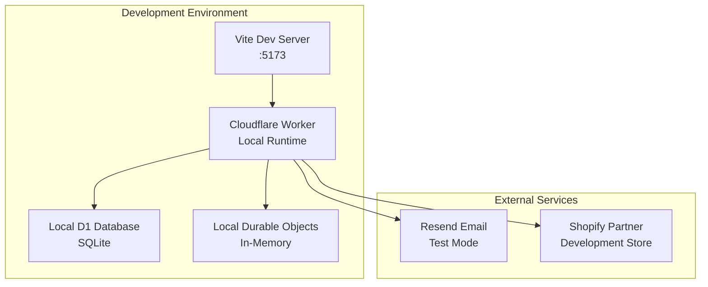
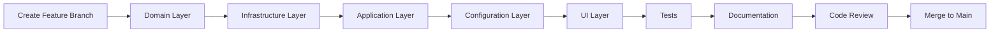
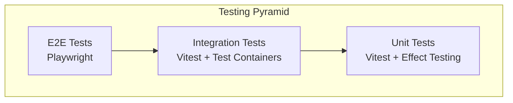
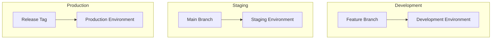

# Development Guide

## Table of Contents

1. [Getting Started](#getting-started)
2. [Development Environment](#development-environment)
3. [Project Structure](#project-structure)
4. [Development Workflow](#development-workflow)
5. [Testing Strategy](#testing-strategy)
6. [Deployment](#deployment)
7. [Debugging](#debugging)
8. [Performance Optimization](#performance-optimization)
9. [Best Practices](#best-practices)
10. [Troubleshooting](#troubleshooting)

## Getting Started

### Prerequisites

- **Node.js** 18+ (LTS recommended)
- **pnpm** 8+ (package manager)
- **Git** for version control
- **Cloudflare Account** with Workers access
- **Wrangler CLI** for Cloudflare deployment

### Quick Setup

```bash
# Clone the repository
git clone https://github.com/your-org/nimblers.git
cd nimblers

# Install dependencies
pnpm install

# Set up environment variables
cp .env.example .env.local
# Edit .env.local with your configuration

# Start development server
pnpm dev
```

### Environment Configuration

Create `.env.local` with the following variables:

```bash
# Database Configuration
DATABASE_URL="file:./dev.db"
GATEWAY_DATABASE_URL="file:./gateway.db"
SHOPIFY_DATABASE_URL="file:./shopify.db"

# Authentication
BETTER_AUTH_SECRET="your-secret-key"
BETTER_AUTH_URL="http://localhost:5173"

# Shopify Integration
SHOPIFY_CLIENT_ID="your-shopify-client-id"
SHOPIFY_CLIENT_SECRET="your-shopify-client-secret"
SHOPIFY_WEBHOOK_SECRET="your-webhook-secret"

# Email Service
RESEND_API_KEY="your-resend-api-key"

# Cloudflare (for production)
CLOUDFLARE_ACCOUNT_ID="your-account-id"
CLOUDFLARE_API_TOKEN="your-api-token"
```

## Development Environment

### Local Development Stack



### Development Scripts

```json
{
  "scripts": {
    "dev": "wrangler dev --local",
    "build": "vite build",
    "preview": "wrangler dev --local --minify",
    "test": "vitest",
    "test:ui": "vitest --ui",
    "test:coverage": "vitest --coverage",
    "lint": "biome check .",
    "lint:fix": "biome check --apply .",
    "type-check": "tsc --noEmit",
    "db:generate": "drizzle-kit generate",
    "db:migrate": "drizzle-kit migrate",
    "db:studio": "drizzle-kit studio"
  }
}
```

### IDE Configuration

#### VS Code Settings

```json
// .vscode/settings.json
{
  "typescript.preferences.importModuleSpecifier": "relative",
  "editor.formatOnSave": true,
  "editor.defaultFormatter": "biomejs.biome",
  "editor.codeActionsOnSave": {
    "quickfix.biome": "explicit",
    "source.organizeImports.biome": "explicit"
  },
  "files.associations": {
    "*.css": "postcss"
  }
}
```

#### Recommended Extensions

```json
// .vscode/extensions.json
{
  "recommendations": [
    "biomejs.biome",
    "bradlc.vscode-tailwindcss",
    "ms-vscode.vscode-typescript-next",
    "esbenp.prettier-vscode",
    "ms-vscode.vscode-json"
  ]
}
```

## Project Structure

### Directory Organization

```
nimblers/
├── src/
│   ├── domain/                 # Business logic & entities
│   │   ├── global/            # Cross-tenant domain
│   │   ├── tenant/            # Tenant-specific domain
│   │   └── shopify/           # Shopify integration domain
│   ├── application/           # Use cases & orchestration
│   │   ├── global/
│   │   ├── tenant/
│   │   └── shopify/
│   ├── infrastructure/        # External concerns
│   │   ├── cloudflare/        # Workers, DO, D1
│   │   ├── persistence/       # Database implementations
│   │   ├── auth/              # Authentication
│   │   └── email/             # Email service
│   ├── config/                # Configuration & DI
│   │   ├── layers.ts          # Effect layers
│   │   └── routes.ts          # Route configuration
│   └── app/                   # UI layer
│       ├── actions/           # Server actions
│       ├── components/        # React components
│       ├── design-system/     # UI primitives
│       ├── pages/             # Route components
│       └── types/             # Shared types
├── docs/                      # Documentation
├── tests/                     # Test files
├── drizzle/                   # Database schemas
└── public/                    # Static assets
```

### Architecture Layers

#### Domain Layer (`src/domain/`)

**Purpose**: Core business logic, entities, and rules

```typescript
// Example: Domain service interface
export abstract class InvitationRepo extends Context.Tag(
  "@core/InvitationRepo"
)<
  InvitationRepo,
  {
    readonly create: (
      invitation: NewInvitation
    ) => Effect.Effect<Invitation, InvitationError>;
    readonly findByToken: (
      token: string
    ) => Effect.Effect<Invitation, InvitationError>;
  }
>() {}
```

#### Application Layer (`src/application/`)

**Purpose**: Use cases and business logic orchestration

```typescript
// Example: Use case implementation
export const InvitationUseCaseLive = (doId: DurableObjectId) =>
  Layer.effect(
    InvitationUseCase,
    Effect.gen(function* () {
      const invitationRepo = yield* InvitationRepo;
      const emailService = yield* EmailService;

      return {
        createInvitation: (input: CreateInvitationInput) =>
          Effect.gen(function* () {
            const invitation = yield* invitationRepo.create(input);
            yield* emailService.sendInvitation(invitation);
            return invitation;
          }).pipe(Effect.withSpan("InvitationUseCase.createInvitation")),
      };
    })
  );
```

#### Infrastructure Layer (`src/infrastructure/`)

**Purpose**: External integrations and technical concerns

```typescript
// Example: Repository implementation
export const InvitationRepoLive = Layer.effect(
  InvitationRepo,
  Effect.gen(function* () {
    const drizzleClient = yield* DrizzleDOClient;

    return {
      create: (invitation: NewInvitation) =>
        Effect.tryPromise({
          try: () => drizzleClient.db.insert(invitations).values(invitation),
          catch: (error) => new DbError({ cause: error }),
        }),
    };
  })
);
```

## Development Workflow

### Feature Development Process



### 1. Domain-First Development

Start with domain models and interfaces:

```typescript
// 1. Define domain models
export const InvitationSchema = S.Struct({
  id: InvitationIdSchema,
  email: EmailSchema,
  role: RoleSchema,
  status: InvitationStatusSchema,
  expiresAt: S.Number,
  createdAt: S.Number,
});

// 2. Define domain errors
export class InvitationExpired extends Data.TaggedError("InvitationExpired")<{
  invitationId: InvitationId;
  expiredAt: Date;
}> {}

// 3. Define service interfaces
export abstract class InvitationUseCase extends Context.Tag(
  "@core/InvitationUseCase"
)<
  InvitationUseCase,
  {
    readonly createInvitation: (
      input: CreateInvitationInput
    ) => Effect.Effect<Invitation, InvitationError>;
  }
>() {}
```

### 2. Infrastructure Implementation

Implement concrete services:

```typescript
// Database repository
export const InvitationRepoLive = Layer.effect(
  InvitationRepo,
  Effect.gen(function* () {
    const db = yield* DrizzleDOClient;
    return {
      create: (invitation) =>
        Effect.tryPromise({
          try: () => db.insert(invitations).values(invitation),
          catch: (error) => new DbError({ cause: error }),
        }),
    };
  })
);
```

### 3. Application Layer

Orchestrate business logic:

```typescript
export const InvitationUseCaseLive = Layer.effect(
  InvitationUseCase,
  Effect.gen(function* () {
    const repo = yield* InvitationRepo;
    const email = yield* EmailService;

    return {
      createInvitation: (input) =>
        Effect.gen(function* () {
          // Validate business rules
          yield* validateInvitationRules(input);

          // Create invitation
          const invitation = yield* repo.create(input);

          // Send email
          yield* email.sendInvitation(invitation);

          return invitation;
        }),
    };
  })
);
```

### 4. Configuration & Wiring

Wire dependencies together:

```typescript
// src/config/layers.ts
export const InvitationLayerLive = (doId: DurableObjectId) => {
  const repoLayer = Layer.provide(InvitationRepoLive, DrizzleDOClientLive);
  const emailLayer = Layer.provide(EmailServiceLive, ResendClientLive);
  const useCaseLayer = Layer.provide(
    InvitationUseCaseLive(doId),
    Layer.merge(repoLayer, emailLayer)
  );
  return useCaseLayer;
};
```

### 5. Server Actions

Create server actions for UI integration:

```typescript
// src/app/actions/invitations/create.ts
"use server";

export async function createInvitation(input: CreateInvitationInput) {
  const program = Effect.gen(function* () {
    const useCase = yield* InvitationUseCase;
    return yield* useCase.createInvitation(input);
  });

  const layer = InvitationLayerLive(getDurableObjectId(input.organizationSlug));

  return Effect.runPromise(
    program.pipe(
      Effect.provide(layer),
      Effect.catchAll((error) =>
        Effect.succeed({ success: false, error: error.message })
      )
    )
  );
}
```

### Git Workflow

#### Branch Naming Convention

```bash
# Feature branches
feature/invitation-system
feature/shopify-oauth

# Bug fixes
fix/invitation-email-template
fix/auth-session-expiry

# Hotfixes
hotfix/security-vulnerability

# Chores
chore/update-dependencies
chore/improve-documentation
```

#### Commit Message Format

```bash
# Format: type(scope): description

feat(invitations): add invitation creation flow
fix(auth): resolve session timeout issue
docs(api): update authentication endpoints
test(invitations): add unit tests for invitation service
refactor(domain): extract common error types
```

## Testing Strategy

### Testing Pyramid



### Unit Testing

#### Domain Logic Testing

```typescript
// tests/domain/invitations/invitation.test.ts
import { describe, it, expect } from "vitest";
import { Effect } from "effect";
import { InvitationUseCaseLive } from "@/application/tenant/invitations/service";

describe("Invitation Use Case", () => {
  it("should create invitation successfully", async () => {
    const mockRepo = {
      create: () => Effect.succeed(mockInvitation),
      findByEmail: () => Effect.fail(new InvitationNotFound()),
    };

    const mockEmail = {
      sendInvitation: () => Effect.succeed(void 0),
    };

    const testLayer = Layer.merge(
      Layer.succeed(InvitationRepo, mockRepo),
      Layer.succeed(EmailService, mockEmail)
    );

    const program = Effect.gen(function* () {
      const useCase = yield* InvitationUseCase;
      return yield* useCase.createInvitation(validInput);
    });

    const result = await Effect.runPromise(
      program.pipe(Effect.provide(testLayer))
    );

    expect(result.email).toBe(validInput.email);
  });
});
```

#### Component Testing

```typescript
// tests/components/InvitationForm.test.tsx
import { render, screen, fireEvent, waitFor } from "@testing-library/react";
import { InvitationForm } from "@/app/components/InvitationForm";

describe("InvitationForm", () => {
  it("should submit invitation form", async () => {
    const mockOnSuccess = vi.fn();

    render(
      <InvitationForm organizationSlug="test-org" onSuccess={mockOnSuccess} />
    );

    fireEvent.change(screen.getByLabelText(/email/i), {
      target: { value: "test@example.com" },
    });

    fireEvent.click(screen.getByRole("button", { name: /send invitation/i }));

    await waitFor(() => {
      expect(mockOnSuccess).toHaveBeenCalled();
    });
  });
});
```

### Integration Testing

```typescript
// tests/integration/invitation-flow.test.ts
import { describe, it, expect, beforeEach } from "vitest";
import { testClient } from "./helpers/test-client";

describe("Invitation Flow Integration", () => {
  beforeEach(async () => {
    await setupTestDatabase();
  });

  it("should complete invitation flow end-to-end", async () => {
    // Create organization
    const org = await testClient.createOrganization({
      name: "Test Org",
      slug: "test-org",
    });

    // Create invitation
    const invitation = await testClient.createInvitation({
      organizationSlug: org.slug,
      email: "invitee@example.com",
      role: "member",
    });

    // Accept invitation
    const result = await testClient.acceptInvitation({
      token: invitation.token,
    });

    expect(result.success).toBe(true);
    expect(result.member.role).toBe("member");
  });
});
```

### E2E Testing

```typescript
// tests/e2e/invitation-flow.spec.ts
import { test, expect } from "@playwright/test";

test.describe("Invitation Flow", () => {
  test("should invite and accept new member", async ({ page, context }) => {
    // Login as organization owner
    await page.goto("/login");
    await page.fill('[data-testid="email"]', "owner@example.com");
    await page.fill('[data-testid="password"]', "password");
    await page.click('[data-testid="login-button"]');

    // Navigate to organization
    await page.goto("/organization/test-org");

    // Create invitation
    await page.click('[data-testid="invite-member-button"]');
    await page.fill(
      '[data-testid="invitation-email"]',
      "newmember@example.com"
    );
    await page.selectOption('[data-testid="invitation-role"]', "member");
    await page.click('[data-testid="send-invitation-button"]');

    // Verify invitation created
    await expect(
      page.locator('[data-testid="invitation-success"]')
    ).toBeVisible();

    // Open invitation in new context (simulate different user)
    const newPage = await context.newPage();
    const invitationUrl = await getInvitationUrl("newmember@example.com");
    await newPage.goto(invitationUrl);

    // Accept invitation
    await newPage.click('[data-testid="accept-invitation-button"]');

    // Verify member added
    await page.reload();
    await expect(
      page.locator('[data-testid="member-newmember@example.com"]')
    ).toBeVisible();
  });
});
```

## Deployment

### Deployment Architecture



### Cloudflare Workers Deployment

#### Development Deployment

```bash
# Deploy to development environment
pnpm run deploy:dev

# Deploy with specific environment
wrangler deploy --env development
```

#### Production Deployment

```bash
# Build for production
pnpm run build

# Deploy to production
pnpm run deploy:prod

# Deploy with migrations
pnpm run deploy:prod --with-migrations
```

### Database Migrations

#### D1 Database Migration

```bash
# Generate migration
pnpm run db:generate

# Apply migration to development
wrangler d1 migrations apply nimblers-gateway-dev

# Apply migration to production
wrangler d1 migrations apply nimblers-gateway-prod
```

#### Durable Object Schema Updates

```typescript
// Automatic schema migration in Durable Object
export class OrganizationDO extends DurableObject {
  async fetch(request: Request) {
    // Schema migration runs automatically
    await this.runMigrations();

    // Handle request
    return this.handleRequest(request);
  }

  private async runMigrations() {
    const currentVersion = await this.sql`PRAGMA user_version`.then(
      (r) => r[0]?.user_version || 0
    );

    if (currentVersion < 1) {
      await this.sql`
        CREATE TABLE IF NOT EXISTS invitations (
          id TEXT PRIMARY KEY,
          email TEXT NOT NULL,
          role TEXT NOT NULL,
          status TEXT NOT NULL,
          created_at INTEGER NOT NULL
        )
      `;
      await this.sql`PRAGMA user_version = 1`;
    }
  }
}
```

### CI/CD Pipeline

```yaml
# .github/workflows/deploy.yml
name: Deploy

on:
  push:
    branches: [main]
  release:
    types: [published]

jobs:
  test:
    runs-on: ubuntu-latest
    steps:
      - uses: actions/checkout@v4
      - uses: actions/setup-node@v4
        with:
          node-version: 18
          cache: "pnpm"

      - run: pnpm install
      - run: pnpm run type-check
      - run: pnpm run lint
      - run: pnpm run test
      - run: pnpm run test:e2e

  deploy-staging:
    needs: test
    if: github.ref == 'refs/heads/main'
    runs-on: ubuntu-latest
    steps:
      - uses: actions/checkout@v4
      - run: pnpm install
      - run: pnpm run build
      - run: wrangler deploy --env staging
        env:
          CLOUDFLARE_API_TOKEN: ${{ secrets.CLOUDFLARE_API_TOKEN }}

  deploy-production:
    needs: test
    if: github.event_name == 'release'
    runs-on: ubuntu-latest
    steps:
      - uses: actions/checkout@v4
      - run: pnpm install
      - run: pnpm run build
      - run: wrangler deploy --env production
        env:
          CLOUDFLARE_API_TOKEN: ${{ secrets.CLOUDFLARE_API_TOKEN }}
```

## Debugging

### Local Debugging

#### Cloudflare Workers Debugging

```typescript
// Add debugging to worker
export default {
  async fetch(request: Request, env: Env, ctx: ExecutionContext) {
    console.log("Request:", {
      url: request.url,
      method: request.method,
      headers: Object.fromEntries(request.headers),
    });

    try {
      const response = await handleRequest(request, env, ctx);
      console.log("Response:", response.status);
      return response;
    } catch (error) {
      console.error("Worker error:", error);
      throw error;
    }
  },
};
```

#### Effect-TS Debugging

```typescript
// Add tracing to Effect programs
const program = Effect.gen(function* () {
  const result = yield* someOperation.pipe(
    Effect.tap((value) =>
      Effect.log(`Operation result: ${JSON.stringify(value)}`)
    ),
    Effect.withSpan("someOperation")
  );
  return result;
}).pipe(
  Effect.catchAll((error) =>
    Effect.gen(function* () {
      yield* Effect.logError(`Operation failed: ${error.message}`);
      return Effect.fail(error);
    })
  )
);
```

### Production Debugging

#### Cloudflare Analytics

```typescript
// Add custom analytics
export default {
  async fetch(request: Request, env: Env, ctx: ExecutionContext) {
    const start = Date.now();

    try {
      const response = await handleRequest(request, env, ctx);

      // Track successful requests
      ctx.waitUntil(
        env.ANALYTICS.writeDataPoint({
          blobs: [request.url, response.status.toString()],
          doubles: [Date.now() - start],
          indexes: ["success"],
        })
      );

      return response;
    } catch (error) {
      // Track errors
      ctx.waitUntil(
        env.ANALYTICS.writeDataPoint({
          blobs: [request.url, error.message],
          doubles: [Date.now() - start],
          indexes: ["error"],
        })
      );

      throw error;
    }
  },
};
```

#### Error Tracking

```typescript
// Structured error logging
export class ErrorTracker {
  static track(error: Error, context: Record<string, any>) {
    console.error("Application Error", {
      message: error.message,
      stack: error.stack,
      context,
      timestamp: new Date().toISOString(),
    });

    // Send to external service in production
    if (env.ENVIRONMENT === "production") {
      // Send to Sentry, LogRocket, etc.
    }
  }
}
```

## Performance Optimization

### Cloudflare Workers Optimization

#### Cold Start Optimization

```typescript
// Minimize cold start impact
const globalCache = new Map();

export default {
  async fetch(request: Request, env: Env) {
    // Use global cache for expensive operations
    const cacheKey = "expensive-operation";
    if (!globalCache.has(cacheKey)) {
      globalCache.set(cacheKey, await expensiveOperation());
    }

    return handleRequest(request, env);
  },
};
```

#### Bundle Size Optimization

```typescript
// Use dynamic imports for large dependencies
async function handleLargeOperation() {
  const { heavyLibrary } = await import("./heavy-library");
  return heavyLibrary.process();
}
```

### Database Optimization

#### Query Optimization

```typescript
// Use indexes effectively
export const invitationsTable = sqliteTable(
  "invitations",
  {
    id: text("id").primaryKey(),
    email: text("email").notNull(),
    organizationId: text("organization_id").notNull(),
    status: text("status").notNull(),
    createdAt: integer("created_at").notNull(),
  },
  (table) => ({
    emailIdx: index("invitations_email_idx").on(table.email),
    orgStatusIdx: index("invitations_org_status_idx").on(
      table.organizationId,
      table.status
    ),
  })
);

// Efficient queries
const pendingInvitations = await db
  .select()
  .from(invitations)
  .where(
    and(
      eq(invitations.organizationId, orgId),
      eq(invitations.status, "pending")
    )
  )
  .limit(50);
```

#### Caching Strategy

```typescript
// Implement caching at multiple levels
export class CachedInvitationRepo {
  constructor(private repo: InvitationRepo, private cache: KVNamespace) {}

  async findById(id: string): Promise<Invitation | null> {
    // Check cache first
    const cached = await this.cache.get(`invitation:${id}`);
    if (cached) {
      return JSON.parse(cached);
    }

    // Fetch from database
    const invitation = await this.repo.findById(id);
    if (invitation) {
      // Cache for 5 minutes
      await this.cache.put(`invitation:${id}`, JSON.stringify(invitation), {
        expirationTtl: 300,
      });
    }

    return invitation;
  }
}
```

## Best Practices

### Code Quality

#### TypeScript Best Practices

```typescript
// Use strict types
interface CreateInvitationRequest {
  readonly email: string;
  readonly role: "owner" | "admin" | "member";
  readonly organizationId: string;
}

// Use branded types for IDs
type InvitationId = string & { readonly __brand: "InvitationId" };

// Use discriminated unions for state
type InvitationStatus =
  | { type: "pending"; expiresAt: Date }
  | { type: "accepted"; acceptedAt: Date }
  | { type: "expired"; expiredAt: Date };
```

#### Effect-TS Best Practices

```typescript
// Compose effects properly
const createAndSendInvitation = (input: CreateInvitationInput) =>
  Effect.gen(function* () {
    // Validate input
    const validatedInput = yield* validateInput(input);

    // Create invitation
    const invitation = yield* createInvitation(validatedInput);

    // Send email (can fail without affecting invitation creation)
    yield* sendInvitationEmail(invitation).pipe(
      Effect.catchAll((error) =>
        Effect.log(`Failed to send invitation email: ${error.message}`)
      )
    );

    return invitation;
  }).pipe(
    Effect.withSpan("createAndSendInvitation"),
    Effect.timeout("30 seconds")
  );
```

### Security Best Practices

#### Input Validation

```typescript
// Validate all inputs
export const CreateInvitationInputSchema = S.Struct({
  email: EmailSchema,
  role: S.Literal("owner", "admin", "member"),
  organizationId: OrganizationIdSchema,
});

export const validateCreateInvitationInput = (input: unknown) =>
  Effect.tryPromise({
    try: () => S.decodePromise(CreateInvitationInputSchema)(input),
    catch: (error) => new ValidationError({ cause: error }),
  });
```

#### Authentication & Authorization

```typescript
// Check permissions at every level
export const requireOrganizationAccess = (
  userId: UserId,
  organizationId: OrganizationId,
  requiredRole: Role = "member"
) =>
  Effect.gen(function* () {
    const membership = yield* getMembership(userId, organizationId);

    if (!membership) {
      return yield* Effect.fail(new UnauthorizedError("Not a member"));
    }

    if (!hasPermission(membership.role, requiredRole)) {
      return yield* Effect.fail(new ForbiddenError("Insufficient permissions"));
    }

    return membership;
  });
```

### Performance Best Practices

#### Efficient Data Loading

```typescript
// Use parallel loading where possible
const loadOrganizationData = (orgId: OrganizationId) =>
  Effect.all(
    {
      organization: getOrganization(orgId),
      members: getMembers(orgId),
      invitations: getInvitations(orgId),
      stores: getConnectedStores(orgId),
    },
    { concurrency: "unbounded" }
  );
```

#### Resource Management

```typescript
// Proper resource cleanup
export const withDatabaseTransaction = <A, E>(operation: Effect.Effect<A, E>) =>
  Effect.acquireUseRelease(
    // Acquire transaction
    Effect.tryPromise(() => db.transaction()),
    // Use transaction
    (tx) => operation.pipe(Effect.provideService(DatabaseTx, tx)),
    // Release transaction
    (tx, exit) =>
      Exit.isSuccess(exit)
        ? Effect.tryPromise(() => tx.commit())
        : Effect.tryPromise(() => tx.rollback())
  );
```

## Troubleshooting

### Common Issues

#### Durable Object State Issues

```typescript
// Problem: State not persisting
// Solution: Ensure proper async/await usage
export class OrganizationDO extends DurableObject {
  async handleRequest(request: Request) {
    // ❌ Wrong - not awaiting
    this.sql`INSERT INTO members (id, name) VALUES (?, ?)`.run(id, name);

    // ✅ Correct - awaiting the operation
    await this.sql`INSERT INTO members (id, name) VALUES (?, ?)`.run(id, name);
  }
}
```

#### Effect-TS Error Handling

```typescript
// Problem: Unhandled effects
// Solution: Always handle errors
const program = Effect.gen(function* () {
  const result = yield* riskyOperation;
  return result;
}).pipe(
  // ✅ Handle all possible errors
  Effect.catchTags({
    ValidationError: (error) => Effect.succeed({ error: error.message }),
    DatabaseError: (error) => Effect.succeed({ error: "Database unavailable" }),
    NetworkError: (error) => Effect.succeed({ error: "Network error" }),
  }),
  // ✅ Catch any remaining errors
  Effect.catchAll((error) => Effect.succeed({ error: "Unknown error" }))
);
```

#### Authentication Issues

```typescript
// Problem: Session not found
// Solution: Check session middleware order
export const routes = [
  // ❌ Wrong order - auth check before session handler
  route("/api/protected", [requireAuth, sessionHandler, handler]),

  // ✅ Correct order - session handler first
  route("/api/protected", [sessionHandler, requireAuth, handler]),
];
```

### Debug Checklist

1. **Environment Variables**: Verify all required env vars are set
2. **Database Connections**: Check D1 and Durable Object connectivity
3. **Authentication**: Verify session handling and token validation
4. **Effect Chains**: Ensure all effects are properly composed and handled
5. **Type Safety**: Run type checking to catch type errors
6. **Network Issues**: Check external API connectivity (Shopify, Resend)

### Performance Debugging

```typescript
// Add performance monitoring
const monitoredOperation = (operation: Effect.Effect<A, E>) =>
  Effect.gen(function* () {
    const start = yield* Effect.clock.currentTimeMillis;
    const result = yield* operation;
    const end = yield* Effect.clock.currentTimeMillis;

    yield* Effect.log(`Operation took ${end - start}ms`);

    if (end - start > 1000) {
      yield* Effect.logWarning("Slow operation detected");
    }

    return result;
  });
```

---

**Next**: [Technology Stack](../technology-stack.md)
