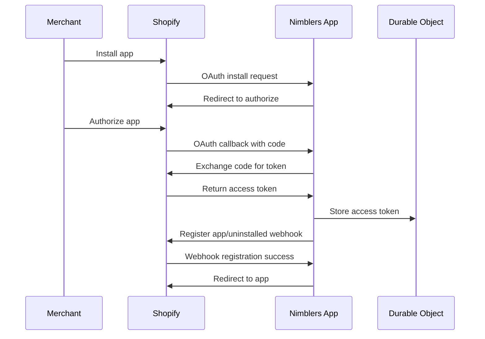
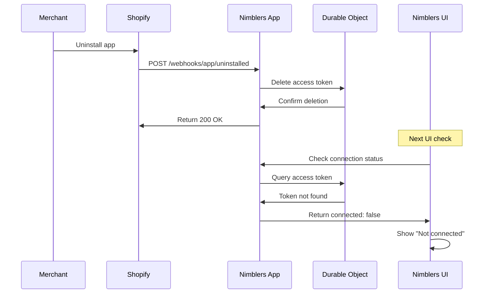

# Shopify App Uninstall Webhooks

This document explains the complete implementation of Shopify's `app/uninstalled` webhook system for the Nimblers application, which ensures proper cleanup when merchants uninstall the app.

## Overview

When a merchant uninstalls a Shopify app, the Shopify platform sends a webhook notification to the app. This system automatically:

1. **Registers webhooks** during OAuth installation
2. **Processes uninstall events** when merchants remove the app
3. **Cleans up access tokens** from storage
4. **Updates UI status** to show "Not connected"

## Problem Solved

**Before Implementation:**

- Merchants uninstall app from Shopify admin
- Access tokens remain in storage
- UI incorrectly shows "Connected to shop.myshopify.com"
- No way to detect app removal

**After Implementation:**

- Webhooks automatically registered during OAuth flow
- Uninstall events trigger token cleanup
- UI correctly shows "Not connected"
- Complete lifecycle management

## Architecture

The webhook system follows Effect-TS Clean Architecture patterns with proper separation of concerns:

### Domain Layer (`src/domain/global/shopify/oauth/`)

**Extended OAuth Service Interface:**

```typescript
export abstract class WebhookService extends Context.Tag(
  "@core/shopify/oauth/WebhookService"
)<
  WebhookService,
  {
    readonly registerAppUninstallWebhook: (
      shop: ShopDomain,
      accessToken: AccessToken,
      webhookUrl: string
    ) => Effect.Effect<void, OAuthError>;
  }
>() {}

// Enhanced OAuth Use Case with webhook registration
export abstract class ShopifyOAuthUseCase extends Context.Tag(
  "@core/shopify/oauth/UseCase"
)<
  ShopifyOAuthUseCase,
  {
    // ... existing methods
    readonly registerWebhooksAfterInstall: (
      shop: ShopDomain,
      accessToken: AccessToken
    ) => Effect.Effect<void, OAuthError>;
  }
>() {}
```

### Infrastructure Layer

**Webhook Service Implementation:**

```typescript
// src/infrastructure/shopify/webhooks/WebhookService.ts
export const WebhookServiceLive = Layer.succeed(WebhookService, {
  registerAppUninstallWebhook: (shop, accessToken, webhookUrl) =>
    Effect.gen(function* () {
      // POST to Shopify Admin API to register webhook
      const response = yield* Effect.tryPromise({
        try: () =>
          fetch(`https://${shop}/admin/api/2024-04/webhooks.json`, {
            method: "POST",
            headers: {
              "Content-Type": "application/json",
              "X-Shopify-Access-Token": accessToken,
            },
            body: JSON.stringify({
              webhook: {
                topic: "app/uninstalled",
                address: webhookUrl,
                format: "json",
              },
            }),
          }),
        catch: (error) =>
          new OAuthError({
            message: "Failed to register app uninstall webhook",
            cause: error,
          }),
      });

      if (!response.ok) {
        const errorText = yield* Effect.tryPromise({
          try: () => response.text(),
          catch: () => "Unknown error",
        });

        return yield* Effect.fail(
          new OAuthError({
            message: `Webhook registration failed: ${response.status} - ${errorText}`,
          })
        );
      }
    }),
});
```

**Enhanced Access Token Service:**

```typescript
// src/infrastructure/cloudflare/durable-objects/shopify/oauth/services.ts
export const AccessTokenServiceDOLive = Layer.effect(
  AccessTokenService,
  Effect.gen(function* () {
    // ... existing methods
    return {
      // ... existing methods
      delete: (shop: ShopDomain) =>
        Effect.gen(function* () {
          const result = yield* Effect.tryPromise({
            try: async () => {
              const result = await doStub.sql.exec(
                `DELETE FROM access_tokens WHERE shop = ?`,
                shop
              );
              return result.changes > 0;
            },
            catch: (error) =>
              new DOError({
                message: "Failed to delete access token",
                cause: error,
              }),
          });

          return result;
        }),
    };
  })
);
```

### Application Layer

**Enhanced OAuth Use Case:**

```typescript
// src/application/global/shopify/oauth/service.ts
export const ShopifyOAuthUseCaseLive = Layer.effect(
  ShopifyOAuthUseCase,
  Effect.gen(function* () {
    const webhookService = yield* WebhookService;
    // ... other dependencies

    return {
      // ... existing methods

      registerWebhooksAfterInstall: (
        shop: ShopDomain,
        accessToken: AccessToken
      ) =>
        Effect.gen(function* () {
          const webhookUrl =
            "https://country-centers-never-austria.trycloudflare.com/shopify/webhooks/app/uninstalled";

          yield* webhookService.registerAppUninstallWebhook(
            shop,
            accessToken,
            webhookUrl
          );
        }).pipe(
          Effect.withSpan("ShopifyOAuthUseCase.registerWebhooksAfterInstall")
        ),

      handleCallback: (request: Request) =>
        Effect.gen(function* () {
          // ... existing callback logic

          // Store the access token
          yield* accessTokenService.store(
            shop,
            tokenResponse.access_token,
            tokenResponse.scope
          );

          // Register webhook after successful token storage
          yield* Effect.gen(function* () {
            yield* webhookService.registerAppUninstallWebhook(
              shop,
              tokenResponse.access_token,
              "https://country-centers-never-austria.trycloudflare.com/shopify/webhooks/app/uninstalled"
            );
          }).pipe(
            Effect.catchAll((error) => {
              console.error("Webhook registration failed:", error);
              return Effect.fail(error);
            })
          );

          // Redirect to app
          return new Response(null, {
            status: 302,
            headers: { Location: `https://${shop}/admin/apps` },
          });
        }),

      disconnect: (shop: ShopDomain) =>
        Effect.gen(function* () {
          const success = yield* accessTokenService.delete(shop);
          return { success };
        }).pipe(Effect.withSpan("ShopifyOAuthUseCase.disconnect")),
    };
  })
);
```

### Routes Layer

**Webhook Processing Route:**

```typescript
// src/app/pages/shopify/routes.ts
route("/webhooks/app/uninstalled", async ({ request }) => {
  if (request.method !== "POST") {
    return new Response("Method not allowed", { status: 405 });
  }

  try {
    // Extract shop domain from headers (Shopify standard)
    const shopDomain = request.headers.get("x-shopify-shop-domain");

    if (!shopDomain) {
      return Response.json(
        {
          success: false,
          message: "Missing shop domain header",
        },
        { status: 400 }
      );
    }

    // Process the uninstall
    const program = Effect.gen(function* () {
      const oauthUseCase = yield* ShopifyOAuthUseCase;
      const result = yield* oauthUseCase.disconnect(shopDomain as ShopDomain);

      return Response.json({
        success: true,
        message: `App successfully uninstalled for shop: ${shopDomain}`,
        shopDomain,
      });
    });

    const layer = ShopifyOAuthDOServiceLive({
      SHOPIFY_OAUTH_DO: env.SHOPIFY_OAUTH_DO,
    });
    return await Effect.runPromise(program.pipe(Effect.provide(layer)));
  } catch (error) {
    console.error("Webhook processing error:", error);
    return Response.json(
      {
        success: false,
        message: "Failed to process uninstall",
        error: String(error),
      },
      { status: 500 }
    );
  }
});
```

## Configuration

### Environment Setup

No additional environment variables needed - uses existing OAuth configuration:

```bash
# .dev.vars
SHOPIFY_CLIENT_ID=your-shopify-client-id
SHOPIFY_CLIENT_SECRET=your-shopify-client-secret
```

### Durable Object Configuration

Uses the existing OAuth Durable Object with enhanced access token management:

```json
// wrangler.jsonc
{
  "durable_objects": {
    "bindings": [
      {
        "name": "SHOPIFY_OAUTH_DO",
        "class_name": "ShopifyOAuthDO"
      }
    ]
  },
  "migrations": [
    {
      "tag": "v2",
      "new_classes": ["ShopifyOAuthDO"],
      "new_sqlite_classes": ["ShopifyOAuthDO"]
    }
  ]
}
```

### Layer Wiring

Enhanced layer configuration includes webhook service:

```typescript
// src/config/layers.ts
export const ShopifyOAuthLayerLive = (doId: DurableObjectId) => {
  const AccessTokenServiceLayer = Layer.provide(
    AccessTokenServiceDOLive,
    DrizzleDOClientLive
  );

  const OAuthUseCaseLayer = Layer.provide(
    ShopifyOAuthUseCaseLive(doId),
    Layer.mergeAll(
      AccessTokenServiceLayer,
      ShopifyOAuthHmacVerifierLive,
      NonceManagerLive,
      ShopValidatorLive,
      WebhookServiceLive, // Added webhook service
      ShopifyOAuthEnvLayer
    )
  );

  return OAuthUseCaseLayer;
};
```

## Webhook Registration Flow

### 1. OAuth Installation Process



### 2. Automatic Webhook Registration

During OAuth callback processing:

1. **Token Exchange**: Get access token from Shopify
2. **Token Storage**: Store in Durable Object SQLite
3. **Webhook Registration**: Register `app/uninstalled` webhook
4. **Error Handling**: If webhook registration fails, entire OAuth fails
5. **Success Redirect**: Only redirect to app if all steps succeed

### 3. Webhook Payload Format

Shopify sends this payload when app is uninstalled:

```json
{
  "shop_domain": "example.myshopify.com",
  "shop_id": 12345,
  "timestamp": "2024-01-01T00:00:00Z"
}
```

## Webhook Processing Flow

### 1. App Uninstall Process



### 2. Webhook Processing Steps

1. **Receive Webhook**: POST to `/shopify/webhooks/app/uninstalled`
2. **Extract Shop**: Get shop domain from `x-shopify-shop-domain` header
3. **Validate Request**: Basic validation of required headers
4. **Delete Token**: Remove access token from Durable Object storage
5. **Respond**: Return 200 OK to acknowledge processing
6. **UI Update**: Next status check returns disconnected state

## Security Considerations

### 1. Webhook Authentication

**Current Implementation:**

- Basic header validation
- Shop domain extraction from headers

**Production Recommendations:**

- Add HMAC verification for webhook authenticity
- Validate webhook source IP addresses
- Implement request signing verification

```typescript
// Enhanced security (future improvement)
const isValidWebhook =
  yield * webhookHmacVerifier.verify(request, env.SHOPIFY_WEBHOOK_SECRET);
```

### 2. Access Control

- Webhook endpoint only accepts POST requests
- Shop domain validation before processing
- Graceful error handling without information disclosure

### 3. Idempotency

- Multiple uninstall webhooks for same shop are handled gracefully
- Token deletion is idempotent (no error if already deleted)
- UI correctly handles "not found" states

## Error Handling

### 1. Webhook Registration Errors

```typescript
// During OAuth callback
yield *
  Effect.gen(function* () {
    // Store token first
    yield* accessTokenService.store(shop, token, scope);

    // Then register webhook - if this fails, entire OAuth fails
    yield* webhookService.registerAppUninstallWebhook(shop, token, webhookUrl);
  }).pipe(
    Effect.catchAll((error) => {
      console.error("OAuth completion failed:", error);
      return Effect.fail(error); // This will cause 500 response
    })
  );
```

### 2. Webhook Processing Errors

```typescript
// Graceful error handling in webhook route
try {
  const result = yield * oauthUseCase.disconnect(shopDomain);
  return Response.json({ success: true, shopDomain });
} catch (error) {
  console.error("Webhook processing error:", error);
  return Response.json(
    {
      success: false,
      message: "Failed to process uninstall",
      error: String(error),
    },
    { status: 500 }
  );
}
```

### 3. UI Resilience

```typescript
// Connection status gracefully handles missing tokens
checkConnectionStatus: (shop: ShopDomain) =>
  Effect.gen(function* () {
    const accessToken = yield* accessTokenService.retrieve(shop).pipe(
      Effect.catchAll(() => Effect.succeed(null)) // Handle errors gracefully
    );

    return {
      connected: !!accessToken,
      shop,
      scope: accessToken ? "read_products,write_products" : undefined,
    };
  }),
```

## Testing Strategy

### 1. Unit Tests

**Webhook Service Tests:**

```typescript
// tests/shopify/oauth/webhook.test.ts
describe("WebhookService", () => {
  it("should successfully register webhook with valid parameters", () => {
    // Test successful webhook registration
  });

  it("should handle Shopify API error response", () => {
    // Test error handling for 422, 401, etc.
  });

  it("should handle network errors", () => {
    // Test network failure scenarios
  });
});
```

**OAuth Use Case Tests:**

```typescript
// tests/shopify/oauth/use-case.test.ts
describe("registerWebhooksAfterInstall", () => {
  it("should successfully register webhook with valid parameters", () => {
    // Test webhook registration flow
  });

  it("should handle webhook registration failure", () => {
    // Test failure scenarios
  });
});

describe("Integration - OAuth Callback with Webhook Registration", () => {
  it("should register webhook after successful OAuth callback", () => {
    // Test complete OAuth + webhook flow
  });

  it("should handle webhook failure during OAuth callback", () => {
    // Test OAuth failure when webhook registration fails
  });
});
```

**Webhook Route Tests:**

```typescript
// tests/shopify/oauth/webhook-routes.test.ts
describe("POST /shopify/webhooks/app/uninstalled", () => {
  it("should successfully process app uninstall webhook", () => {
    // Test successful webhook processing
  });

  it("should handle missing shop domain header", () => {
    // Test validation error scenarios
  });
});
```

### 2. Integration Testing

**Complete Flow Testing:**

1. Start OAuth installation
2. Complete OAuth callback
3. Verify webhook registration
4. Simulate app uninstall webhook
5. Verify token deletion
6. Check UI status update

### 3. Manual Testing

**Development Testing:**

1. Use ngrok or CloudFlare Tunnel for webhook endpoint
2. Install app on development shop
3. Verify webhook registration in Shopify admin
4. Uninstall app and check webhook processing
5. Verify UI shows "Not connected"

## Production Deployment

### 1. Webhook URL Configuration

**Development:**

```typescript
const webhookUrl =
  "https://country-centers-never-austria.trycloudflare.com/shopify/webhooks/app/uninstalled";
```

**Production:**

```typescript
const webhookUrl = "https://nimblers.co/shopify/webhooks/app/uninstalled";
```

### 2. Environment-Specific Configuration

```typescript
// Environment-aware webhook URL
const getWebhookUrl = (env: string) => {
  switch (env) {
    case "production":
      return "https://nimblers.co/shopify/webhooks/app/uninstalled";
    case "staging":
      return "https://staging.nimblers.co/shopify/webhooks/app/uninstalled";
    default:
      return "https://country-centers-never-austria.trycloudflare.com/shopify/webhooks/app/uninstalled";
  }
};
```

### 3. Monitoring and Alerting

**Webhook Registration Monitoring:**

- Log all webhook registration attempts
- Alert on registration failures
- Monitor webhook registration success rates

**Webhook Processing Monitoring:**

- Log all incoming webhook requests
- Monitor processing success/failure rates
- Alert on processing errors

## Performance Considerations

### 1. Webhook Registration

- **Non-blocking**: Webhook registration happens after token storage
- **Failure handling**: If webhook registration fails, OAuth fails (prevents inconsistent state)
- **Timeout handling**: Use reasonable timeouts for Shopify API calls

### 2. Webhook Processing

- **Fast response**: Acknowledge webhook quickly (< 30 seconds)
- **Async processing**: Can defer complex cleanup to background tasks
- **Idempotent operations**: Handle duplicate webhooks gracefully

### 3. Storage Operations

- **Atomic deletion**: Token deletion is atomic in SQLite
- **Efficient queries**: Use indexed queries for token lookup
- **Connection pooling**: Durable Object maintains persistent connections

## Future Enhancements

### 1. Enhanced Security

- Add HMAC verification for webhook authenticity
- Implement webhook signing verification
- Add rate limiting for webhook endpoints

### 2. Advanced Monitoring

- Add webhook delivery tracking
- Implement retry mechanisms for failed webhooks
- Add webhook processing analytics

### 3. Extended Cleanup

- Clean up related data (orders, customers, etc.)
- Send notification emails to shop owners
- Archive shop data for compliance

## Troubleshooting

### Common Issues

1. **Webhook registration fails during OAuth**

   - Check network connectivity to Shopify
   - Verify access token has correct permissions
   - Ensure webhook URL is accessible

2. **Webhooks not received**

   - Verify webhook URL is publicly accessible
   - Check Shopify webhook delivery logs
   - Ensure endpoint returns 200 OK

3. **UI still shows connected after uninstall**
   - Check webhook processing logs
   - Verify token deletion in Durable Object
   - Check connection status endpoint

### Debug Commands

```bash
# Check webhook registration
curl -H "X-Shopify-Access-Token: $TOKEN" \
     https://$SHOP.myshopify.com/admin/api/2024-04/webhooks.json

# Test webhook endpoint
curl -X POST \
     -H "x-shopify-shop-domain: test-shop.myshopify.com" \
     -H "Content-Type: application/json" \
     -d '{"shop_domain":"test-shop.myshopify.com"}' \
     https://nimblers.co/shopify/webhooks/app/uninstalled

# Check Durable Object storage
# (through admin interface or debug endpoint)
```

## Conclusion

The app uninstall webhook system provides complete lifecycle management for Shopify app installations. It ensures:

- **Automatic cleanup** when merchants uninstall the app
- **Consistent UI state** that reflects actual connection status
- **Secure webhook processing** with proper validation
- **Comprehensive testing** covering all scenarios
- **Production-ready architecture** following Effect-TS patterns

This implementation follows Shopify's best practices and provides a robust foundation for app lifecycle management.
