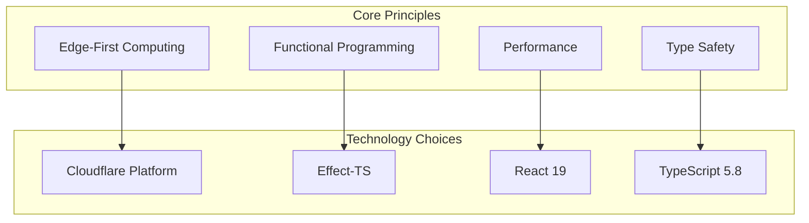

# Technology Stack

## Table of Contents

1. [Overview](#overview)
2. [Cloudflare Platform](#cloudflare-platform)
3. [Effect-TS Ecosystem](#effect-ts-ecosystem)
4. [React & UI Framework](#react--ui-framework)
5. [Database & ORM](#database--orm)
6. [Authentication & Security](#authentication--security)
7. [Development Tools](#development-tools)
8. [External Integrations](#external-integrations)
9. [Performance & Monitoring](#performance--monitoring)
10. [Future Considerations](#future-considerations)

## Overview

Nimblers is built on a modern, edge-first technology stack designed for **performance**, **scalability**, and **developer experience**. The architecture leverages Cloudflare's global edge network with functional programming principles through Effect-TS.

### Technology Philosophy



### Stack Summary

| Layer         | Technology           | Purpose                | Benefits                               |
| ------------- | -------------------- | ---------------------- | -------------------------------------- |
| **Platform**  | Cloudflare Workers   | Edge computing         | Global distribution, zero cold starts  |
| **Language**  | TypeScript 5.8.3     | Type-safe development  | Compile-time error detection           |
| **Framework** | Effect-TS 3.16.0     | Functional programming | Composable, testable, error-safe       |
| **UI**        | React 19 (Canary)    | User interface         | Server components, concurrent features |
| **Database**  | D1 + Durable Objects | Data persistence       | Global consistency + tenant isolation  |
| **Styling**   | Panda CSS 0.53.7     | Zero-runtime CSS       | Type-safe styling, performance         |
| **Auth**      | Better Auth 1.2.8    | Authentication         | Session-based, secure                  |

## Cloudflare Platform

### Cloudflare Workers

**Purpose**: Serverless compute platform running on V8 isolates at the edge.

**Key Features**:

- **Zero Cold Starts**: V8 isolates start in <1ms
- **Global Distribution**: 300+ edge locations worldwide
- **Web Standards**: Built on standard Web APIs
- **Automatic Scaling**: Handles millions of requests

```typescript
// Worker entry point
export default {
  async fetch(
    request: Request,
    env: Env,
    ctx: ExecutionContext
  ): Promise<Response> {
    // Request handling logic
    return new Response("Hello from the edge!");
  },
} satisfies ExportedHandler<Env>;
```

**Benefits for Nimblers**:

- **Low Latency**: Users connect to nearest edge location
- **High Availability**: Built-in redundancy and failover
- **Cost Efficiency**: Pay-per-request pricing model
- **Developer Experience**: Local development with Wrangler

### Durable Objects

**Purpose**: Stateful compute primitives with strong consistency guarantees.

**Key Features**:

- **Strong Consistency**: Single-threaded execution model
- **Global Coordination**: Distributed state management
- **SQLite Storage**: Built-in persistent storage
- **WebSocket Support**: Real-time communication

```typescript
export class OrganizationDO extends DurableObject {
  constructor(ctx: DurableObjectState, env: Env) {
    super(ctx, env);
  }

  async fetch(request: Request): Promise<Response> {
    // Handle organization-specific requests
    return this.handleRequest(request);
  }

  // Built-in SQLite database
  async createMember(member: Member) {
    await this.sql`
      INSERT INTO members (id, name, email, role) 
      VALUES (${member.id}, ${member.name}, ${member.email}, ${member.role})
    `;
  }
}
```

**Benefits for Nimblers**:

- **Perfect Tenant Isolation**: Each organization gets its own instance
- **Consistent State**: No race conditions or data conflicts
- **Built-in Persistence**: SQLite database included
- **Real-time Features**: WebSocket support for live updates

### D1 Database

**Purpose**: Serverless SQLite database with global replication.

**Key Features**:

- **SQLite Compatibility**: Standard SQL interface
- **Global Replication**: Read replicas worldwide
- **Automatic Backups**: Point-in-time recovery
- **Schema Migrations**: Version-controlled schema changes

```sql
-- Global user accounts and organization registry
CREATE TABLE users (
  id TEXT PRIMARY KEY,
  email TEXT UNIQUE NOT NULL,
  name TEXT NOT NULL,
  created_at INTEGER NOT NULL
);

CREATE TABLE organizations (
  id TEXT PRIMARY KEY,
  slug TEXT UNIQUE NOT NULL,
  name TEXT NOT NULL,
  created_at INTEGER NOT NULL
);
```

**Benefits for Nimblers**:

- **Global Consistency**: Shared data across all edge locations
- **High Performance**: Local reads from edge replicas
- **Cost Effective**: Serverless pricing model
- **Easy Management**: Automated backups and scaling

### Additional Cloudflare Services

#### KV (Key-Value Store)

```typescript
// Caching frequently accessed data
await env.CACHE.put("user:123", JSON.stringify(userData), {
  expirationTtl: 3600, // 1 hour
});
```

#### R2 (Object Storage)

```typescript
// File uploads and static assets
await env.STORAGE.put("avatars/user123.jpg", imageData, {
  httpMetadata: { contentType: "image/jpeg" },
});
```

#### Analytics Engine

```typescript
// Custom metrics and monitoring
env.ANALYTICS.writeDataPoint({
  blobs: ["user_signup", userId],
  doubles: [Date.now()],
  indexes: ["events"],
});
```

## Effect-TS Ecosystem

### Core Effect-TS

**Purpose**: Functional programming library for TypeScript with powerful error handling and composition.

**Key Features**:

- **Type-Safe Error Handling**: Compile-time error tracking
- **Composable Effects**: Build complex operations from simple parts
- **Dependency Injection**: Context-based service management
- **Observability**: Built-in tracing and metrics

```typescript
import { Effect, Context, Layer } from "effect";

// Define a service interface
export abstract class UserRepo extends Context.Tag("UserRepo")<
  UserRepo,
  {
    readonly findById: (id: string) => Effect.Effect<User, UserNotFound>;
    readonly create: (user: NewUser) => Effect.Effect<User, UserError>;
  }
>() {}

// Implement the service
export const UserRepoLive = Layer.effect(
  UserRepo,
  Effect.gen(function* () {
    const db = yield* DatabaseClient;

    return {
      findById: (id: string) =>
        Effect.tryPromise({
          try: () => db.query("SELECT * FROM users WHERE id = ?", [id]),
          catch: (error) => new DatabaseError({ cause: error }),
        }),

      create: (user: NewUser) =>
        Effect.tryPromise({
          try: () => db.query("INSERT INTO users ...", [user]),
          catch: (error) => new DatabaseError({ cause: error }),
        }),
    };
  })
);
```

**Benefits for Nimblers**:

- **Bulletproof Error Handling**: All errors are tracked at compile time
- **Testable Code**: Easy mocking and dependency injection
- **Composable Architecture**: Build complex flows from simple operations
- **Performance**: Lazy evaluation and efficient execution

### Effect Schema

**Purpose**: Runtime type validation and transformation with compile-time types.

```typescript
import { Schema as S } from "effect";

// Define schemas with validation
export const UserSchema = S.Struct({
  id: S.UUID,
  email: S.String.pipe(S.pattern(/^[^\s@]+@[^\s@]+\.[^\s@]+$/)),
  name: S.String.pipe(S.minLength(2), S.maxLength(100)),
  role: S.Literal("admin", "member", "owner"),
  createdAt: S.Number,
});

export type User = S.Schema.Type<typeof UserSchema>;

// Use in API endpoints
export const validateUser = (input: unknown) =>
  Effect.tryPromise({
    try: () => S.decodePromise(UserSchema)(input),
    catch: (error) => new ValidationError({ cause: error }),
  });
```

### Effect Platform

**Purpose**: Platform-specific implementations for HTTP, file system, and other APIs.

```typescript
import { HttpApiBuilder, HttpApiEndpoint } from "@effect/platform";

// Define HTTP API endpoints
const getUserEndpoint = HttpApiEndpoint.get("getUser", "/users/:id")
  .addSuccess(UserSchema)
  .addError(HttpApiError.NotFound);

// Build API with handlers
const api = HttpApiBuilder.make("UserAPI")
  .add(getUserEndpoint)
  .handle("getUser", ({ path }) =>
    Effect.gen(function* () {
      const userRepo = yield* UserRepo;
      return yield* userRepo.findById(path.id);
    })
  );
```

## React & UI Framework

### React 19 (Canary)

**Purpose**: Modern React with Server Components and concurrent features.

**Key Features**:

- **Server Components**: Render on server, stream to client
- **Concurrent Features**: Suspense, transitions, and streaming
- **Improved Hydration**: Selective hydration for better performance
- **Enhanced Developer Experience**: Better error boundaries and debugging

```typescript
// Server Component (default)
export async function UserProfile({ userId }: { userId: string }) {
  // Data fetching happens on server
  const user = await getUser(userId);

  return (
    <div>
      <h1>{user.name}</h1>
      <p>{user.email}</p>
      <UserActions userId={userId} />
    </div>
  );
}

// Client Component (when interactivity needed)
("use client");
export function UserActions({ userId }: { userId: string }) {
  const [isLoading, setIsLoading] = useState(false);

  const handleDelete = async () => {
    setIsLoading(true);
    await deleteUser(userId);
    setIsLoading(false);
  };

  return (
    <button onClick={handleDelete} disabled={isLoading}>
      {isLoading ? "Deleting..." : "Delete User"}
    </button>
  );
}
```

### RedwoodSDK

**Purpose**: Full-stack React framework optimized for Cloudflare Workers.

**Key Features**:

- **Server Actions**: Type-safe server functions
- **Route Handlers**: File-based routing with middleware
- **Request Context**: Shared context across request lifecycle
- **Edge Optimization**: Built for edge computing

```typescript
// Server Action
"use server";
export async function createUser(formData: FormData) {
  const name = formData.get("name") as string;
  const email = formData.get("email") as string;

  // Server-side logic with Effect-TS
  const program = Effect.gen(function* () {
    const userRepo = yield* UserRepo;
    return yield* userRepo.create({ name, email });
  });

  return Effect.runPromise(program.pipe(Effect.provide(UserRepoLive)));
}

// Route Handler
import { route } from "rwsdk/router";

export const routes = [
  route("/users/:id", async ({ params, ctx }) => {
    const user = await getUser(params.id);
    return <UserProfile user={user} />;
  }),
];
```

### React Aria Components

**Purpose**: Accessible UI components with built-in ARIA support.

```typescript
import { Button, TextField, Label, Input } from "react-aria-components";

export function LoginForm() {
  return (
    <form>
      <TextField>
        <Label>Email</Label>
        <Input type="email" required />
      </TextField>

      <TextField>
        <Label>Password</Label>
        <Input type="password" required />
      </TextField>

      <Button type="submit">Sign In</Button>
    </form>
  );
}
```

**Benefits**:

- **Accessibility First**: WCAG 2.1 AA compliance out of the box
- **Keyboard Navigation**: Full keyboard support
- **Screen Reader Support**: Proper ARIA labels and descriptions
- **Mobile Friendly**: Touch and gesture support

## Database & ORM

### Drizzle ORM

**Purpose**: Type-safe SQL ORM with excellent TypeScript integration.

**Key Features**:

- **Type Safety**: Full TypeScript support with inference
- **SQL-like Syntax**: Familiar query building
- **Multiple Databases**: SQLite, PostgreSQL, MySQL support
- **Schema Migrations**: Version-controlled schema changes

```typescript
// Schema definition
export const users = sqliteTable(
  "users",
  {
    id: text("id").primaryKey(),
    email: text("email").notNull().unique(),
    name: text("name").notNull(),
    role: text("role", { enum: ["admin", "member", "owner"] }).notNull(),
    createdAt: integer("created_at").notNull(),
  },
  (table) => ({
    emailIdx: index("users_email_idx").on(table.email),
    roleIdx: index("users_role_idx").on(table.role),
  })
);

// Type-safe queries
const adminUsers = await db
  .select()
  .from(users)
  .where(eq(users.role, "admin"))
  .orderBy(desc(users.createdAt));

// Inferred types
type User = typeof users.$inferSelect;
type NewUser = typeof users.$inferInsert;
```

### Multi-Database Architecture

**Global D1 Database**:

```typescript
// Shared data across all tenants
export const globalSchema = {
  users,
  sessions,
  organizations,
  shopConnections,
};
```

**Tenant Durable Object SQLite**:

```typescript
// Tenant-specific data with perfect isolation
export class OrganizationDO extends DurableObject {
  // Each organization has its own SQLite database
  async createMember(member: Member) {
    await this.sql`
      INSERT INTO members (id, user_id, role, joined_at)
      VALUES (${member.id}, ${member.userId}, ${member.role}, ${Date.now()})
    `;
  }
}
```

**Shopify OAuth Database**:

```typescript
// OAuth state management
export const shopifySchema = {
  oauthStates,
  accessTokens,
  webhookEvents,
};
```

## Authentication & Security

### Better Auth

**Purpose**: Modern authentication library with session management.

**Key Features**:

- **Session-Based Auth**: Secure session cookies
- **Multiple Providers**: Email, OAuth, magic links
- **Security First**: CSRF protection, secure headers
- **Edge Compatible**: Works with Cloudflare Workers

```typescript
import { betterAuth } from "better-auth";

export const auth = betterAuth({
  database: {
    provider: "sqlite",
    url: env.DATABASE_URL,
  },
  emailAndPassword: {
    enabled: true,
    requireEmailVerification: true,
  },
  session: {
    cookieCache: {
      enabled: true,
      maxAge: 60 * 60 * 24 * 7, // 7 days
    },
  },
  socialProviders: {
    google: {
      clientId: env.GOOGLE_CLIENT_ID,
      clientSecret: env.GOOGLE_CLIENT_SECRET,
    },
  },
});

// Usage in server actions
export async function loginUser(email: string, password: string) {
  const session = await auth.api.signInEmail({
    body: { email, password },
  });

  return session;
}
```

### Security Libraries

**Argon2**: Password hashing

```typescript
import { hash, verify } from "@node-rs/argon2";

// Hash password
const hashedPassword = await hash(password, {
  memoryCost: 19456,
  timeCost: 2,
  outputLen: 32,
  parallelism: 1,
});

// Verify password
const isValid = await verify(hashedPassword, password);
```

**CSRF Protection**: Built into Better Auth

```typescript
// Automatic CSRF token generation and validation
const csrfToken = await auth.api.getCsrfToken();
```

## Development Tools

### Build Tools

#### Vite

**Purpose**: Fast build tool and development server.

```typescript
// vite.config.mts
import { defineConfig } from "vite";
import { cloudflareDevProxyVitePlugin } from "@cloudflare/vitest-pool-workers";

export default defineConfig({
  plugins: [cloudflareDevProxyVitePlugin()],
  build: {
    target: "esnext",
    minify: true,
    rollupOptions: {
      external: ["cloudflare:workers"],
    },
  },
});
```

#### Wrangler

**Purpose**: Cloudflare Workers CLI for development and deployment.

```jsonc
// wrangler.jsonc
{
  "name": "nimblers",
  "main": "src/infrastructure/cloudflare/worker.ts",
  "compatibility_date": "2025-01-21",
  "compatibility_flags": ["nodejs_compat"],
  "durable_objects": {
    "bindings": [
      {
        "name": "ORG_DO",
        "class_name": "OrganizationDurableObject"
      }
    ]
  },
  "d1_databases": [
    {
      "binding": "GATEWAY_DB",
      "database_name": "nimblers-gateway",
      "database_id": "your-database-id"
    }
  ]
}
```

### Code Quality

#### Biome

**Purpose**: Fast linter and formatter for JavaScript/TypeScript.

```json
// biome.json
{
  "linter": {
    "enabled": true,
    "rules": {
      "recommended": true,
      "suspicious": {
        "noExplicitAny": "error"
      },
      "style": {
        "useConst": "error"
      }
    }
  },
  "formatter": {
    "enabled": true,
    "indentStyle": "space",
    "indentWidth": 2
  }
}
```

#### TypeScript

**Purpose**: Type-safe JavaScript with advanced type features.

```json
// tsconfig.json
{
  "compilerOptions": {
    "target": "ES2022",
    "module": "ESNext",
    "moduleResolution": "bundler",
    "strict": true,
    "noUncheckedIndexedAccess": true,
    "exactOptionalPropertyTypes": true,
    "paths": {
      "@/*": ["./src/*"]
    }
  }
}
```

### Testing

#### Vitest

**Purpose**: Fast unit testing framework with Vite integration.

```typescript
// vitest.config.ts
import { defineConfig } from "vitest/config";

export default defineConfig({
  test: {
    environment: "miniflare",
    environmentOptions: {
      modules: true,
      durableObjects: {
        ORG_DO: "OrganizationDurableObject",
      },
    },
  },
});
```

#### Playwright

**Purpose**: End-to-end testing framework.

```typescript
// playwright.config.ts
import { defineConfig } from "@playwright/test";

export default defineConfig({
  testDir: "./tests/e2e",
  use: {
    baseURL: "http://localhost:5173",
    trace: "on-first-retry",
  },
  projects: [
    {
      name: "chromium",
      use: { ...devices["Desktop Chrome"] },
    },
  ],
});
```

## External Integrations

### Shopify Integration

**Purpose**: E-commerce platform integration for store management.

```typescript
// Shopify API client
import { shopifyApi } from "@shopify/shopify-api";

const shopify = shopifyApi({
  apiKey: env.SHOPIFY_API_KEY,
  apiSecretKey: env.SHOPIFY_API_SECRET,
  scopes: ["read_products", "write_products"],
  hostName: "nimblers.co",
});

// OAuth flow
export async function initiateShopifyAuth(shop: string) {
  const authRoute = await shopify.auth.begin({
    shop,
    callbackPath: "/api/shopify/callback",
    isOnline: false,
  });

  return authRoute;
}
```

### Email Service (Resend)

**Purpose**: Transactional email delivery.

```typescript
import { Resend } from "resend";

const resend = new Resend(env.RESEND_API_KEY);

export async function sendInvitationEmail(invitation: Invitation) {
  await resend.emails.send({
    from: "noreply@nimblers.co",
    to: invitation.email,
    subject: "You're invited to join our team",
    react: InvitationEmailTemplate({
      inviterName: invitation.inviterName,
      organizationName: invitation.organizationName,
      acceptUrl: `https://nimblers.co/invite/${invitation.token}`,
    }),
  });
}
```

### React Email

**Purpose**: React components for email templates.

```typescript
import { Html, Head, Body, Container, Button } from "@react-email/components";

export function InvitationEmailTemplate({
  inviterName,
  organizationName,
  acceptUrl,
}: InvitationEmailProps) {
  return (
    <Html>
      <Head />
      <Body>
        <Container>
          <h1>You're invited to join {organizationName}</h1>
          <p>{inviterName} has invited you to join their team.</p>
          <Button href={acceptUrl}>Accept Invitation</Button>
        </Container>
      </Body>
    </Html>
  );
}
```

## Performance & Monitoring

### Panda CSS

**Purpose**: Zero-runtime CSS-in-JS with build-time optimization.

```typescript
// panda.config.ts
import { defineConfig } from "@pandacss/dev";

export default defineConfig({
  preflight: true,
  include: ["./src/**/*.{js,jsx,ts,tsx}"],
  exclude: [],
  theme: {
    extend: {
      tokens: {
        colors: {
          primary: { value: "#0066FF" },
          secondary: { value: "#6B7280" },
        },
      },
    },
  },
  outdir: "styled-system",
});
```

```typescript
// Usage in components
import { css } from "styled-system/css";
import { VStack, HStack } from "styled-system/jsx";

export function UserCard({ user }: { user: User }) {
  return (
    <VStack gap="4" className={css({ p: "6", bg: "white", rounded: "lg" })}>
      <HStack gap="3">
        
        <div>
          <h3 className={css({ fontSize: "lg", fontWeight: "bold" })}>
            {user.name}
          </h3>
          <p className={css({ color: "gray.600" })}>{user.email}</p>
        </div>
      </HStack>
    </VStack>
  );
}
```

### Monitoring & Analytics

**Cloudflare Analytics Engine**:

```typescript
// Custom metrics
env.ANALYTICS.writeDataPoint({
  blobs: ["user_action", "invitation_created"],
  doubles: [Date.now(), responseTime],
  indexes: ["events", userId],
});
```

**Effect-TS Observability**:

```typescript
// Built-in tracing
const program = Effect.gen(function* () {
  const result = yield* createInvitation(input);
  return result;
}).pipe(
  Effect.withSpan("createInvitation", { userId, organizationId }),
  Effect.timeout("30 seconds")
);
```

## Future Considerations

### Planned Additions

#### GraphQL API

```typescript
// Future GraphQL implementation
import { createYoga } from "graphql-yoga";

const yoga = createYoga({
  schema: buildSchema(`
    type Query {
      organization(slug: String!): Organization
    }
    
    type Mutation {
      createInvitation(input: CreateInvitationInput!): Invitation
    }
  `),
});
```

#### Real-time Features

```typescript
// WebSocket support via Durable Objects
export class OrganizationDO extends DurableObject {
  async webSocketMessage(ws: WebSocket, message: string) {
    // Handle real-time updates
    const data = JSON.parse(message);

    // Broadcast to all connected clients
    this.ctx.getWebSockets().forEach((socket) => {
      socket.send(JSON.stringify(data));
    });
  }
}
```

#### AI Integration

```typescript
// Cloudflare Workers AI
const response = await env.AI.run("@cf/meta/llama-2-7b-chat-int8", {
  messages: [{ role: "user", content: "Analyze this e-commerce data..." }],
});
```

### Scalability Considerations

**Horizontal Scaling**:

- Durable Objects automatically distribute across regions
- D1 provides global read replicas
- Workers scale to millions of requests

**Performance Optimization**:

- Edge caching with Cloudflare KV
- Streaming responses for large datasets
- Lazy loading of heavy dependencies

**Cost Optimization**:

- Pay-per-request pricing model
- Automatic scaling prevents over-provisioning
- Edge computing reduces bandwidth costs

---

This comprehensive technology stack provides Nimblers with a modern, scalable, and maintainable foundation that leverages the best of edge computing, functional programming, and type safety.
