# Workflows & Processes

## Table of Contents

1. [Overview](#overview)
2. [User Authentication Flow](#user-authentication-flow)
3. [Organization Management](#organization-management)
4. [Invitation System](#invitation-system)
5. [Shopify Integration](#shopify-integration)
6. [Member Management](#member-management)
7. [Error Handling Workflows](#error-handling-workflows)
8. [Background Processes](#background-processes)

## Overview

Nimblers implements several core workflows that enable multi-tenant organization management with Shopify integration. Each workflow is designed with **Effect-TS patterns** for type safety, error handling, and observability.

### Workflow Categories

| Category                | Purpose                              | Complexity | Dependencies        |
| ----------------------- | ------------------------------------ | ---------- | ------------------- |
| **Authentication**      | User identity and session management | Medium     | Better Auth, D1     |
| **Organization**        | Multi-tenant organization lifecycle  | High       | D1, Durable Objects |
| **Invitations**         | Team member onboarding               | High       | Email, Both DBs     |
| **Shopify Integration** | E-commerce store connections         | Very High  | Shopify API, OAuth  |
| **Member Management**   | Role-based access control            | Medium     | Tenant DB           |

## User Authentication Flow

The authentication system provides secure, session-based user management with multi-organization support.

### Complete Authentication Sequence

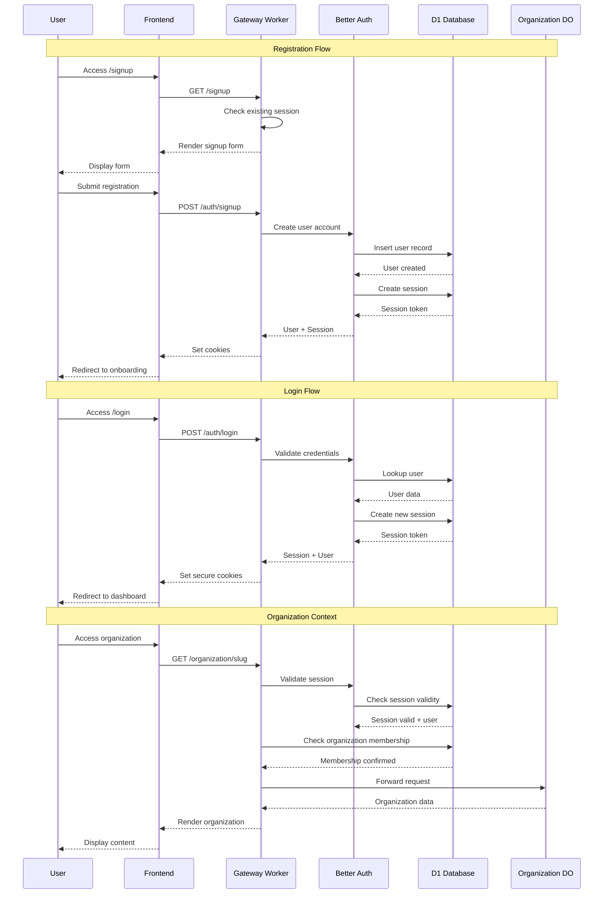

### Authentication States

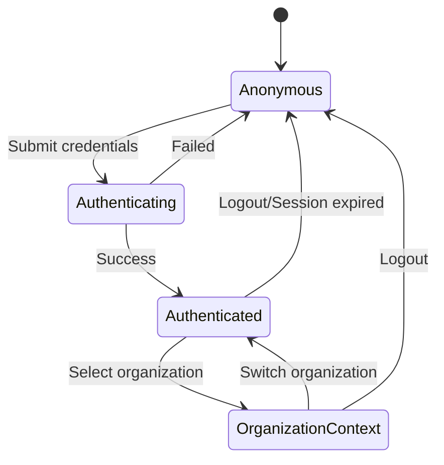

### Session Management

#### Session Creation

```typescript
// Better Auth session creation
export const createSession = (userId: UserId) =>
  Effect.gen(function* () {
    const authService = yield* AuthService;
    const sessionRepo = yield* SessionRepo;

    // Create session with Better Auth
    const session = yield* authService.createSession({
      userId,
      expiresAt: new Date(Date.now() + 7 * 24 * 60 * 60 * 1000), // 7 days
    });

    // Store in D1 database
    yield* sessionRepo.create({
      id: session.id,
      userId: session.userId,
      token: session.token,
      expiresAt: session.expiresAt,
    });

    return session;
  });
```

#### Session Validation Middleware

```typescript
export const sessionHandler = async ({ request, ctx }: RequestInfo) => {
  const sessionResult = await Effect.runPromise(
    Effect.gen(function* () {
      const authService = yield* AuthService;
      const sessionData = yield* authService.getSession();

      return {
        session: sessionData.session,
        user: sessionData.user,
      };
    }).pipe(
      Effect.provide(AuthServiceLive(request)),
      Effect.catchAll(() => Effect.succeed(null))
    )
  );

  if (!sessionResult) {
    return new Response(null, {
      status: 302,
      headers: { Location: "/login" },
    });
  }

  // Add to context for downstream handlers
  ctx.session = sessionResult.session;
  ctx.user = sessionResult.user;
};
```

## Organization Management

Organization management encompasses creation, member management, and tenant isolation.

### Organization Creation Workflow

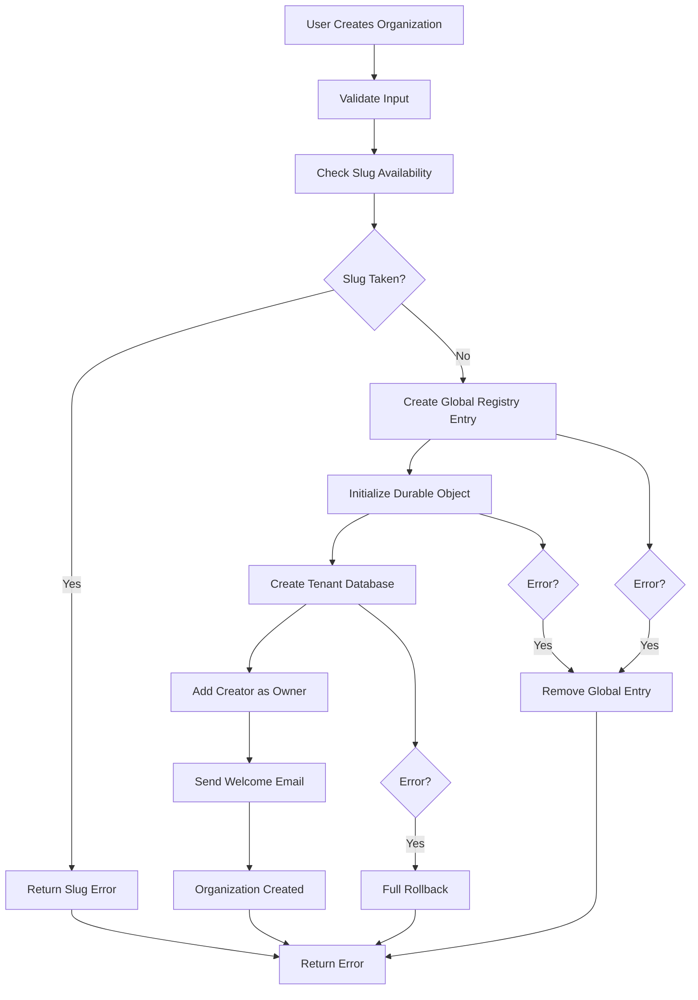

### Implementation Details

#### Organization Creation Use Case

```typescript
export const createOrganization = (input: CreateOrgInput, creatorId: UserId) =>
  Effect.gen(function* () {
    // 1. Validate input and check slug availability
    const validatedInput = yield* validateOrganizationInput(input);
    const slugAvailable = yield* checkSlugAvailability(validatedInput.slug);

    if (!slugAvailable) {
      yield* Effect.fail(
        new SlugUnavailableError({
          slug: validatedInput.slug,
        })
      );
    }

    // 2. Create in global registry (atomic operation)
    const org = yield* Effect.gen(function* () {
      const globalOrgRepo = yield* GlobalOrgRepo;
      return yield* globalOrgRepo.create({
        id: nanoid() as OrganizationId,
        slug: validatedInput.slug,
        name: validatedInput.name,
        status: "active",
      });
    });

    // 3. Initialize tenant environment (with rollback)
    yield* Effect.gen(function* () {
      const doId = orgDONamespace.idFromName(org.slug);
      const orgDO = orgDONamespace.get(doId);

      const response = yield* Effect.tryPromise({
        try: async () => {
          return await orgDO.fetch(
            new Request("http://internal/initialize", {
              method: "POST",
              headers: { "Content-Type": "application/json" },
              body: JSON.stringify({
                organization: org,
                creator: { id: creatorId },
              }),
            })
          );
        },
        catch: (error) => new TenantInitializationError({ cause: error }),
      });

      if (!response.ok) {
        yield* Effect.fail(
          new TenantInitializationError({
            message: `Failed to initialize tenant: ${response.status}`,
          })
        );
      }
    }).pipe(
      Effect.catchAll((error) =>
        Effect.gen(function* () {
          // Rollback: Remove from global registry
          const globalOrgRepo = yield* GlobalOrgRepo;
          yield* globalOrgRepo.delete(org.id).pipe(
            Effect.catchAll(() => Effect.succeed(void 0)) // Log but don't fail
          );
          return yield* Effect.fail(error);
        })
      )
    );

    return org;
  }).pipe(
    Effect.withSpan("OrganizationUseCase.create", {
      attributes: {
        organizationSlug: input.slug,
        creatorId,
      },
    })
  );
```

### Tenant Initialization Process

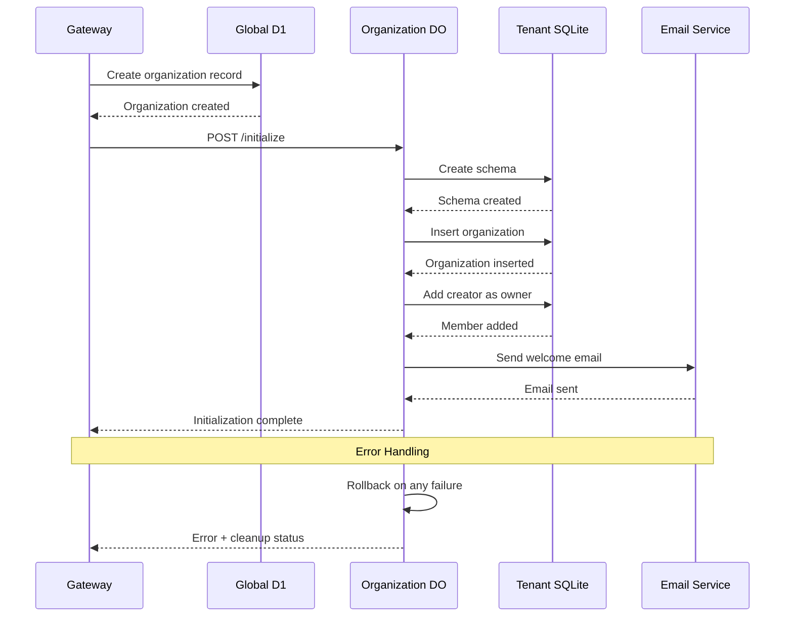

## Invitation System

The invitation system enables secure team member onboarding with email verification and role assignment.

### Complete Invitation Flow

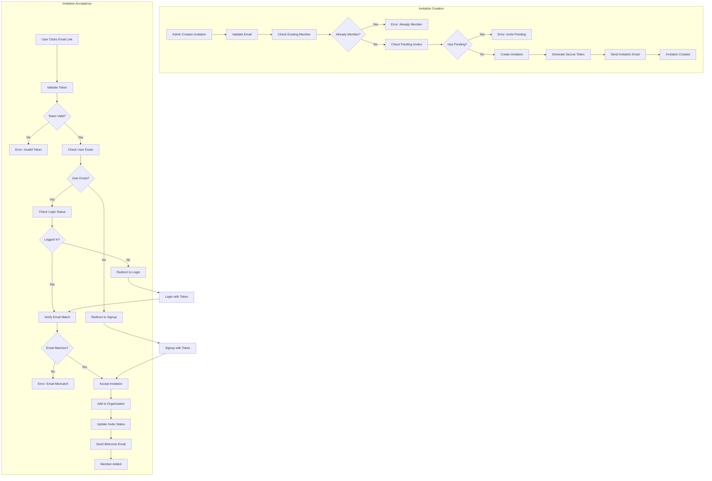

### Invitation State Management

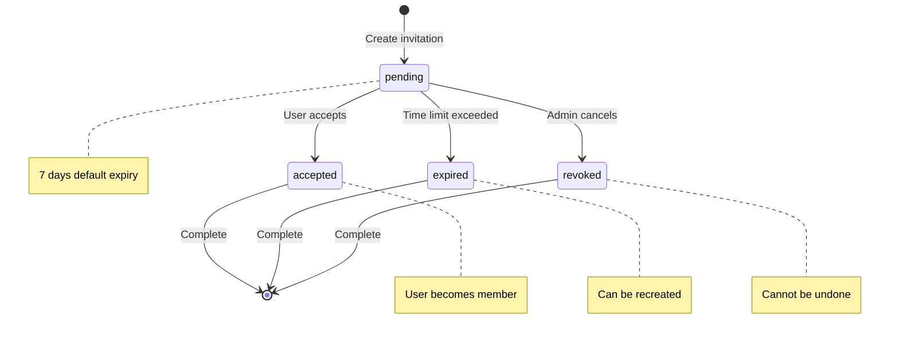

### Implementation Details

#### Invitation Creation

```typescript
export const createInvitation = (input: CreateInvitationInput) =>
  Effect.gen(function* () {
    const invitationRepo = yield* InvitationRepo;
    const memberRepo = yield* MemberRepo;
    const emailService = yield* EmailService;
    const tokenService = yield* InviteTokenService;

    // 1. Validate invitee is not already a member
    const existingMember = yield* memberRepo.findByEmail(input.inviteeEmail);
    if (Option.isSome(existingMember)) {
      yield* Effect.fail(
        new UserAlreadyMember({
          email: input.inviteeEmail,
        })
      );
    }

    // 2. Check for pending invitations
    const pendingInvite = yield* invitationRepo.findPendingByEmail(
      input.inviteeEmail
    );
    if (Option.isSome(pendingInvite)) {
      yield* Effect.fail(
        new DuplicatePendingInvitation({
          email: input.inviteeEmail,
        })
      );
    }

    // 3. Create invitation record
    const invitation = yield* invitationRepo.create({
      id: nanoid() as InvitationId,
      email: input.inviteeEmail,
      inviterId: input.inviterId,
      role: input.role,
      status: "pending",
      expiresAt: Date.now() + 7 * 24 * 60 * 60 * 1000, // 7 days
      createdAt: Date.now(),
    });

    // 4. Generate secure token
    const token = yield* tokenService.generateInvitationToken({
      invitationId: invitation.id,
      email: invitation.email,
      organizationSlug: input.organizationSlug,
    });

    // 5. Send invitation email
    yield* emailService.sendInvitation({
      to: invitation.email,
      inviterName: input.inviterName,
      organizationName: input.organizationName,
      acceptUrl: `${baseUrl}/invite/${token}`,
      role: invitation.role,
    });

    return { invitation, token };
  }).pipe(Effect.withSpan("InvitationUseCase.create"));
```

#### Invitation Acceptance

```typescript
export const acceptInvitation = (token: string, acceptingUserId?: UserId) =>
  Effect.gen(function* () {
    const tokenService = yield* InviteTokenService;
    const invitationRepo = yield* InvitationRepo;
    const memberRepo = yield* MemberRepo;
    const userRepo = yield* UserRepo;

    // 1. Validate and decode token
    const tokenData = yield* tokenService.validateInvitationToken(token);

    // 2. Get invitation and verify it's still valid
    const invitation = yield* invitationRepo.findById(tokenData.invitationId);
    if (Option.isNone(invitation)) {
      yield* Effect.fail(
        new InvitationNotFound({
          invitationId: tokenData.invitationId,
        })
      );
    }

    const invite = invitation.value;
    if (invite.status !== "pending") {
      yield* Effect.fail(
        new InvitationAlreadyProcessed({
          status: invite.status,
        })
      );
    }

    if (invite.expiresAt < Date.now()) {
      yield* Effect.fail(
        new InvitationExpired({
          expiredAt: new Date(invite.expiresAt),
        })
      );
    }

    // 3. Handle user context
    let userId: UserId;
    if (acceptingUserId) {
      // User is logged in - verify email matches
      const user = yield* userRepo.findById(acceptingUserId);
      if (Option.isNone(user) || user.value.email !== invite.email) {
        yield* Effect.fail(
          new EmailMismatchError({
            expectedEmail: invite.email,
            actualEmail: user.value?.email,
          })
        );
      }
      userId = acceptingUserId;
    } else {
      // User needs to sign up or log in
      yield* Effect.fail(
        new AuthenticationRequiredError({
          redirectTo: `/invite/${token}`,
        })
      );
    }

    // 4. Add user as member (atomic operation)
    yield* Effect.gen(function* () {
      // Add to organization
      yield* memberRepo.create({
        id: nanoid() as MemberId,
        userId,
        role: invite.role,
        createdAt: Date.now(),
      });

      // Update invitation status
      yield* invitationRepo.updateStatus(invite.id, "accepted");
    }).pipe(Effect.withSpan("InvitationUseCase.acceptInvitation.atomicUpdate"));

    return { success: true, organizationSlug: tokenData.organizationSlug };
  });
```

### Email Templates

#### Invitation Email

```typescript
// Email template using React Email
export function InvitationEmail({
  inviterName,
  organizationName,
  acceptUrl,
  role,
}: InvitationEmailProps) {
  return (
    <Html>
      <Head />
      <Body style={main}>
        <Container style={container}>
          <Heading style={h1}>
            You're invited to join {organizationName}
          </Heading>

          <Text style={text}>
            {inviterName} has invited you to join {organizationName} as a {role}
            .
          </Text>

          <Section style={buttonContainer}>
            <Button style={button} href={acceptUrl}>
              Accept Invitation
            </Button>
          </Section>

          <Text style={footer}>
            This invitation will expire in 7 days. If you don't want to receive
            these emails, you can ignore this message.
          </Text>
        </Container>
      </Body>
    </Html>
  );
}
```

## Shopify Integration

The Shopify integration provides secure OAuth flows and store connection management.

### OAuth Authorization Flow

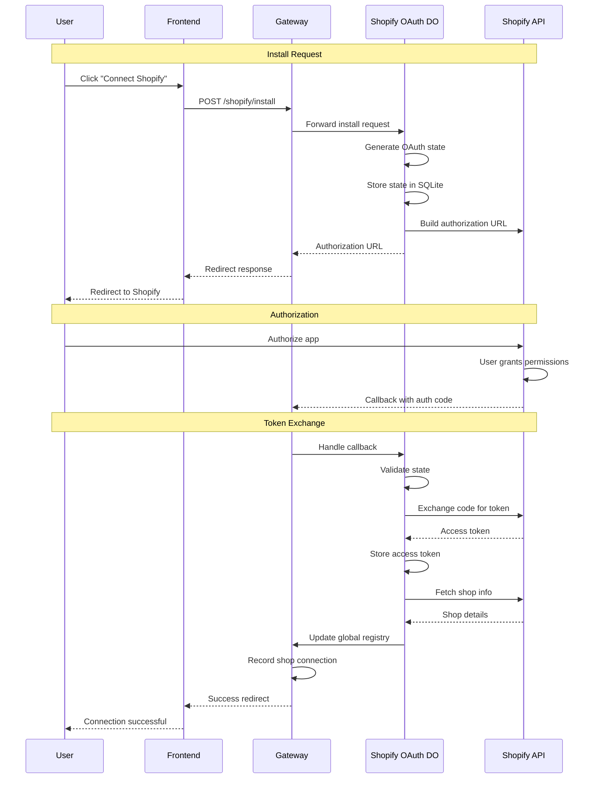

### OAuth State Management

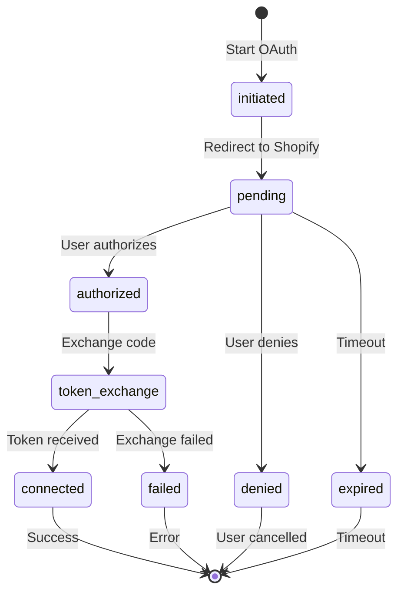

### Implementation Details

#### OAuth Initiation

```typescript
export const initiateShopifyOAuth = (input: OAuthInitiateInput) =>
  Effect.gen(function* () {
    const oauthRepo = yield* ShopifyOAuthRepo;
    const configService = yield* ShopifyConfigService;

    // 1. Validate shop domain
    const shopDomain = yield* validateShopDomain(input.shopDomain);

    // 2. Check if shop is already connected
    const existingConnection = yield* checkExistingConnection(shopDomain);
    if (existingConnection) {
      yield* Effect.fail(
        new ShopAlreadyConnectedError({
          shopDomain,
          connectedToOrganization: existingConnection.organizationSlug,
        })
      );
    }

    // 3. Generate OAuth state and PKCE parameters
    const state = yield* generateSecureState();
    const codeVerifier = yield* generateCodeVerifier();
    const codeChallenge = yield* generateCodeChallenge(codeVerifier);

    // 4. Store OAuth state
    const oauthState = yield* oauthRepo.createState({
      id: nanoid() as OAuthStateId,
      shopDomain,
      organizationSlug: input.organizationSlug,
      state,
      codeVerifier,
      scope: "read_products,write_products,read_orders",
      status: "initiated",
      expiresAt: Date.now() + 10 * 60 * 1000, // 10 minutes
      createdAt: Date.now(),
    });

    // 5. Build authorization URL
    const authUrl = yield* configService.buildAuthorizationUrl({
      shopDomain,
      clientId: configService.clientId,
      scope: oauthState.scope,
      redirectUri: `${configService.baseUrl}/shopify/callback`,
      state,
      codeChallenge,
      codeChallengeMethod: "S256",
    });

    return { authUrl, state };
  }).pipe(Effect.withSpan("ShopifyOAuth.initiate"));
```

#### OAuth Callback Handling

```typescript
export const handleOAuthCallback = (callbackData: OAuthCallbackData) =>
  Effect.gen(function* () {
    const oauthRepo = yield* ShopifyOAuthRepo;
    const tokenRepo = yield* ShopifyTokenRepo;
    const shopifyAPI = yield* ShopifyAPIClient;
    const globalRepo = yield* GlobalShopConnectionRepo;

    // 1. Validate callback parameters
    const validatedCallback = yield* validateCallbackData(callbackData);

    // 2. Retrieve and validate OAuth state
    const oauthState = yield* oauthRepo.findByState(validatedCallback.state);
    if (Option.isNone(oauthState)) {
      yield* Effect.fail(
        new InvalidOAuthStateError({
          state: validatedCallback.state,
        })
      );
    }

    const state = oauthState.value;
    if (state.status !== "initiated" || state.expiresAt < Date.now()) {
      yield* Effect.fail(
        new OAuthStateExpiredError({
          stateId: state.id,
        })
      );
    }

    // 3. Exchange authorization code for access token
    const tokenResponse = yield* shopifyAPI.exchangeCodeForToken({
      clientId: configService.clientId,
      clientSecret: configService.clientSecret,
      code: validatedCallback.code,
      codeVerifier: state.codeVerifier,
    });

    // 4. Store access token
    const accessToken = yield* tokenRepo.create({
      id: nanoid() as AccessTokenId,
      shopDomain: state.shopDomain,
      organizationSlug: state.organizationSlug,
      accessToken: tokenResponse.accessToken,
      scope: tokenResponse.scope,
      status: "active",
      expiresAt: tokenResponse.expiresAt,
      createdAt: Date.now(),
    });

    // 5. Fetch shop information
    const shopInfo = yield* shopifyAPI.getShopInfo({
      shopDomain: state.shopDomain,
      accessToken: accessToken.accessToken,
    });

    // 6. Update global shop connection registry
    yield* globalRepo.create({
      shopDomain: state.shopDomain,
      organizationSlug: state.organizationSlug,
      type: "shopify",
      status: "active",
      connectedAt: Date.now(),
    });

    // 7. Update OAuth state
    yield* oauthRepo.updateStatus(state.id, "connected");

    return {
      success: true,
      shopDomain: state.shopDomain,
      organizationSlug: state.organizationSlug,
      shopInfo,
    };
  }).pipe(Effect.withSpan("ShopifyOAuth.callback"));
```

## Member Management

Member management handles role-based access control and organization membership.

### Member Lifecycle

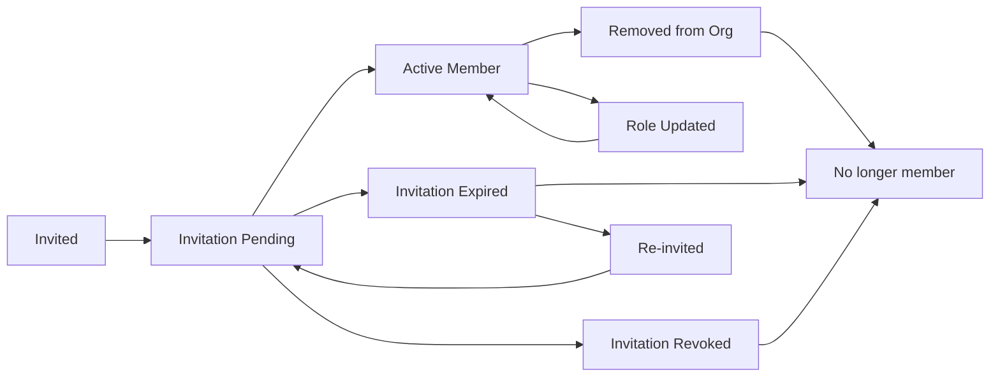

### Role-Based Permissions

| Permission                   | Owner | Admin | Member |
| ---------------------------- | ----- | ----- | ------ |
| **Organization Management**  |
| Delete organization          | ✅    | ❌    | ❌     |
| Update organization settings | ✅    | ✅    | ❌     |
| View organization details    | ✅    | ✅    | ✅     |
| **Member Management**        |
| Invite members               | ✅    | ✅    | ❌     |
| Remove members               | ✅    | ✅    | ❌     |
| Change member roles          | ✅    | ✅    | ❌     |
| View member list             | ✅    | ✅    | ✅     |
| **Store Integration**        |
| Connect stores               | ✅    | ✅    | ❌     |
| Disconnect stores            | ✅    | ✅    | ❌     |
| View store data              | ✅    | ✅    | ✅     |

### Role Change Workflow

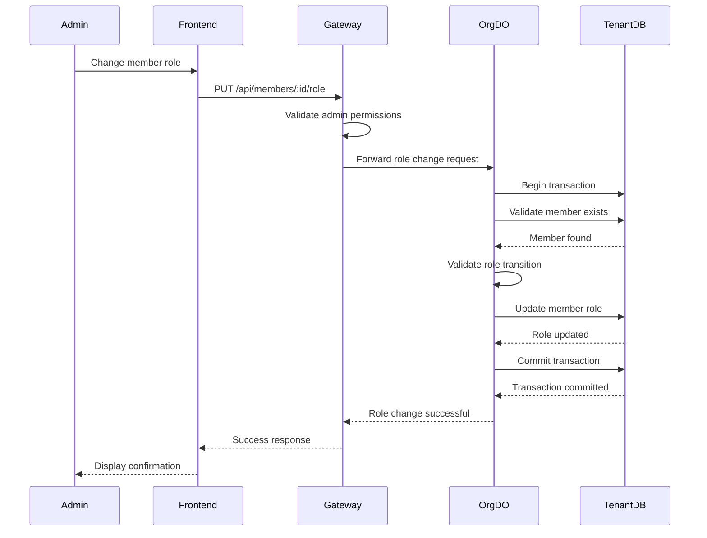

## Error Handling Workflows

The system implements comprehensive error handling with structured error types and recovery strategies.

### Error Categories

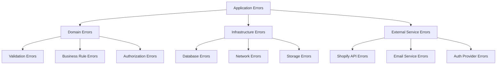

### Error Recovery Patterns

#### Retry with Exponential Backoff

```typescript
export const retryWithBackoff = <A, E>(
  effect: Effect.Effect<A, E>,
  maxRetries: number = 3
) =>
  effect.pipe(
    Effect.retry({
      times: maxRetries,
      delay: (attempt) => `${Math.pow(2, attempt) * 1000}ms`,
    }),
    Effect.catchAll((error) =>
      Effect.gen(function* () {
        yield* Effect.logError("Operation failed after retries", { error });
        return yield* Effect.fail(error);
      })
    )
  );
```

#### Graceful Degradation

```typescript
export const getOrganizationWithFallback = (slug: OrganizationSlug) =>
  Effect.gen(function* () {
    // Try primary data source
    const primary = yield* orgRepo
      .findBySlug(slug)
      .pipe(Effect.catchAll(() => Effect.succeed(Option.none())));

    if (Option.isSome(primary)) {
      return primary.value;
    }

    // Fallback to cached data
    const cached = yield* cacheService
      .get(`org:${slug}`)
      .pipe(Effect.catchAll(() => Effect.succeed(Option.none())));

    if (Option.isSome(cached)) {
      yield* Effect.logWarning("Using cached organization data", { slug });
      return cached.value;
    }

    // Final fallback
    yield* Effect.fail(new OrganizationNotFound({ slug }));
  });
```

## Background Processes

### Cleanup and Maintenance

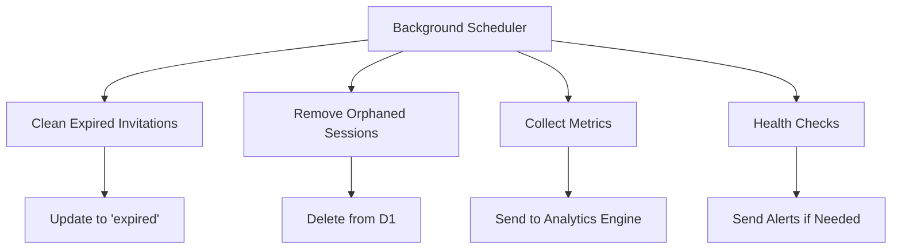

### Scheduled Tasks

#### Invitation Cleanup

```typescript
// Scheduled function (could be implemented with Cloudflare Cron Triggers)
export const cleanupExpiredInvitations = () =>
  Effect.gen(function* () {
    const invitationRepo = yield* InvitationRepo;
    const now = Date.now();

    // Find all expired pending invitations
    const expiredInvitations = yield* invitationRepo.findExpired(now);

    // Update status to expired
    yield* Effect.all(
      expiredInvitations.map((invitation) =>
        invitationRepo.updateStatus(invitation.id, "expired")
      ),
      { concurrency: 5 }
    );

    yield* Effect.logInfo("Cleaned up expired invitations", {
      count: expiredInvitations.length,
    });
  }).pipe(Effect.withSpan("BackgroundTask.cleanupExpiredInvitations"));
```

---

**Next**: [API Documentation](../api/README.md)
